# Assign your brand {#branding-assign}

## Link a brand to a template {#linking-a-brand-to-a-template}

To use the parameters defined for a brand, it must be linked to a delivery template. To do this, you have to create or edit a template.

Your template will be linked to the brand. In the email editor, the elements such as the **Email address of default sender**, the **Default sender name**, or the **Logo** will use the configured brand data.

>[!BEGINTABS]

>[!TAB Adobe Campaign V8]

To create a delivery template, you can duplicate a built-in template, convert an existing delivery into a template or create a delivery template from scratch. [Learn more](https://experienceleague.adobe.com/en/docs/campaign/campaign-v8/send/create-templates)

Once your template has been created, you can link it to a brand. To do this:

1. Browse to **[!UICONTROL Resources]** `>` **[!UICONTROL Templates]** `>` **[!UICONTROL Delivery templates]** in Adobe Campaign explorer.

1. Select a delivery template or duplicate an existing one.

    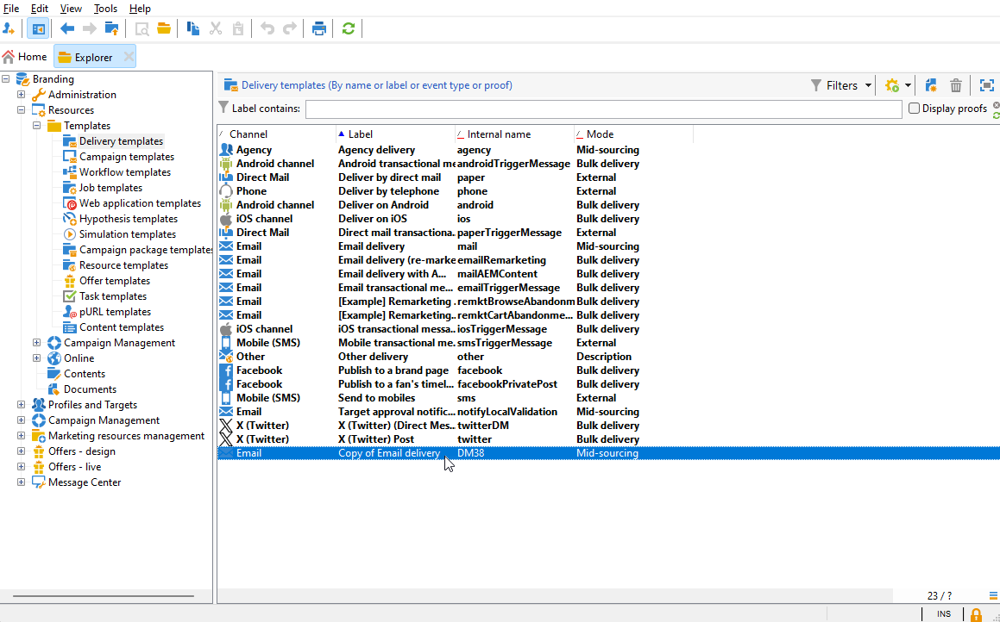

1. Access the **[!UICONTROL Properties]** of your selected delivery template.

    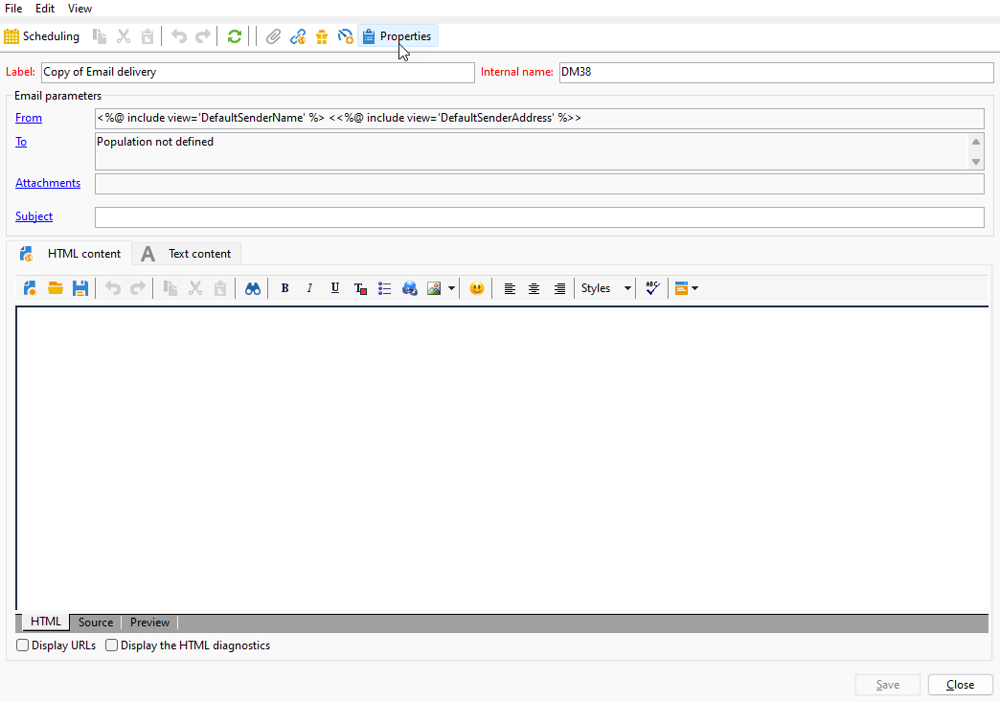

1. From the **[!UICONTROL General]** tab, select your brand from the **[!UICONTROL Branding]** drop-down.

    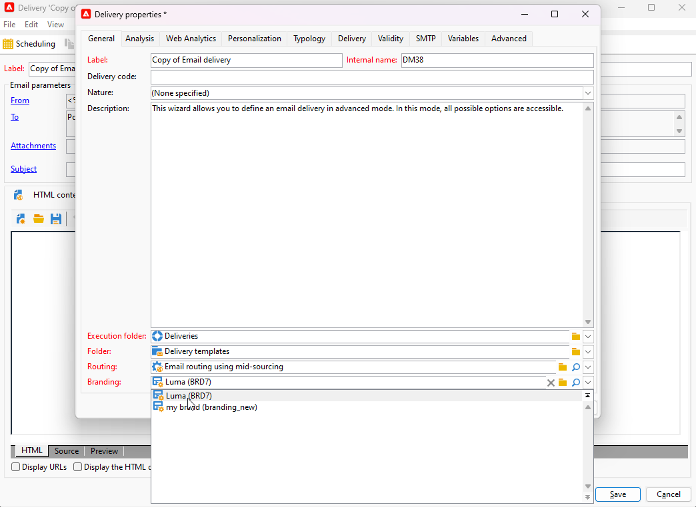

1. Once configured, select **OK**.

You can now use this template to send your deliveries.

>[!TAB Adobe Campaign Web]

To create a delivery template, you can duplicate a built-in template, convert an existing delivery into a template or create a delivery template from scratch. [Learn more](https://experienceleague.adobe.com/en/docs/campaign-web/v8/msg/delivery-template)

Once your template has been created, you can link it to a brand. To do this:

1. Browse to the **[!UICONTROL Templates]** tab, from the **[!UICONTROL Deliveries]** left menu,and select a delivery template.

    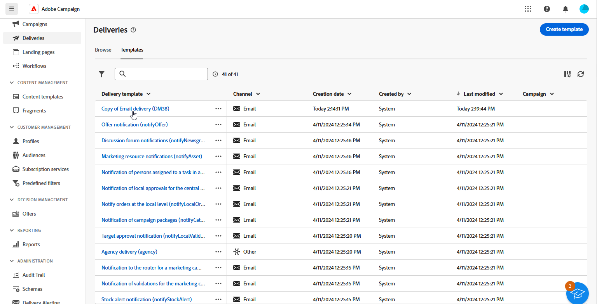

1. Click **[!UICONTROL Settings]**.

    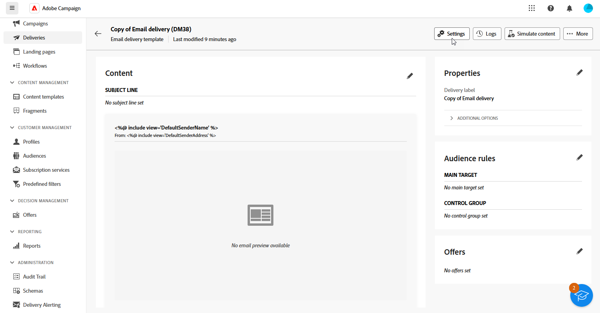

1. From the **[!UICONTROL Delivery]** tab, access the **[!UICONTROL Branding]** field and select the brand that you want to link to the template.

    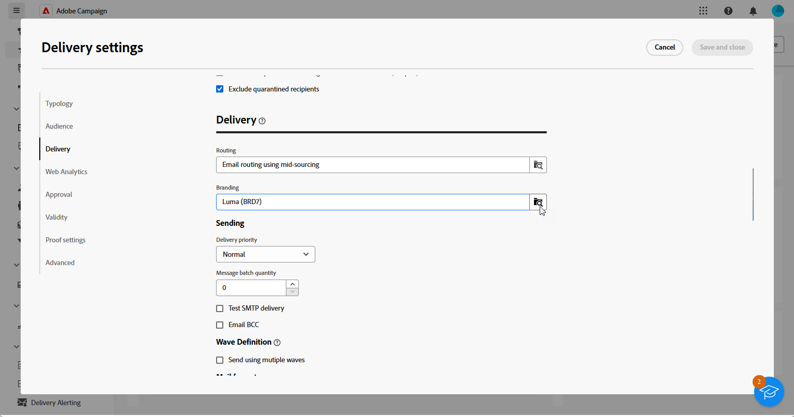

1. Confirm your selection and save your template.

You can now use this template to send your deliveries.

>[!ENDTABS]

## Assign a brand to your delivery {#assigning-a-brand-to-an-email}

>[!BEGINTABS]

>[!TAB Adobe Campaign V8]

To create a new standalone delivery, follow the steps below.

1. To create a new delivery, browse to the **[!UICONTROL Campaigns]** tab.

1. Click **[!UICONTROL Deliveries]** and click the **[!UICONTROL Create]** button above the list of existing deliveries.

    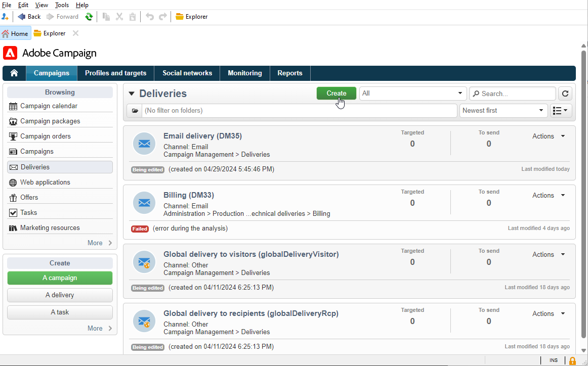

1. Select a delivery template.

1. Access the **[!UICONTROL Properties]** of your selected delivery template.

    

1. From the **[!UICONTROL General]** tab, select your brand from the **[!UICONTROL Branding]** drop-down.

    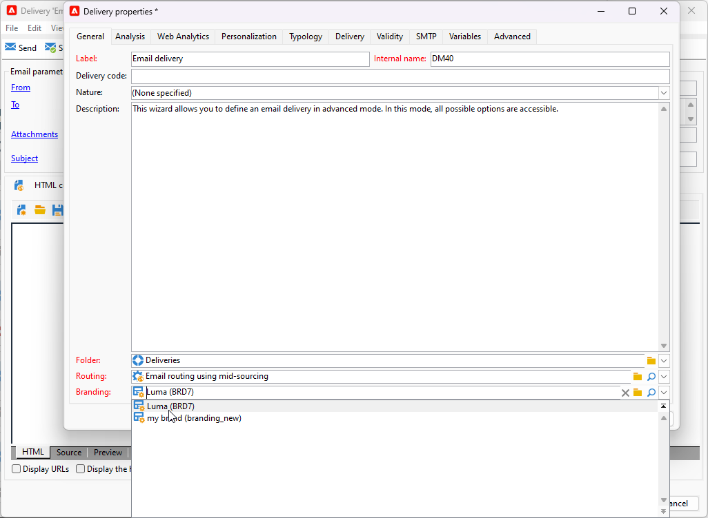

1. Once configured, select **OK**.

1. Further personalize your deliveries. For more information about creating an email refer to the [Design and send emails](https://experienceleague.adobe.com/en/docs/campaign-web/v8/msg/email/create-email) section.

>[!TAB Adobe Campaign Web]

To create a new standalone delivery, follow the steps below.

1. Browse to the **[!UICONTROL Deliveries]** menu on the left rail, and click the **[!UICONTROL Create delivery]** button.

    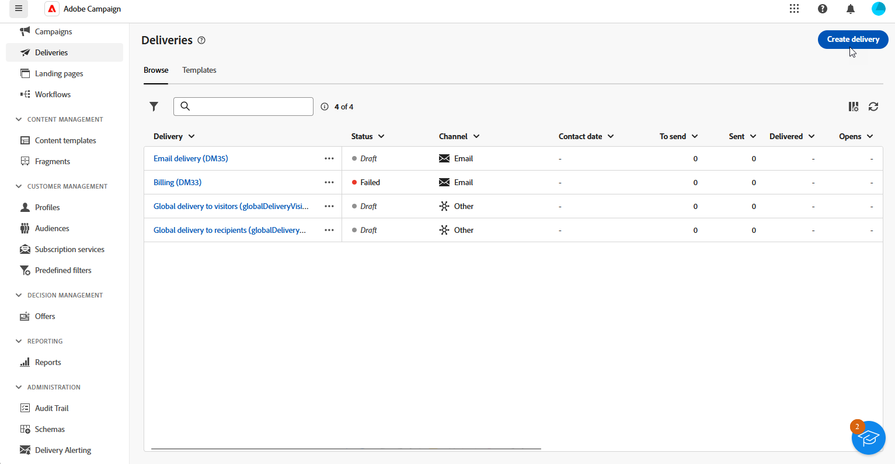

1. Select Email or Push notification as the channel and choose a delivery template from the list.

1. Click the **[!UICONTROL Create delivery]** button to confirm.

1. From the **[!UICONTROL Properties]** page, click **[!UICONTROL Settings]**.

    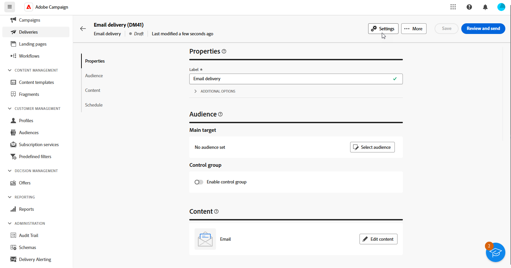

1. From the **[!UICONTROL Delivery]** tab, access the **[!UICONTROL Branding]** field.

    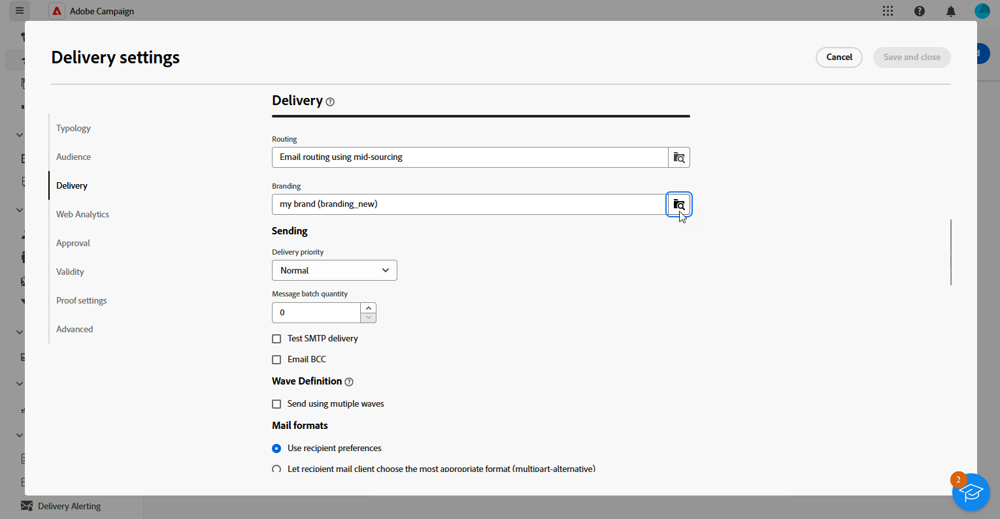

1. Select the brand that you want to link to the template.

    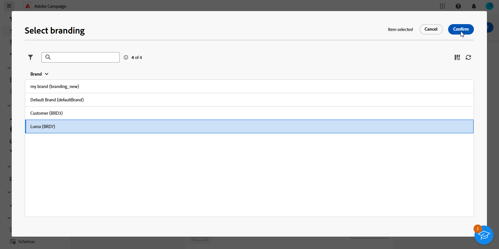

1. Further personalize your deliveries. For more information about creating an email refer to the [Create your first email](https://experienceleague.adobe.com/en/docs/campaign-web/v8/msg/email/create-email) section.

>[!ENDTABS]
