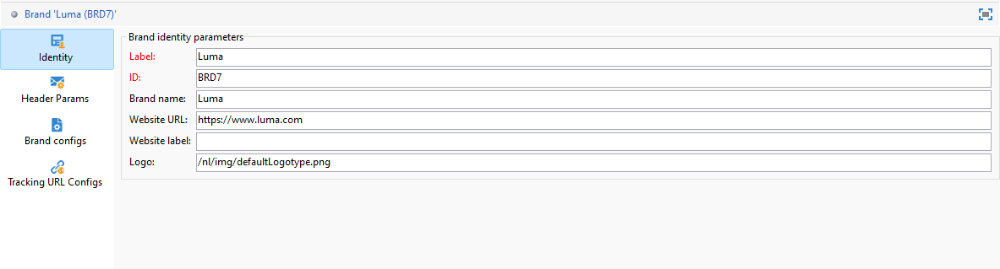
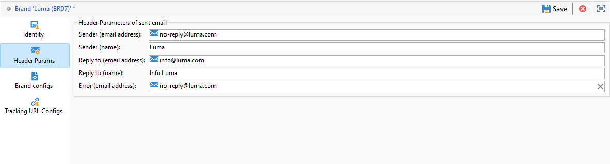
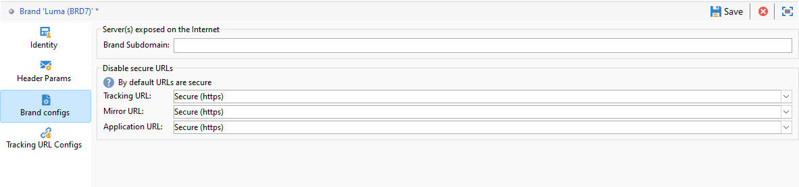

# Configure brands {#branding-configure}

>[!IMPORTANT]
>
>Brands cannot be created or modified by end-users: these operations have to be performed by Adobe Campaign technical administrator. For any request, contact Adobe Customer care.

In Adobe Campaign V8, Brands can be found in the **[!UICONTROL Administration > Platform > Branding]** menu.

A **[!UICONTROL Brand]** is defined by the following characteristics:

* An **[!UICONTROL Identity]**, which defines and personalizes your brand. This section contains the following fields:

    * **[!UICONTROL Label]** visible in the interface
    * **[!UICONTROL ID]**
    * **[!UICONTROL Brand name]**
    * **[!UICONTROL Website URL]** and **[!UICONTROL Website label]** of the brand
    * **[!UICONTROL Brand logo]**

  

* **[!UICONTROL Header parameters of sent emails]** which personalizes what the recipients of your campaigns will see. This section contains the following fields:

    * **[!UICONTROL Sender (email address)]** with the brand's email address.
    * **[!UICONTROL Sender (name)]** with the brand's name.
    * **[!UICONTROL Reply to (email address)]** with the email address the customer can reply to.
    * **[!UICONTROL Reply to (name)]** with the brand's name.
    * **[!UICONTROL Error (email address)]** with the email address to use in case of an error.

  >[!IMPORTANT]
  >
  >After having updated the header parameters of the emails, if the name and email address of the sender have not changed in the email created from the template, check the template's advanced settings.

  

* **[!UICONTROL Brand configs]** defines the servers used for tracking also for landing page access. This section contains the following fields:

    * **[!UICONTROL Brand subdomain]** refers to the designated subdomain URL specific to this brand, requested for delegation from Adobe.

  Note that configuration for tracking, mirror, and application servers is stored in separate external accounts associated with routing. These settings are applied during provisioning and should not be modified. To display URLs, access the **[!UICONTROL Branding prefixes]** tab from your external account.

  

* **[!UICONTROL Tracking URL configs]** menu enables you to enhance URL tracking by defining additional parameters for integration with Web analytics tools such as Adobe Analytics and Google Analytics. 

  Use the **[!UICONTROL Additional URL Parameters]** menu to create additional parameters as key-value pairs along with their applicability conditions. Each parameter name must be unique and non-empty, and each parameter value must be non-empty. The applicability condition can be empty, but none of these values can include JST tags.

  These parameters will be applied to tracked URLs that match any domain name specified in the **[!UICONTROL List of Domain Names]**, which can include regular expressions.
