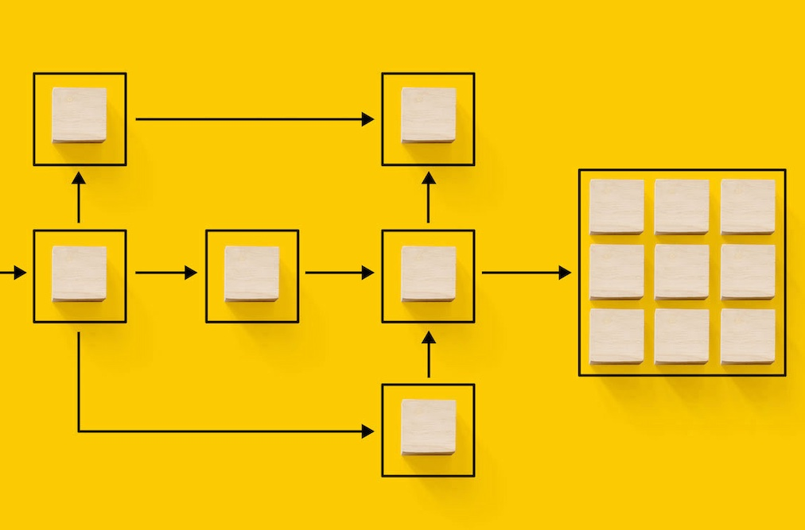

# Campaign Standard transition to Campaign v8 {#triggers-home} 

As a Campaign Standard user transitioning to Campaign v8, you can now benefit from the new version of Adobe Campaign Web User Interface and well as the powerful v8 console. The transition is seemless and will allow you to use all the intuitive features designed to simplify the creation of personalized cross-channel campaigns. Campaign Web User Interface also brings a connected canvas with Adobe Experience Platform for a unified experience.

In addition, this transition will bring many benefits:

* Robust IT Infrastructure
* Enhanced Support
* Integration with Adobe Experience Platform
* Consistent User Interface and Experience

For more information on key capabilities and concept differences, refer to [this page](https://experienceleague.adobe.com/en/docs/campaign-web/v8/rn/acs-migration.html).

## What's New

Get a glimpse of all the features and capability offered by [Campaign Web User Interface](https://experienceleague.adobe.com/en/docs/campaign-web/v8/campaign-web-home) and [Campaign v8](https://experienceleague.adobe.com/en/docs/campaign/campaign-v8/campaign-home).

For you to be able to transition seemlessly, we've added key capabilities from Campaign Standard to v8:

>[!BEGINTABS]

>[!TAB Dynamic Reporting]

You can access Dynamic Reporting which provides fully customizable and real-time reports to measure the impact of your marketing activities.

>[!TAB Centralized Branding] 

Your technical administrators can now define one or several brands to centralize the parameters that affect a brand's identity.

>[!TAB Rest APIs]

You can use Rest APIs to create integrations for Adobe Campaign and build your own ecosystem by interfacing Adobe Campaign with the panel of technologies that you use. 

>[!ENDTABS]

## Start with the basics

<table style="table-layout:fixed">
  <tr style="border: 0;">
    <td>
    
    
<strong>Discover the new user interface</strong> 

    </td>
    <td>
    
    
<strong>Reimagined workflow canvas</strong> 
 
    </td>
    <td>
    
    
<strong>Meet the Email Designer</strong> 
    
</td>
    <td>
    
    
<strong>Make your content dynamic</strong> 

    </td>
  </tr>
  <tr style="border: 0;">
    <td align="center"></td>
    <td align="center"></td>
    <td align="center"></td>
    <td align="center"></td>
    </tr>
</table>
