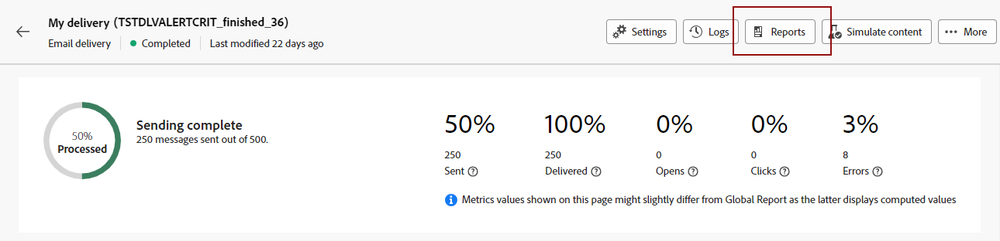
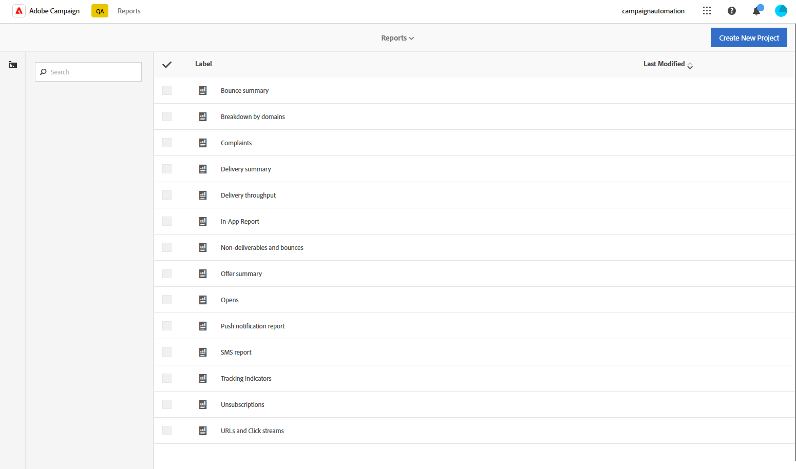

# Get started with dynamic reports {#about-dynamic-reports}

Dynamic Reporting provides fully customizable and real-time reports. It adds access to profile data, enabling demographic analysis by profile dimensions such as gender, city and age in addition to functional email campaign data like opens and clicks. With the drag-and-drop interface, you can explore data, determine how your email campaigns performed against your most important customer segments and measure their impact on recipients.

## Accessing dynamic reports {#accessing-dynamic-reports}

Reports can be accessed in each campaign and delivery by clicking **Reports**. A popup window will appear, informing you that you will be redirected to the **Dynamic Report** page in a new browser tab.

Certain reports cannot be available immediately after a delivery, depending on the time it takes to collect and process information.

Dynamic reports are divided into two categories:

* **Templates**, which can be modified by copying them using the **Save as** option (**Project > Save As..**) in the template.
* **Custom reports** (identified in blue), which can be directly created by clicking the **Create New Project** button on the **Reports** home page.

