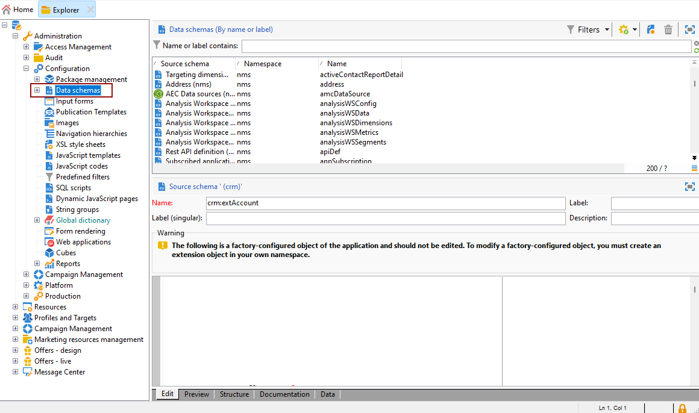
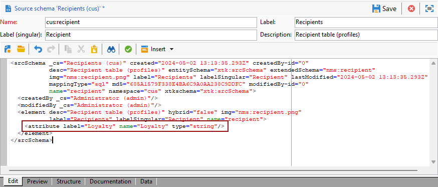
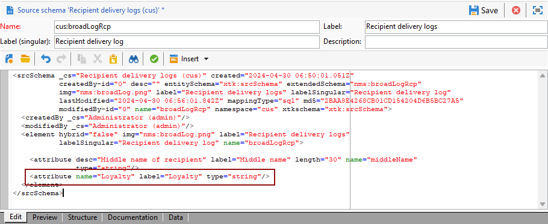
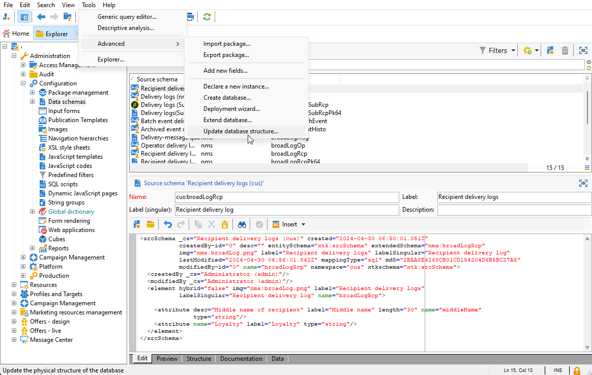
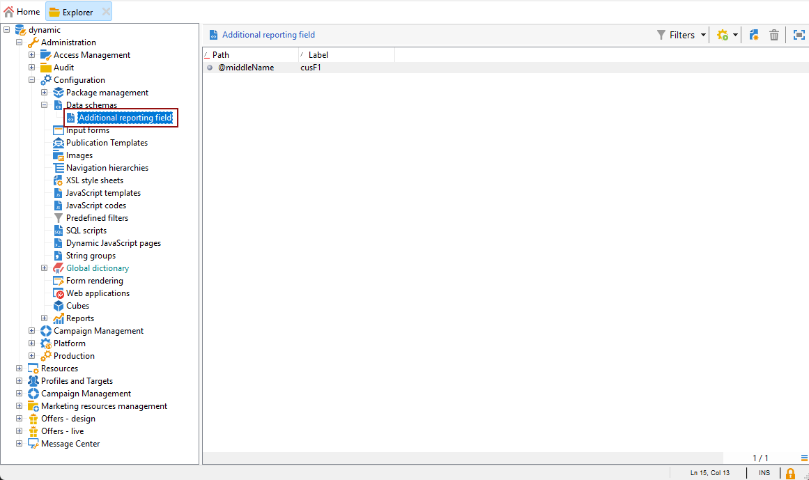
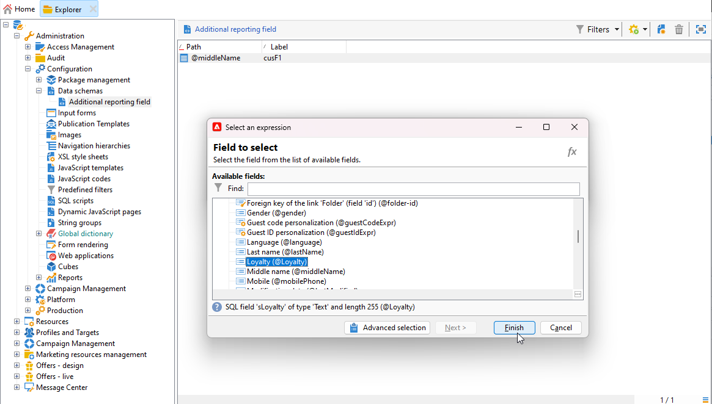
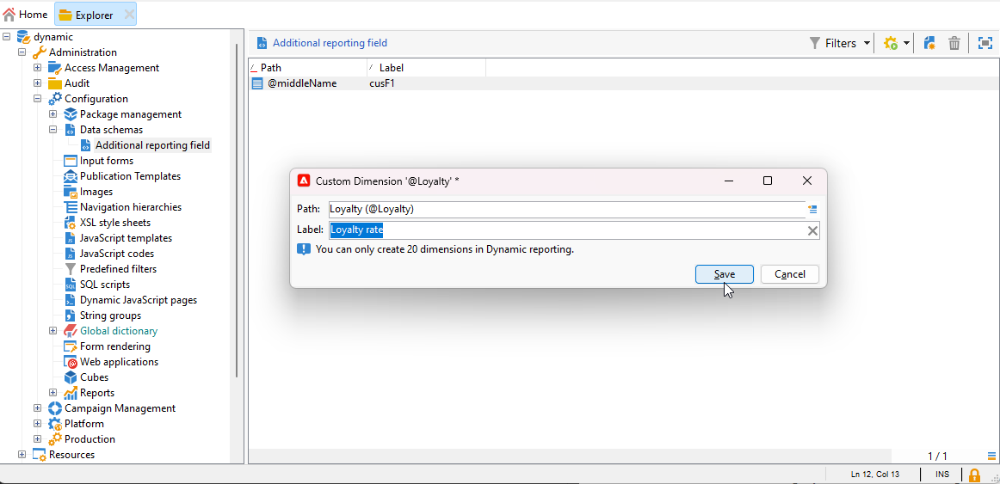
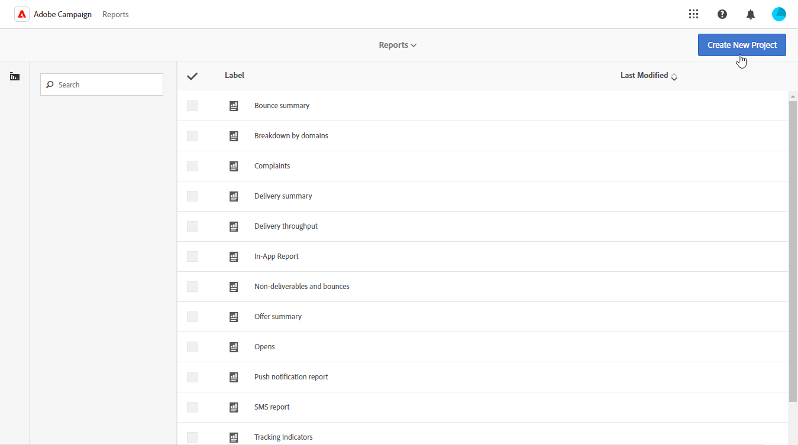
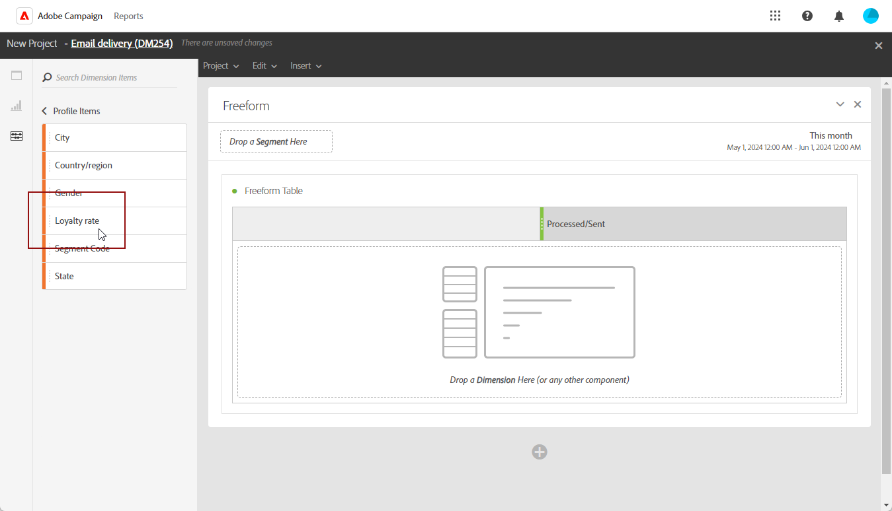

# Creating a custom profile dimension{#creating-a-custom-profile-dimension}

Reports can also be created and managed based on custom profile data created during the recipient schema extension.

* [Step 1: Extend your recipient schema](##extend-schema)
* [Step 2: Link your new custom field](#link-custom)
* [Step 3: Create a dynamic report to filter recipients with the custom profile dimension](#create-report)

## Step 1: Extend your recipient schema {#extend-schema}

To add a new profile field, you need to extend your schema, follow the steps below:

1. Navigate to the **[!UICONTROL Administration]** > **[!UICONTROL Configuration]** > **[!UICONTROL Data schemas]** folder in the Explorer.

   

1. Identify your custom recipient schema and select it. If you have not yet extended the built-in nms:recipient schema, refer to [this procedure](https://experienceleague.adobe.com/en/docs/campaign/campaign-v8/developer/shemas-forms/extend-schema).

1. Add your custom field to the schema editor.

   For example, to add a Loyalty custom field in your recipient schema: 

   ```
   <attribute label="Loyalty" name="loyalty" type="string"/>
   ```

   

1. Click **[!UICONTROL Save]**.

1. Then, identify your custom broadLogRcp schema and select it. If you have not yet extended the built-in Delivery log schema, refer to [this procedure](https://experienceleague.adobe.com/en/docs/campaign/campaign-v8/developer/shemas-forms/extend-schema).

1. Add the same custom field as your Recipient schema to the schema editor.

   

1. Click **[!UICONTROL Save]**.

1. To apply the modifications made to the schemas, launch the Database update wizard via **[!UICONTROL Tools]** > **[!UICONTROL Advanced]** > **[!UICONTROL Update database structure]** and run the Update the database structure. [Learn more](https://experienceleague.adobe.com/en/docs/campaign/campaign-v8/developer/shemas-forms/update-database-structure)

   

Your new profile field is now ready to be used and selected by your recipients.

## Step 2: Link your new custom field {#link-custom}

>[!NOTE]
>
> You can only add up to 20 custom field to Dynamic report.

Now that your profile field is created, we need to link it to the corresponding Dynamic reporting dimension.

1. Navigate to the **[!UICONTROL Administration]** > **[!UICONTROL Configuration]** > **[!UICONTROL Data schemas]** > **[!UICONTROL Additional reporting field]** folder in the Explorer.

   

1. Click **[!UICONTROL New]** to create your corresponding Dynamic reporting dimension.

1. Select **[!UICONTROL Edit expression]** and browse through the Recipient schema to find your previously created custom profile field.

   

1. Click **[!UICONTROL Finish]**.

1. Type-in your dimension **[!UICONTROL Label]**, visible in Dynamic reporting, and click **[!UICONTROL Save]**.

   

Your custom profile field is now available as a custom profile dimension in your reports. To delete your custom profile dimension, you can select it and click the **[!UICONTROL Delete]** icon. 

Now that recipient schema has been extended with this profile field and your custom dimension created, you can start targeting recipients in deliveries.

## Step 3: Create a dynamic report to filter recipients with the custom profile dimension {#create-report}

After sending your delivery, you can breakdown reports using your custom profile dimension.

1. From the **[!UICONTROL Reports]** tab, select an out-of-the-box report or click the **[!UICONTROL Create]** button to start one from scratch.

   

1. In the **[!UICONTROL Dimensions]** category, click **[!UICONTROL Profile]** then drag and drop your custom profile dimension to your freeform table.

   

1. Drag and drop any metrics to start filtering your data.

1. Drag and drop a visualization in your workspace if needed.
