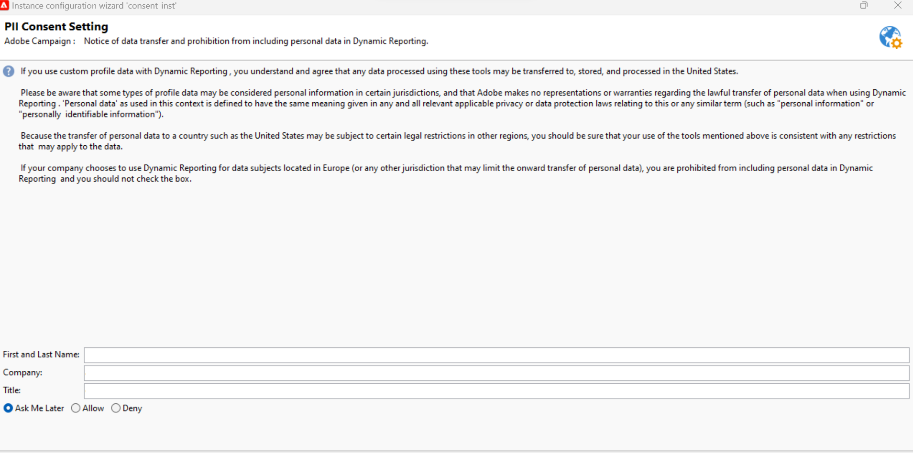

# Dynamic reporting usage agreement {#pii-agreement}

The Dynamic reporting usage agreement's purpose is to function as a pop-up consent for data processing. By default, the agreement is only visible and can only be accepted or declined by users assigned with administration rights.

To access the Dynamic reporting usage agreement, select **[!UICONTROL Tools]** > **[!UICONTROL Advanced]** > **[!UICONTROL Deployment wizard]**.

Three options are available:

* **[!UICONTROL Ask me later]**: Until you accept or decline the agreement, the profile dimensions will not appear in your reports and your customers' Personal identification information will not be collected or sent.
* **[!UICONTROL Accept]**: By accepting this agreement, you authorize Adobe Campaign to collect your customers' Personal identification information and to transfer them to the reporting or data center.
* **[!UICONTROL Decline]**: By declining the agreement, the profile dimensions will not appear in your reports and your customers' Personal identification information will not be collected or sent. Note that in this case externalID will still be collected and used to identify end-users.

The table below displays what happens after accepting with this agreement depending on your region.

|  |Dynamic reporting|Microsoft Dynamics 365 connector|
|---|---|---|
|Americas & APAC (Asia Pacific)| **Feature available**.  All out-of-the-box (i.e. city, country/region, state, gender and segments on the age basis) & custom profiles information pushed into the US reporting center. |**Feature available**.  All out-of-the-box & custom profiles fields and Adobe Campaign event fields are processed in the US data center.|
|EMEA (Europe Middle East & Africa)|**Feature available**.  All out-of-the-box (i.e. city, country/region, state, gender and segments on the age basis) & custom profiles information pushed into the EMEA reporting center.|**Feature available.**  All out-of-the-box & custom profiles fields and Adobe Campaign event fields processed in the EMEA data center.  **[!UICONTROL Control data]** which contains Adobe I/O registration data and IDs of customer end-user events sent and stored in the US data center.|

The table below displays what happens after declining this agreement depending on your region. Note that even if you decline this agreement, reporting on deliveries and Microsoft Dynamics 365 integration will still be available.

|  Region |Dynamic reporting|Microsoft Dynamics 365 connector|
|---|---|---|
|Americas & APAC (Asia Pacific)|**Feature available**.   No out-of-the-box & custom profiles information pushed into the US reporting center with the exception of ExternalID.|**Feature available**.  No out-of-the-box or custom profile fields sent to the US data center with the exception of External ID and Recipient ID.  All Adobe Campaign event fields processed in the US data center with the exception of mirror page ID.|
|EMEA (Europe Middle East & Africa)|**Feature available**.  No out-of-the-box & custom profiles information pushed into the EMEA reporting center with the exception of ExternalID.|**Feature available.**  No out-of-the-box or custom profile fields sent to the EMEA data center with the exception of External ID and Recipient ID.  All Adobe Campaign event fields processed in the EMEA data center with the exception of mirror page ID.|

<!--
This choice is not final, you can always change it by selecting **[!UICONTROL Enable PII data to be transferred to US region to use reporting on Profile data]** in **[!UICONTROL Administration]** > **[!UICONTROL Application Settings]** > **[!UICONTROL Options]**.

The value can be changed at any time. The value 1 corresponds to **[!UICONTROL Ask me later]**, 2 **[!UICONTROL Decline]** and 3 **[!UICONTROL Accept]**.
-->