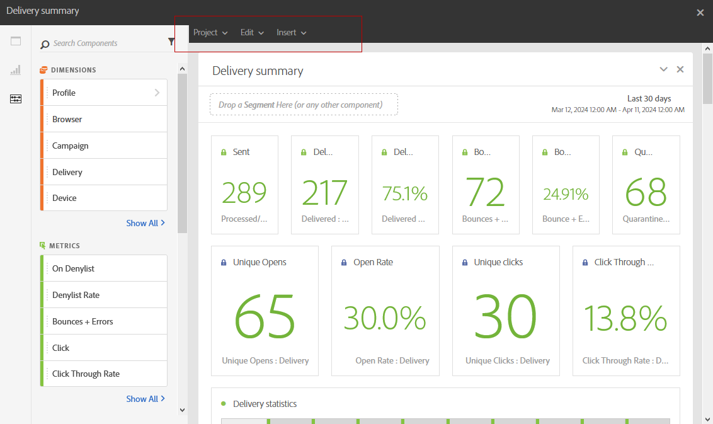
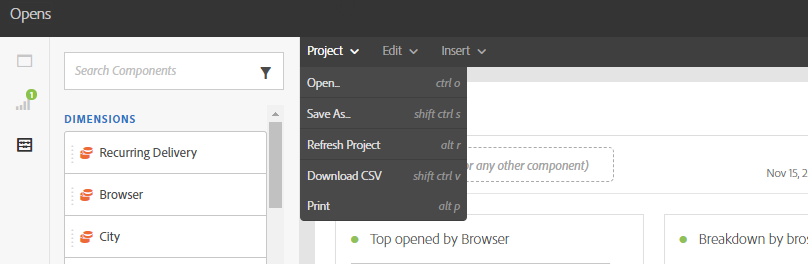
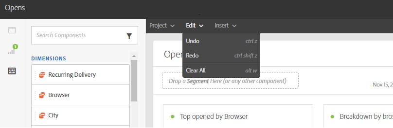

# Reporting interface{#reporting-interface}

The top toolbar allows you, for example, to modify, save or print your report.

Use the **Project** tab to:

* **Open...**: Opens a previously created report or a template.
* **Save As...**: Duplicates templates to be able to modify them.
* **Refresh project**: Updates your report based upon new data and changes to filters.
* **Download CSV**: Exports your reports to a CSV file.

The **Edit** tab allows you to:

* **Undo**: Cancels your last action on your dashboard.
* **Clear all**: Deletes every panel on your dashboard.

The **Insert** table lets you customize your reports by adding graphs and tables to your dashboard:

* **New Blank Panel**: Adds a new blank panel to your dashboard.
* **New Freeform**: Adds a new freeform table to your dashboard.
* **New Line**: Adds a new line graph to your dashboard.
* **New Bar**: Adds a new bar graph to your dashboard.

**Related topics:**

* [Adding panels](adding-panels.md)
* [Adding visualizations](adding-visualizations.md)
* [Adding components](adding-components.md)

## Tabs {#tabs}

The left tabs let you build your report and filter your data as needed.

These tabs give you access to the following items:

* **[!UICONTROL Panels]**: add a blank panel or freeform to your report to start filtering your data. For more on this, refer to the Adding panels section
* **[!UICONTROL Visualizations]**: drag and drop a selection of visualization items to give your report a graphical dimension. For more on this, refer to the Adding visualizations section.
* **[!UICONTROL Components]**: customize your reports with different dimensions, metrics, segments and time periods.

## Toolbar {#toolbar}

The toolbar can be found above your workspace. Composed of different tabs, it allows you, for example, to modify, save, share or print your report.

**Related topics:**

* [Adding panels](adding-panels.md)
* [Adding visualizations](adding-visualizations.md)
* [Adding components](adding-components.md)

### Project tab {#project-tab}

Use the **Project** tab to:

* **Open...**: Opens a previously created report or a template.
* **Save As...**: Duplicates templates to be able to modify them.
* **Refresh project**: Updates your report based upon new data and changes to filters.
* **Download CSV**: Exports your reports to a CSV file.
* **[!UICONTROL Print]**: Print your report.

### Edit tab {#edit-tab}

The **Edit** tab allows you to:

* **Undo**: Cancels your last action on your dashboard.
* **Clear all**: Deletes every panel on your dashboard.

### Insert tab {#insert-tab}

The **Insert** tab lets you customize your reports by adding graphs and tables to your dashboard:

* **New Blank Panel**: Adds a new blank panel to your dashboard.
* **New Freeform**: Adds a new freeform table to your dashboard.
* **New Line**: Adds a new line graph to your dashboard.
* **New Bar**: Adds a new bar graph to your dashboard.
