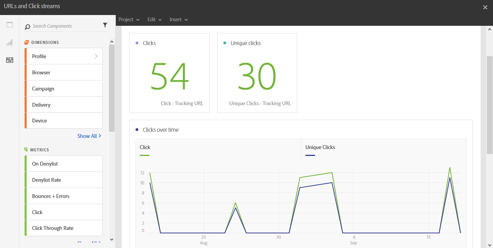

# URLs and click streams{#urls-and-click-streams}

The **URLs and click streams** shows the URLs that were clicked the most during a delivery, or several deliveries if they are linked to a campaign or program.

Each table is represented by summary numbers and charts. You can change how the details are shown in their respective visualization settings.

The **Most visited links** table contains the available data for recipient behavior per delivery, such as:

* **Click**: The number of times content was clicked in a delivery.
* **Unique clicks**: The number of recipients who clicked on content in a delivery.
