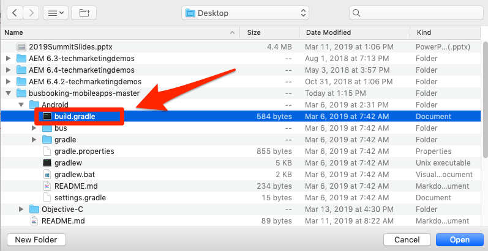
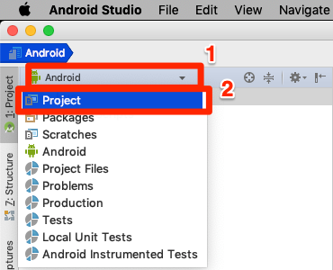
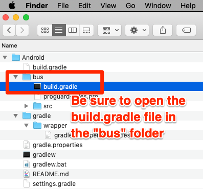
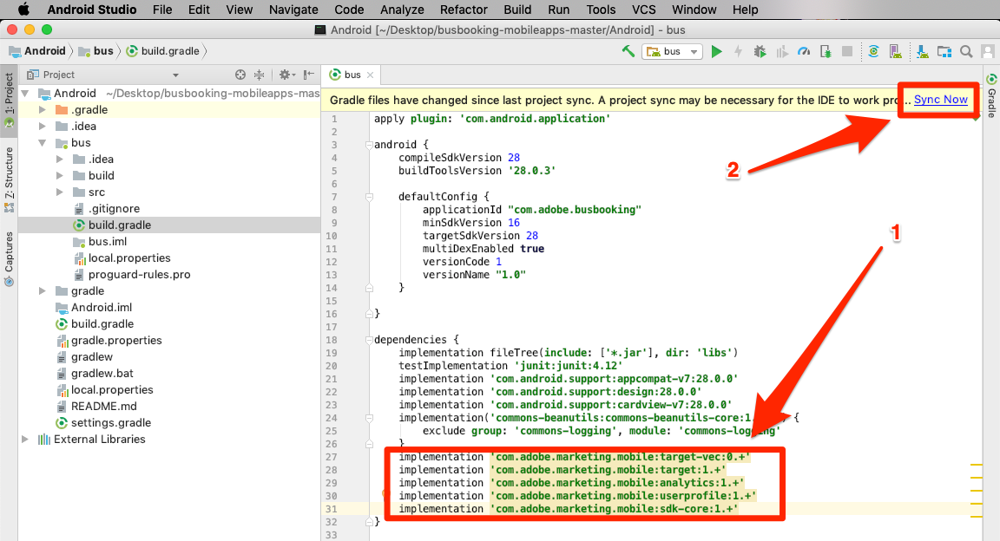
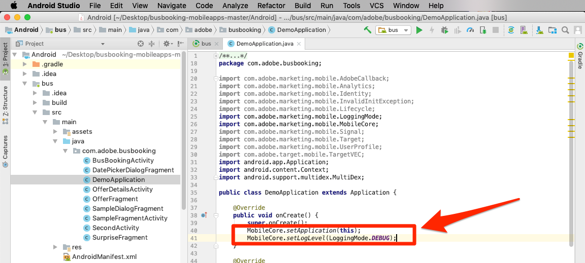
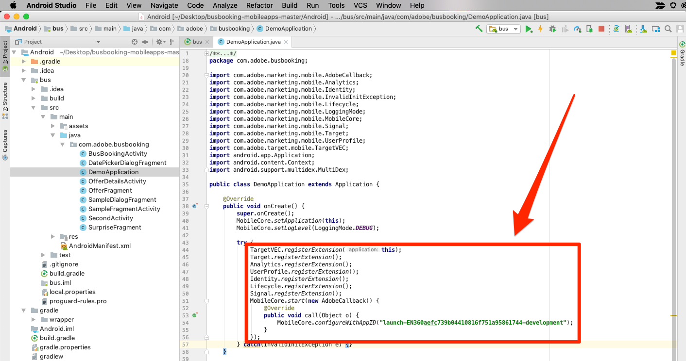

# Install the Mobile SDK

In this lesson, you will implement the Mobile SDK with the extensions and settings corresponding to your Launch property's Development environment.

## Prerequisites

In this lesson we will start adding code to the Bus Booking app, so if you haven't already done so:

1. Download [Android Studio](https://developer.android.com/studio)
1. Download the [Bus Booking app](https://github.com/Adobe-Marketing-Cloud/busbooking-mobileapps)
1. Install [Gradle](https://gradle.org/)

## Learning Objectives

At the end of this lesson, you will be able to:

* Obtain the installation instructions for your mobile Launch property
* Understand the difference between a Development, Staging, and Production environment
* Update your `build.gradle` file to add the Mobile SDK
* Import the Mobile SDK into your app
* Verify that the SDK has been implemented successfully

## Get the Installation Instructions

The Installation Instructions for mobile Launch properties are a collection of code snippets that you add to specific locations in your mobile app.

Click on the `Environments` tab in the top navigation to go to the environments page. Note that Development, Staging, and Production environments have been pre-created for you. These correspond to the typical environments in the code development and release process. Code is first written by a developer in a Development environment. When they have completed their work, they send it to a Staging environment for QA and other teams to review. Once the QA and other teams are satisfied, the code is then published to the Production environment, which is the public-facing environment  which your visitors experience when they download your app.  

Launch permits additional Development environments, which is useful in large organizations in which multiple developers are working on different projects at the same time.

Development, Staging, and Production are the only environments we need to complete the tutorial.  


In the **[!UICONTROL Development]** row, click the Install icon  to open the embed code modal.  

   

Let's go through the instructions step-by-step.

## Update the build.gradle file

If you have previously used Launch in websites, one of the first things you will notice is that there are a lot more installation instructions for mobile apps than for websites.

The Adobe Mobile SDK for Android uses Gradle to manage dependencies between its various components. One of the first things we will do is add the Adobe Mobile SDK dependencies to the Bus Booking app's build.gradle file.

**To update the build.gradle file**

1. Open Android Studio
1. Select "Open an existing Android Studio Project"

   

1. Open the build.gradle file at the root of the Bus Booking Android folder:

   

1. Open the dropdown and switch to the Project view

   

1. Open the **Android > bus > build.gradle** file

   

1. In the Launch interface, make sure the operating system to `Android`

   

1. In Android Studio, paste the dependencies from your clipboard right after the existing dependencies
1. Click the "Sync Now" link to sync the project

   

## Update the AppDelegate

Now it's time to update the App to import the SDK

**To import the SDK**

1. Open the **Android > bus > src > main > java > com.adobe.busbooking > DemoApplication** file

   

1. In the Launch interface, scroll to the **[!UICONTROL Add Initialization Code]** section.
1. Copy the import statements, by clicking the first  icon in the **[!UICONTROL Add Initialization Code]** section:

   

1. In Android Studio, paste these import statements *before* the existing imports in the `DemoApplication` file

    

1. In the Launch interface, copy the two lines related to the Core extension, by clicking the second  icon in the **[!UICONTROL Add Initialization Code]** section. The second line turns on console logging statements (available options are "DEBUG", "VERBOSE", "WARNING", and "ERROR").

   

1. In Android Studio, paste these Core statements into the `DemoApplication` file right after `super.onCreate()`:

   

1. In the Launch interface, copy the extension statements, by clicking the third  icon in the [!UICONTROL Add Initialization Code] section.

   

1. In Android Studio, paste these extension statements into the `DemoApplication` file just after the Core statements. Note that `MobileCore.configureWithAppID` contains the identifier of the Launch development environment of your property. This is important, as you will need to update this value when we are ready to deploy the app to the production environment.

   

>[!IMPORTANT] Add "this" as an argument to `TargetVEC.registerExtension(this)` if it is not already in the implementation instructions.

## Verify the implementation

1. Save your Android Studio project
1. Run the app and launch it in the Emulator. If you don't have any emulator devices configured, configure one now, being sure to configure a device running Android 4.0 (API 14) or later. In this screenshots, we are emulating a Pixel 2.

   

1. Wait for the Emulator to launch and fully open the app to the booking screen (this may take a few minutes)

   

1. Confirm that calls are being made to the Adobe servers in the Android Studio Logcat

   

Here are examples of some specific calls you can look for:

1. **Calls to retrieve the Launch configuration** (filter Logcat to `adobedtm.com`). Note the extension configurations which you entered in the earlier lesson. While adding the extension requires an update to the app, these settings can be managed externally in Launch and changed at any time:

    ```java
    03-14 16:30:29.484 24869-24930/com.adobe.busbooking D/ADBMobile: ConfigurationExtension - Cached configuration loaded. 
     {"target.propertyToken":"","target.timeout":5,"global.privacy":"optedin","analytics.backdatePreviousSessionInfo":true,"analytics.offlineEnabled":true,"build.environment":"dev","rules.url":"https://assets.adobedtm.com/launch-EN360aefc739b04410816f751a95861744-development-rules.zip","experienceCloud.org":"7ABB3E6A5A7491460A495D61@AdobeOrg","target.clientCode":"techmarketingdemos","target.autoFetch":true,"target.fetchBackground":false,"lifecycle.sessionTimeout":300,"target.environmentId":"busbookingapp","analytics.server":"tmd.sc.omtrdc.net","analytics.rsids":"tmd-mobile-dev1","analytics.batchLimit":0,"property.id":"PRb4881271498b4f2cbaf67d38a8f3891a","global.ssl":true,"analytics.aamForwardingEnabled":true}
    ```

1. **Request to the ID Service** (filter Logcat to `IdentityExtension`) In this example, the ID (`d_mid`)has already been set and is just being reported up again)

    ```java
   03-14 17:01:18.526 7743-7803/com.adobe.busbooking D/ADBMobile: IdentityExtension - Sending request (https://dpm.demdex.net/id?d_mid=59651426340521082405908216148091920022&d_ver=2&d_orgid=7ABB3E6A5A7491460A495D61%40AdobeOrg)
    ```

1. **Analytics request** (filter Logcat to `AnalyticsExtension`)

    ```java
   03-14 17:01:18.509 7743-7777/com.adobe.busbooking D/ADBMobile: AnalyticsExtension - Sending Analytics ID call (https://tmd.sc.omtrdc.net/id?mcorgid=7ABB3E6A5A7491460A495D61%40AdobeOrg&mid=59651426340521082405908216148091920022)
    ```

Congratulations, you've added the SDK to a mobile app!

[Next "Add the Experience Cloud ID Service" >](id-service.md)