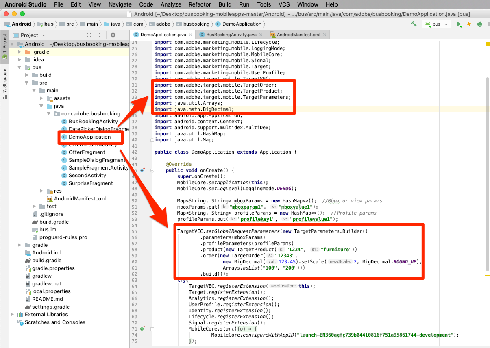
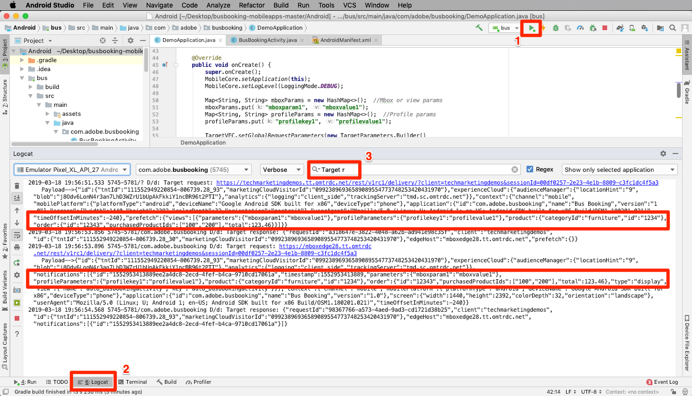
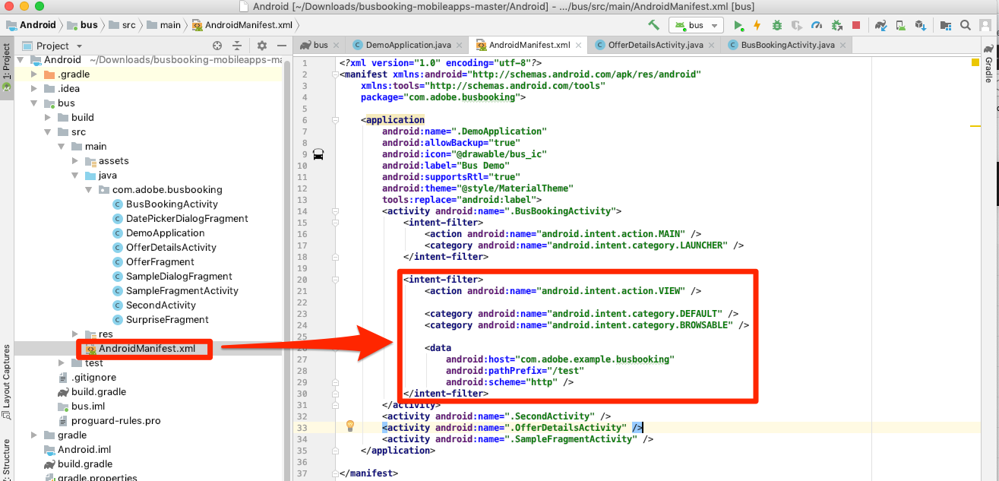
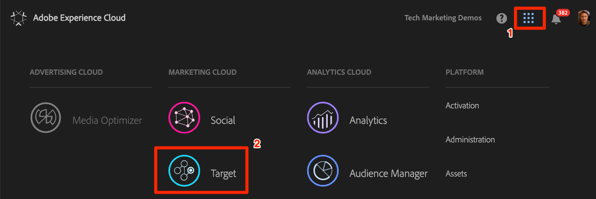
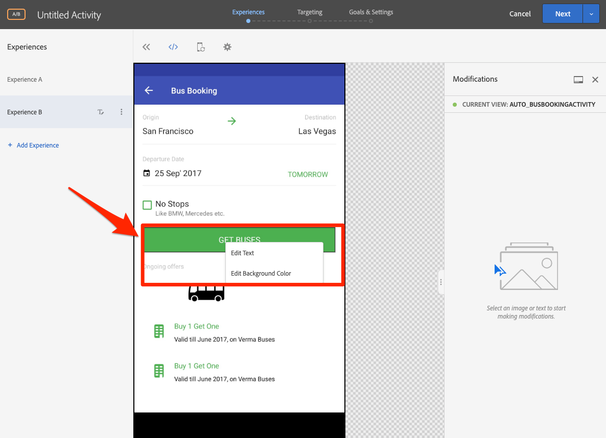

# Add Adobe Target's Visual Experience Composer (VEC)

In this lesson, you will enable the Target Visual Experience Composer (VEC) for Mobile apps.

[Adobe Target](https://marketing.adobe.com/resources/help/en_US/target/) is the Adobe Experience Cloud solution that provides everything you need to tailor and personalize your customers' experience, so you can maximize revenue on your web and mobile sites, apps, social media, and other digital channels.

The Visual Experience Composer (VEC) for Native Mobile Apps lets you create activities and personalize content on native mobile apps in a do-it-yourself fashion without continuous development dependencies and app-release cycles.

In the lesson [Add Extensions](launch-add-extensions.md), you added the Target VEC extension to your Launch property. In the lesson [Install the Mobile SDK](launch-install-the-mobile-sdk.md) you imported the extension into the sample application. Only a few minor updates are required to start setting up activities in Target's mobile visual experience composer!

>[!IMPORTANT] Both the Target and Target VEC Launch extensions are required to use the Target VEC in your mobile application.

## Learning Objectives

At the end of this lesson, you will be able to:

* Enable the sample app for the Target VEC
* Add parameters to the Target VEC request
* Pair your device with the VEC
* Create an activity using the VEC

## Prerequisites

To complete the lessons in this section, you must:

* Complete the lessons in [Configure Launch](launch-create-a-property.md) section.
* Have Approver-level access to the Adobe Target interface

## The App Load request

Target will fire an "app load" request when the app first loads because of the settings we selected when we configured the Target VEC extension. This request prefetches all Target VEC activities that you  created for your app.

In Android studio, filter Logcat to "Target r" to show the Target requests and responses. Notice the parameters for the application name and version. All Target VEC activities that you create will automatically be targeted to these properties.

   

## Add Parameters

As you just saw in the last exercise, app Lifecycle metrics are automatically included as parameters in the Target VEC request. You can also add custom parameters to the requests, globally or for specific views in the app.

**To add custom parameters globally**

1. In Android Studio, open `DemoApplication` file.
1. Import the Target VEC extension by adding `import ACPTargetVEC` beneath the existing import
1. Add the following sample code in the `onCreate()` function, before the extensions are registered. This example code shows how mbox parameters, profile parameters, product (or entity) parameters, and order parameters can be added to the TargetVEC request. This example uses static values, while in your actual app you would likely want to use dynamic variables to populate the values. And of course, you would only want to populate the parameters that are relevant to all views:

   ```java
   Map<String, String>targetParams = new HashMap<>(); //params
   targetParams.put( "param1", "value1");
   Map<String, String>taregtProfileParams = new HashMap<>(); //profile params
   taregtProfileParams.put("profilekey1","profilevalue1");

   TargetVEC.setGlobalRequestParameters(new TargetParameters.Builder()
            .parameters(targetParams)
            .profileParameters(taregtProfileParams)
            .product(new TargetProduct("1234", "furniture"))
            .order(new TargetOrder("12343", 123.45, Arrays.asList("100", "200")))
            .build());
   ```

1. You may notice errors in Android Studio, since the parameter code above requires the following imports, which you need to add to the file:

   ```java
   import com.adobe.marketing.mobile.TargetOrder;
   import com.adobe.marketing.mobile.TargetProduct;
   import com.adobe.marketing.mobile.TargetParameters;
   import java.util.Arrays;
   import java.util.Map;
   import java.util.HashMap;
   ```

   

Now that you've added parameters to the app, it's time to confirm they are being passed in the request.

**To verify the parameters**

1. Save the Android Studio project
1. Rebuild the app and wait for it to reopen in the Emulator
1. Open the Logcat pane of Android Studio
1. Filter to show all statements with "Target r"
1. The custom parameters you just added should be visible in the request

   

For more information, and details on how to pass parameters with specific views, see [the documentation](https://docs.adobe.com/content/help/en/target/using/implement-target/mobile-apps/composer/mobile-visual-experience-composer-android.html#parameters).

## Pairing the Mobile App with the Target Interface

In order to create VEC activities in the Target interface, you must first pair Target with your app. This pairing is achieved with the use of deep links. 

We will expand this tutorial in the future to show how to pair your Android app with the VEC and create an activity in the Target VEC. Until then, please see the [Android - set up the mobile app](https://docs.adobe.com/content/help/en/target/using/implement-target/mobile-apps/composer/mobile-visual-experience-composer-android.html)

<!--
### Creating the Deep Link

Android supports the use of [Deep links and Android App Links](https://developer.android.com/training/app-links/deep-linking) to create URLs that go directly to specific locations in your app. You probably already use these in your app. If so, you can use these existing links to pair with Target. For this tutorial, you will review the deep link scheme already defined in the Bus Booking app so you have a sense of what you will need to have in your own app.

**To verify the Intent Filter**

1. In Android Studio, open the AndroidManifest.xml file
1. Note that there is already an Intent Filter configured for the deep link scheme of the Bus Booking app
1. Note that the `Host` and `Scheme` are already set to `com.adobe.example.busbooking` and `http`, respectively. This means that a url like `http://busboooking.example.adobe.com` when opened in the Simulator should automatically open the sample app

   

The next step is to confirm that the deep link scheme is working

### Verify the deep link

Because of the way the Intent Filter is configured, when a user with your app installed opens a URL like `http://busboooking.example.adobe.com` in the Emulator it will open your application.

**To verify the deep link scheme**

1. Save the Android Studio project
1. Rebuild the app
1. In the Emulator, open Chrome
1. Enter the url `http://busboooking.example.adobe.com` into the address bar
1. You should get prompted with a modal to "Open this page in "DemoApplication"
1. Click `Open`
1. This should open the Bus Booking app

   

Now that your deep link structure is set up, you are ready to use the Target VEC to set up activities!

## Create an activity in the Mobile VEC

Now let's create an activity in the Target UI.

**To Create an Activity with the Target VEC**

1. Log into the [Adobe Experience Cloud](https://experiencecloud.adobe.com)
1. Use the solution switcher to go to Target

   

1. Launch Target

   

1. Click the **[!UICONTROL Create Activity]** button and select **[!UICONTROL A/B Test]**
1. Select **[!UICONTROL Mobile App]**
1. Make sure **[!UICONTROL Visual]** is selected under **[!UICONTROL Choose Experience Composer]**

   >[!WARNING] The Visual Experience Composer for mobile apps is currently in Beta and may not be available in your Target account.  Even if you have been able to complete all of the steps thus far, you may not see the Mobile VEC option as pictured below.

1. Click the **[!UICONTROL Next]** button
  
   

1. On the **[!UICONTROL Select an app to use]** screen, click **[!UICONTROL Add New App]**

   

1. Enter the url scheme you just defined in the  **[!UICONTROL Enter URL scheme]** field, e.g. `http://busboooking.example.adobe.com`
1. Click **[!UICONTROL Create Deep Link]**

   

    >[!NOTE] You have a few options to send the deep link to the app. You can:
    >
    >   1. Take a photo of the QR code from your iOS Device (in our tutorial, the device would have to be linked to Android Studio)
    >   1. Copy the deep link from the Target interface and send it to the device however you would like
    >   1. Email the deep link to a valid email address and then open the link with an email application on the device

1. Click on the **[!UICONTROL Copy & Send Link]** tab.

   

1. Switch back to the Emulator
1. Open Safari in the Emulator
1. Paste the deep link URL into the address bar
1. Click to open the app

   

    > [!TIP] If you are unsuccessful when copy-and-pasting the URL from your Desktop to the Emulator it's usually for one of these two reasons:
    >
    >   1. **The URL copied from the Target interface doesn't paste into the Emulator** This happens when the Desktop and Emulator clipboards are not synced.  If this happens, try toggling off and on the `Automatically Sync Pasteboard` setting in the Emulator and copy/pasting again:
    >
    >      
    >
    >   1. **Pasting the URL lands on the Google Search results page** Try repasting the deep link URL into the address bar and hitting `Enter`. You might need to repeat this a few times.

1. After the App has loaded, switch back to your browser tab where you have Target opened. You should see your app loaded in the VEC.
1. Click on text and image assets in your app and you should see options to edit and replace them!

   

1. Make some changes to the first screen in your app
1. Now position the Emulator next to the browser with the VEC open
1. Navigate to a different screen in the app and notice how the VEC updates with the Emulator!
1. You can make updates to multiple views in your app, in a single activity!


1. You can also visually add click-tracking metrics!
1. Save and Approve your activity and verify that you can see it in the sample app

Pairing the device with the VEC is a one-time action. When you create more activities in the future on the same device, you will just be able to select the device from a list, as pictured below:

   

>[!TIP] If you have a device open, but it is "Unavailable" in the selection menu, background the app by returning to the Home screen and then move the app back into the foreground to make it "Available" again.

## Building Audiences based on Lifecyle metrics

Lifecycle metrics built-in metrics about the visitor's usage of your app that are automatically included in calls made by the Adobe Mobile SDK. You can easily build audiences in Target based on these metrics.

**To create an audience**

1. In the Target interface, click **Audiences** in the top navigation
1. Click the **Create Audience** button

   

1. Name the Audience `Launches < 5`
1. Click **Add Rule > Custom**

   

1. In the first dropdown, select the **a.Launches** parameter. All of the Lifecycle metric parameters begin with the "a." prefix. We will Target content based on the number of app Launches the user has, which is an excellent way to target first time users of your app with an instructional, first-time-user-experience (FTUE).
1. In the next dropdown, select **is less than**
1. In the third dropdown, enter **5**
1. Click **Save**

   

Note that there are a huge variety of out-of-the-box audience building options in Target. Additionally, you can send up custom data in the Target request for audience-building, use audiences shared from other Experience Cloud solutions such as Audience Manager and Analytics, and CRM data shared to Target using the Customer Attributes feature of the People Core Service.
  -->
[Next "Add Adobe Target" >](target.md)