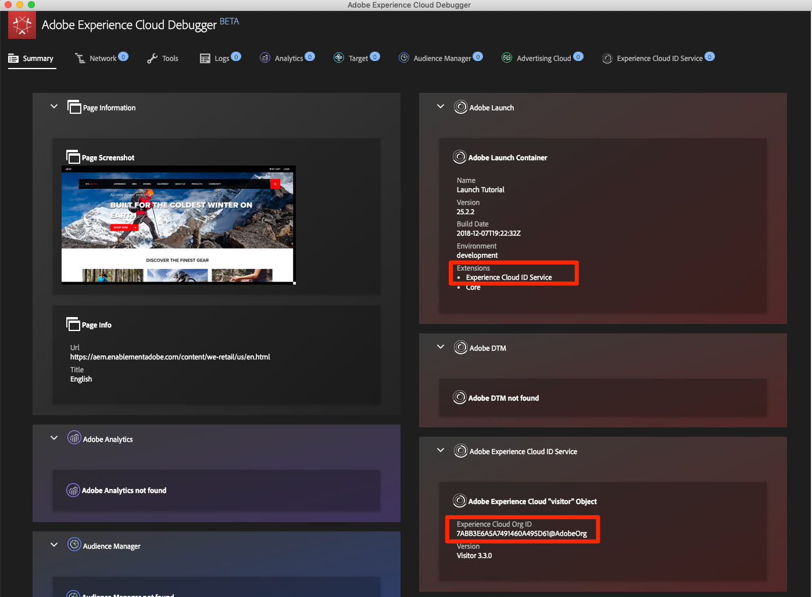
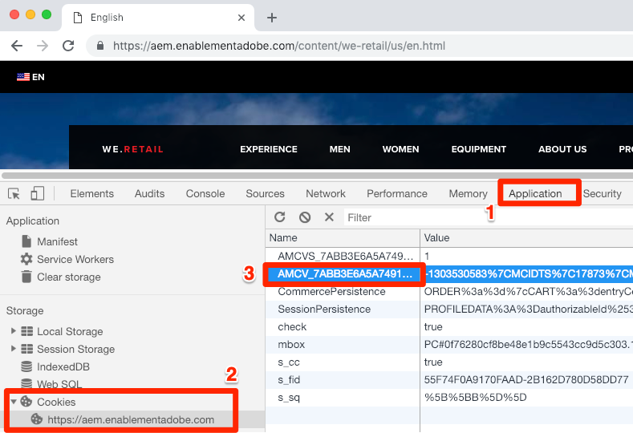
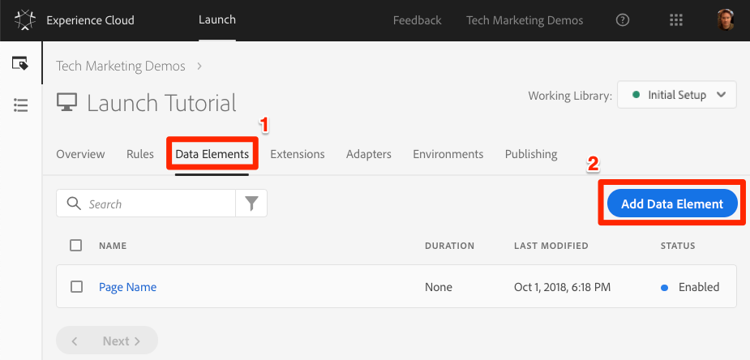
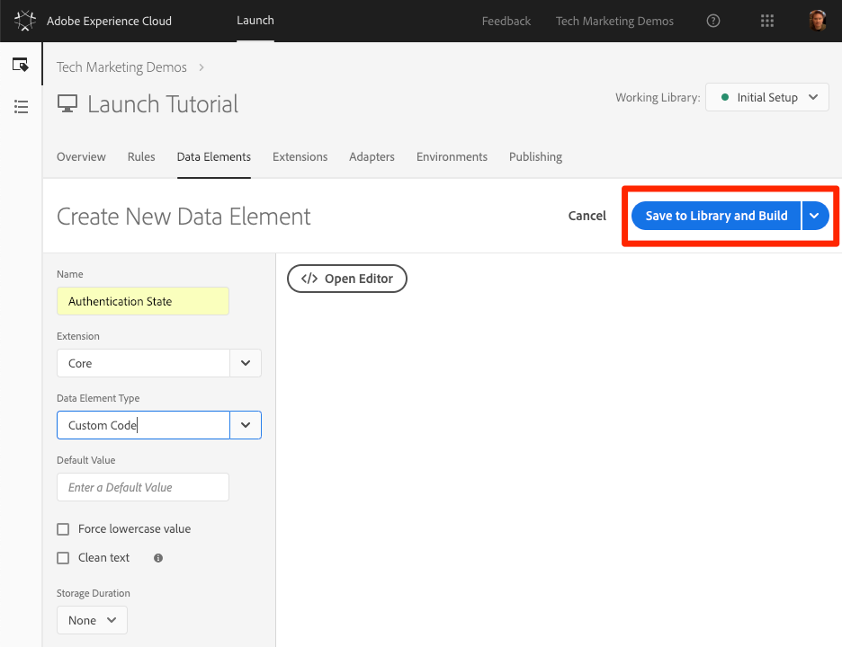
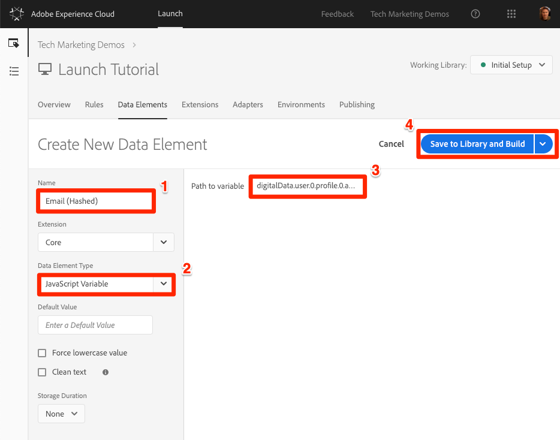
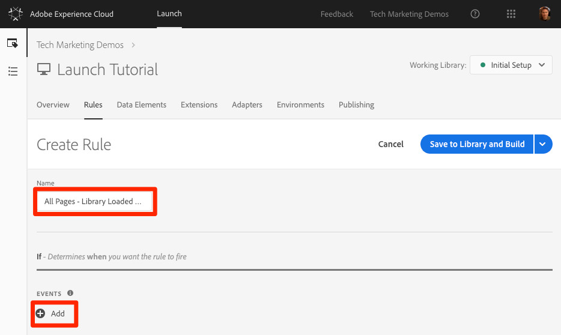
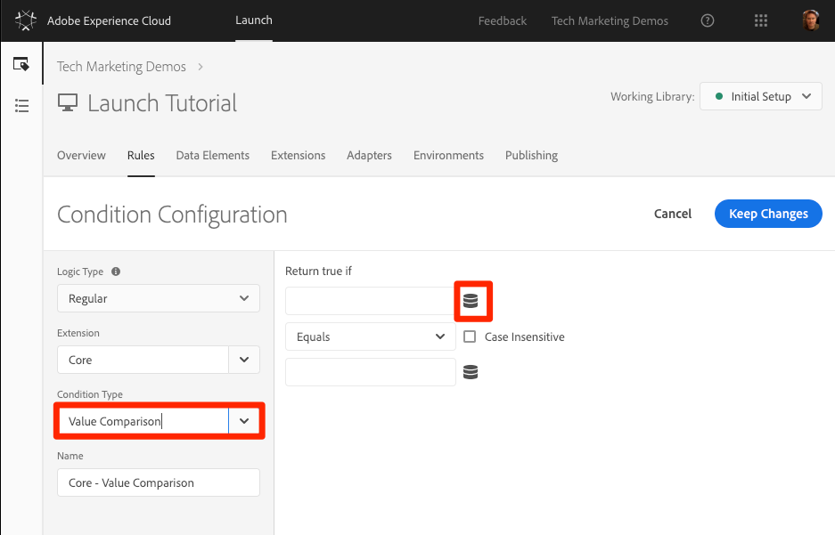
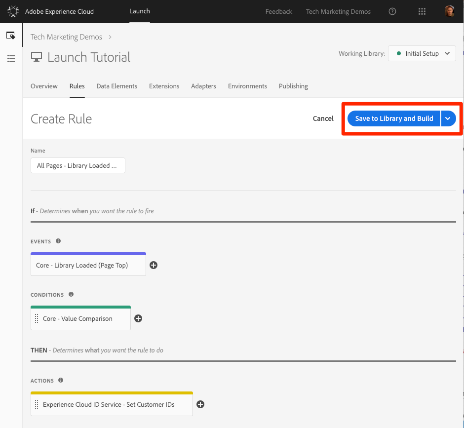
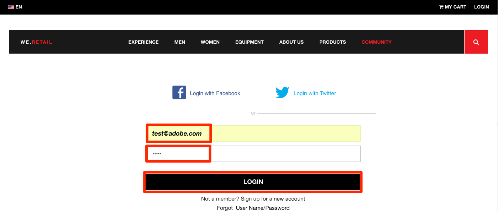
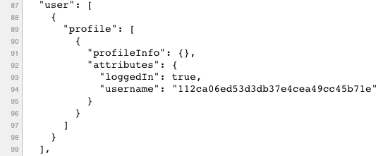

# Add Adobe Campaign

This lesson will guide your through the steps required to implement the [Experience Cloud ID Service extension](https://docs.adobelaunch.com/extension-reference/web/experience-cloud-id-service-extension) and send customer ids.

The [Experience Cloud ID Service](https://marketing.adobe.com/resources/help/en_US/mcvid/) sets a common visitor id across all Adobe solutions in order to power Experience Cloud capabilities such as audience-sharing between solutions.  You can also send your own customer ids to the Service to enable cross-device targeting and integrations with your Customer Relationship Management (CRM) system.

## Learning Objectives

At the end of this lesson, you will be able to:

* Add the ID Service extension
* Create a data element to collect your customer ids
* Create a rule that uses the "Set Customer IDs" action to send the customer ids to Adobe
* Use the rule ordering feature to sequence rules that fire on the same event

## Prerequisites

You should have already completed the lessons in the [Configure Launch](launch.md) section.

## Add the ID Service Extension

Since this is the first extension you are adding, here is a quick overview of extensions. Extensions are one of the core features of Launch. An extension is an integration built by Adobe, an Adobe partner, or any Adobe customer that adds new and endless options for the tags that you can deploy to your website. If you think of Launch as an operating system, extensions are the apps that you install so Launch can do the things you need it to do.

**To add the ID Service Extension**

1. In the top navigation, click **[!UICONTROL Extensions]**

1. Click **[!UICONTROL Catalog]** to go to the Extensions Catalog page

    

1. Note the variety of extensions that are available in the Catalog

1. In the filter at the top, type "id" to filter the Catalog

1. On the card for the Experience Cloud ID Service, click **[!UICONTROL Install]**

    

1. Note that your Experience Cloud Organization ID has been auto-detected for you.

1. Leave all of the default settings and click **[!UICONTROL Save to Library and Build]**

    

>[!NOTE] Each version of the ID Service extension comes with a specific version of VisitorAPI.js which is noted in the extension description. You update the VisitorAPI.js version by updating the ID Service extension.

### Validate the Extension

The ID Service extension is one of the few Launch extensions that makes a request without having to use a rule action. The extension will automatically make a request to the ID Service on the first page load of the first visit to a website. Once the ID has been requested, it will be stored in a first party cookie beginning with "AMCV_".

**To validate the ID Service extension**

1. Open the [We.Retail site](https://aem.enablementadobe.com/content/we-retail/us/en.html)

1. Make sure the Debugger is mapping the Launch property to *your* Development environment, as described in the [earlier lesson](launch-switch-environments.md).

1. On the Summary tab of the Debugger, the Launch section should indicate that the Experience Cloud ID Service extension is implemented.

1. Also, on the Summary tab, the ID Service section should populate with the same Org ID that was on your extension configuration screen in the Launch interface:

   

1. The initial request to retrieve the Visitor ID might appear in the ID Service tab of the Debugger. It might have already been requested, though, so don't worry if you don't see it:
   

1. After the initial request to fetch the Visitor ID, the ID is stored in a cookie whose name begins with `AMCV_`. You can confirm that the cookie has been set by doing the following:
    1. Open your browser's Developer Tools
    1. Go to the `Application` tab
    1. Expand `Cookies` on the left side
    1. Click on the domain `https://aem.enablementadobe.com`
    1. Look for the AMCV_ cookie on the right hand side. You might see several since have loaded the We.Retail site using both it's hardcoded Launch property as well as mapped to your own.

   

That's it! You've added your first extension! For more details on the configuration options of the ID Service, see [the documentation](https://marketing.adobe.com/resources/help/en_US/mcvid/mcvid-function-vars.html).

## Send Customer IDs

Next, you will send a [Customer ID](https://marketing.adobe.com/resources/help/en_US/mcvid/mcvid-authenticated-state.html) to the ID Service. This will allow you to [integrate your CRM](https://marketing.adobe.com/resources/help/en_US/mcloud/attributes.html) with the Experience Cloud as well as track visitors across devices.

In the earlier lesson, [Add Data Elements, Rules, and Libraries](launch-data-elements-rules.md) you created a data element and used it in a rule. Now, you will use those same techniques to send a Customer ID when the visitor is authenticated.  

### Create Data Elements for Customer IDs

Start by creating two data elements:

1. `Authentication State`—to capture whether or not the visitor is logged in
1. `Email (Hashed)`—to capture the hashed version of the email address (used as the customer ID) from the data layer

**To create the data element for Authentication State**

1. Click **[!UICONTROL Data Elements]** in the top navigation
1. Click the **[!UICONTROL Add Data Element]** button

   

1. Name the data element `Authentication State`
1. For the **[!UICONTROL Data Element Type]**, select **[!UICONTROL Custom Code]**
1. Click the **[!UICONTROL Open Editor]** button

   

1. In the [!UICONTROL Edit Code] window, use the following code to return values of "logged in" or "logged out" based on an attribute in the We.Retail site's data layer:

    ```javascript
    if (digitalData.user[0].profile[0].attributes.loggedIn)
        return "logged in"
    else
        return "logged out"
    ```

1. Click **[!UICONTROL Save]** to save the custom code

   

1. Leave all of the other settings on their default values
1. Click **[!UICONTROL Save to Library and Build]** to save the data element and return to the data elements page

   

By knowing the authentication state of the user, you know when a customer id should exist on the page to send to the ID Service. The next step is to create a data element for the customer id itself. On the We.Retail demo site, you will use the hashed version of the visitor's email address.

**To add the data element for the hashed email**

1. Click the **[!UICONTROL Add Data Element]** button

   

1. Name the data element `Email (Hashed)`
1. For the **[!UICONTROL Data Element Type]**, select **[!UICONTROL JavaScript Variable]**
1. As the **[!UICONTROL Path to variable]**, use the following pointer to a variable in the We.Retail site's data layer: `digitalData.user.0.profile.0.attributes.username`
1. Leave all of the other settings on their default values
1. Click **[!UICONTROL Save to Library and Build]** to save the data element

   

### Add a Rule to send the Customer IDs

The Experience Cloud ID Service passes the Customer IDs in rules using an action called “Set Customer IDs.”  You will now create a rule to trigger this action when the visitor is authenticated.

**To create a rule to send the Customer IDs**

1. In the top navigation, click **[!UICONTROL Rules]**
1. Click **[!UICONTROL Add Rule]** to open the Rule Builder

   

1. Name the rule `All Pages - Library Loaded - Authenticated - 10`
  
    >[!TIP] This naming convention indicates you are firing this rule at the top of all pages when the user is authenticated and it will have an order of “10”. Using a naming convention like this&mdash;instead of naming it for the solutions triggered in the actions&mdash;will allow you to minimize the overall number of rules needed by your implementation.

1. Under **[!UICONTROL Events]** click **[!UICONTROL Add]**

   

    1. For the **[!UICONTROL Event Type]** select **[!UICONTROL Library Loaded (Page Top)]**
    1. For the  **[!UICONTROL Order]** enter `10`. The Order controls the sequence of rules that are triggered by the same event. Rules with a lower order will fire before rules with a higher order. In this case, you want to set the customer ID before you fire the Target request, which you will do in the next lesson with a rule with an order of `50` .
    1. Click the **[!UICONTROL Keep Changes]** button to return to the Rule Builder

    

1. Under **[!UICONTROL Conditions]** click **[!UICONTROL Add]**

   

    1. For the **[!UICONTROL Condition Type]** select **[!UICONTROL Value Comparison]**
    1. Click the  icon to open the Data Element modal

        

    1. In the Data Element Modal, click on **[!UICONTROL Authentication State]** and then click **[!UICONTROL Select]**

        

1. Make sure `Equals` is the operator
1. Type "logged in" in the text field, causing the rule fire whenever the Data Element “Authentication State” has has a value of “logged in”

1. Click **[!UICONTROL Keep Changes]**

   

1. Under **[!UICONTROL Actions]** click **[!UICONTROL Add]**

   

    1. For the **[!UICONTROL Extension]** select **[!UICONTROL Experience Cloud ID Service]**
    1. For the **[!UICONTROL Action Type]** select **[!UICONTROL Set Customer IDs]**
    1. For the **[!UICONTROL Integration Code]** enter `crm_id`
    1. For the **[!UICONTROL Value]** enter open the Data Element selector modal and select the `Email (Hashed)`
    1. For the **[!UICONTROL Auth State]** select **[!UICONTROL Authenticated]**
    1. Click the **[!UICONTROL Keep Changes]** button to save the action and return to the Rule Builder

        

1. Click the **[!UICONTROL Save to Library and Build]** button to save the rule

   

You've now created a rule that will send the Customer ID as a variable `crm_id` when the visitor is Authenticated. Since you specified the Order as `10` this rule will fire before your `All Pages - Library Loaded` rule created in the [Add Data Elements, Rules and Libraries](launch-data-elements-rules.md) lesson which uses the default Order value of `50`.

### Validate the Customer IDs

To validate your work, you will log into the We.Retail site to confirm the behavior of the new rule.

**To log into the We.Retail site**

1. Open the [We.Retail site](https://aem.enablementadobe.com/content/we-retail/us/en.html)

1. Make sure the Debugger is mapping the Launch property to *your* Development environment, as described in the [earlier lesson](launch-switch-environments.md)

   

1. Click the **[!UICONTROL LOGIN]** link in the top right corner of the We.Retail site

   

1. Enter `test@adobe.com` as the username
1. Enter `test` as the password
1. Click the **[!UICONTROL LOGIN]** button

   

1. Return to the Homepage

Now, confirm the customer id is sent to the Service using the Debugger extension.

**To validate that the ID Service is passing the customer id**

1. Make sure the tab with the We.Retail site is in focus
1. In the Debugger, go to the Experience Cloud ID Service tab
1. Expand your Org ID
1. Click on the cell with the `Customer ID - crm_id` value
1. In the modal, note the customer id value and that the `AUTHENTICATED` state is reflected:

   

1. Note that you can confirm the hashed email value by viewing the source code of the We.Retail page and looking at the username property. It should match the value you see in the Debugger:

   

### Additional Validation Tips

Launch also has rich console logging features. To turn them on, go to the **[!UICONTROL Tools]** tab in the Debugger and turn on the **[!UICONTROL Launch Console Logging]** toggle.


This will turn on console logging both in your browser console and in the Logs tab of the Debugger. You should see the logging of all of the rules you have created so far! Note that new log entries are added to the top of the list, so your rule "All Pages - Library Loaded - Authenticated - 10" should fire before the "All Pages - Library Loaded" rule and appear below it in the Debugger's Console Logging:


[Next "Add Adobe Target" >](target.md)
