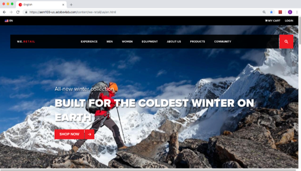

# Overview

_Implementing the Experience Cloud in Mobile iOS Applications_ is the perfect starting point for mobile app developers who want to learn how to implement the Adobe Experience Cloud solutions in their iOS apps.

Each lesson contains how-to exercises and foundational information to help you implement the Experience Cloud and understand its value.  Callouts are provided to highlight information which might be useful to customers migrating from our previous SDK. A demo app is provided for you to complete the tutorial, so you can learn the underlying techniques in a safe environment. After completing this tutorial, you should be ready to start implementing all of your marketing solutions through Launch on your own website.

After completing this you will be able to:

* Create a Launch Property

* Install a Launch Property in a mobile app

* Add the following Adobe Experience Cloud solutions:
  * **[Experience Cloud ID Service](id-service.md)**
  * **[Adobe Target](target.md)**
  * **[Adobe Analytics](analytics.md)**
  * **[Adobe Audience Manager](audience-manager.md)**

<!--* ??? Create rules and data elements to send data to the Adobe solutions-->

<!--* Validate the implementation using the Adobe Experience Cloud Debugger-->

* Publish changes in Launch through development, staging, and production environments

## Prerequisites

In these lessons, it is assumed that you have an Adobe Id and the required permissions to complete the exercises. If not, you may need to reach out to your Experience Cloud Administrator to request access.

* For Launch, you must have permission to Develop, Approve, Publish, Manage Extensions, and Manage Environments. For more information on Launch permissions, see [the documentation](https://docs.adobelaunch.com/administration/user-permissions).
* For Adobe Target, you must to know your client code
* For Adobe Analytics, you must know your tracking server and which report suites you will use to complete this tutorial
* For Audience Manager, you must know your Audience Manager Subdomain (also known as the “Partner Name” “Partner ID,” or “Partner Subdomain”)

Also, it is assumed that you are familiar with front-end development languages like HTML and JavaScript. You do not need to be a master of these languages to complete the lessons, but you will get more out of them if you can comfortably read and understand code.

## About Launch

Launch, by Adobe is the next generation of mobile SDK and website tag management capabilities from Adobe. Launch gives customers a simple way to deploy and manage all of the analytics, marketing, and advertising solutions necessary to power relevant customer experiences. There is no additional charge for Launch. It is available for any Adobe Experience Cloud customer.

## About the Lessons

In these lessons, you will implement the Adobe Experience Cloud into a fake meal-tracking app called FoodTracker (from the Apple tutorial "[Start Developing iOS Apps (Swift)](https://developer.apple.com/library/archive/referencelibrary/GettingStarted/DevelopiOSAppsSwift/index.html)"). The App has some simple capabilities that will allow you to complete an Experience Cloud mobile implementation before you move on to your own app. You will build your own Launch property, in your own Experience Cloud organization, and implement in a local copy of the FoodTracker app.

## Get the Tools

1. Download [XCode](https://developer.apple.com/xcode/)
1. Download the completed [FoodTracker app](https://developer.apple.com/sample-code/swift/downloads/09_PersistData.zip) (right-click on this link and click "Save Link As")

Let's get started!

[Next "Create a Launch Property" >](launch.md)