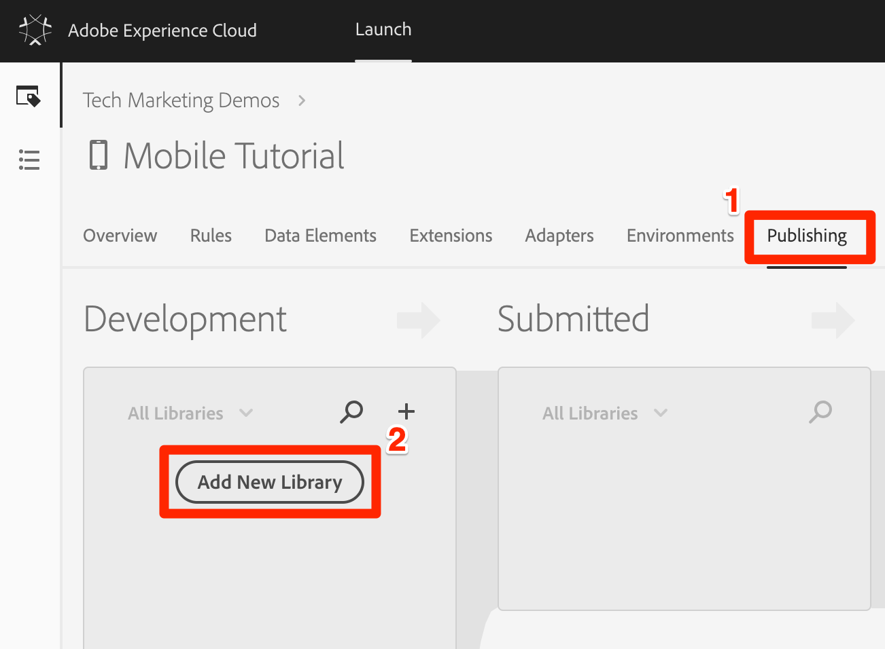
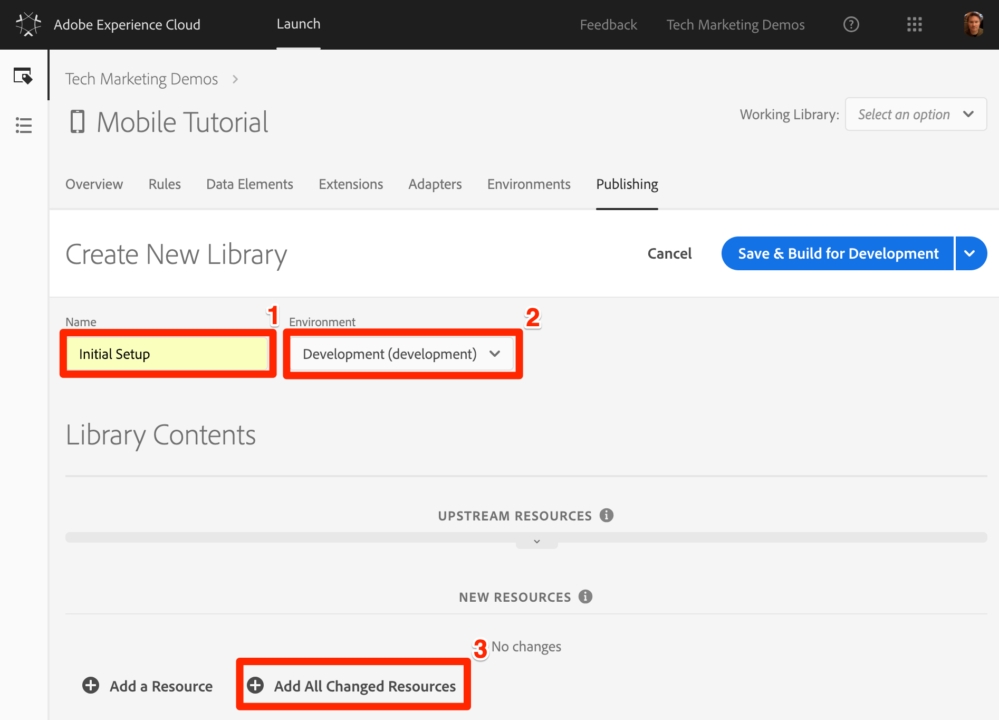

# Add a Library

In this lesson, you will create your first Library.

## Learning Objectives

At the end of this lesson, you will be able to:

* Create a library
* Add changes to a library
* Use the "Working Library" feature to work more efficiently

## Save Your Changes to a Library

After configuring a collection of extensions, data elements, and rules in the Launch interface, you need to package these capabilities and logic into a set of JavaScript code that you can deploy on your website so that marketing tags will fire when visitors come to the site. A library is the set of JavaScript code that will do this.

In an earlier lesson, you implemented the embed code of your development environment on the sample page. When you loaded the sample page a 404 error was returned for the embed code URL because a Launch library had not been built yet and assigned to the environment. Now you will put your new data element and rule in a library so that your sample page can do something.

**To add and build a library**

1. Go to the [!UICONTROL Publishing] tab

1. Click **[!UICONTROL Add New Library]**

   

1. Name the Library `Initial Setup`

1. Select **[!UICONTROL Environment > Development]**

1. Click **[!UICONTROL Add All Changed Resources]**

   

1. Note that after clicking **[!UICONTROL Add All Changed Resources]** Launch summarizes the changes you just made.

1. Click **[!UICONTROL Save & Build for Development]**

   

After a few moments, the status dot will turn green indicating the library successfully built.


## Validate Your Work

Now validate that your rule is working as expected.

Reload your sample page. If you look at the Developer Tools -> Network tab, you should now see a 200 response for your Launch Library!


If you look at the Developer Tools -> Console, you should see the text "The page name is home"


Congratulations, you created your first data element and rule and built your first Launch library!

## Use the Working Library Feature

When you are making a lot of changes in Launch, it is inconvenient to have to come to the Publishing tab, add changes, and build the library each time you want to see the result.  Now that you have created your "Initial Setup" library, you can use a feature called "Working Library" to rapidly save your changes and rebuild the library in a single step.

Make a small change to your "All Pages - Library Loaded" rule. In the top navigation, click **[!UICONTROL Rules]** and then click on the `All Pages - Library Loaded` rule to open it up.


On the `Edit Rule` page, click the ***[!UICONTROL Working Library]*** dropdown and select your `Initial Setup` library.


Once you've selected the library, you should see that the **[!UICONTROL Save]** button now defaults to **[!UICONTROL Save and to Library and Build]**. When you make a change in Launch, you can use this option to automatically add the change directly to your working library and rebuild it.

Test it out. Open your Custom Code action and just add a colon after the text "The page name is" so the entire code block reads:

```javascript
  console.log('The page name is: '+_satellite.getVar('Page Name'));
```

Save the code, keep the changes in the action, and now click the **[!UICONTROL Save to Library and Build]** button.


Wait a moment until the green dot reappears next to the [!UICONTROL Working Library] dropdown. Now, reload your sample page and you should see your change reflected in the console message (you may have to clear your browser cache and reload, in order to see the change to the page):


This is a much faster way of working and you will use this approach for the rest of the tutorial.

[Next "Install the Launch Property and the SDK" >](launch-install-the-mobile-sdk.md)
