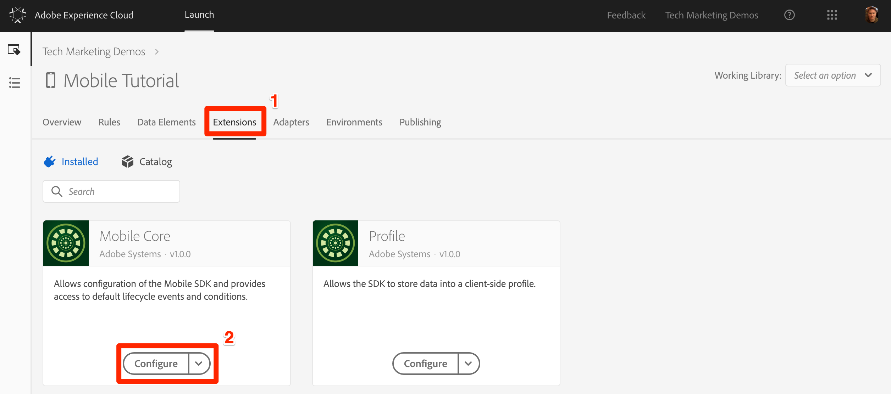
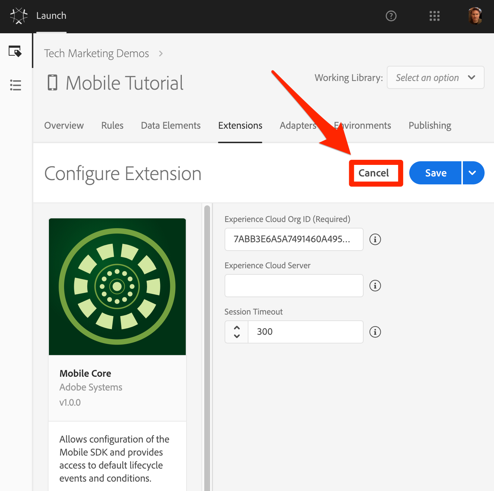
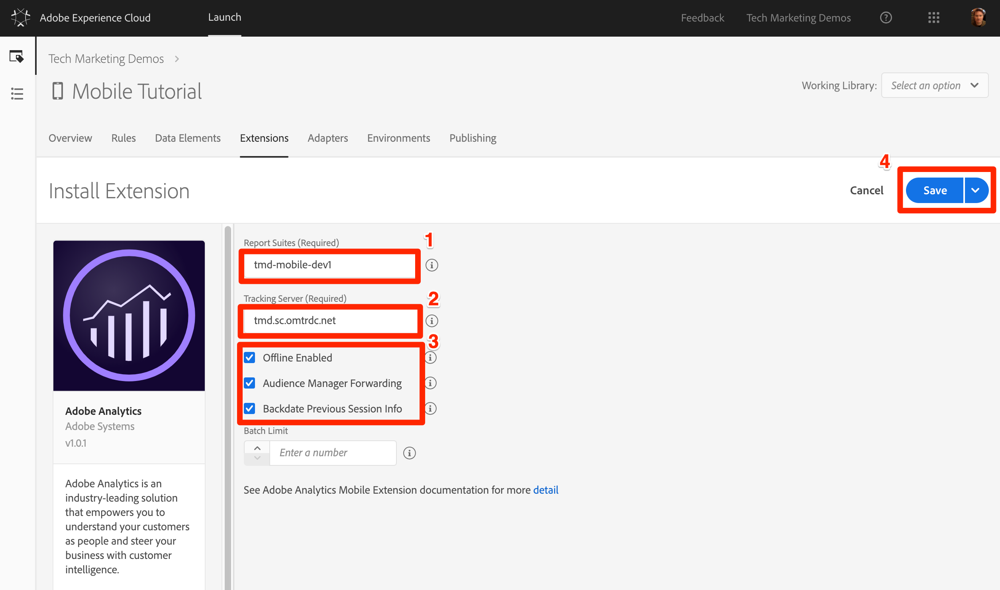
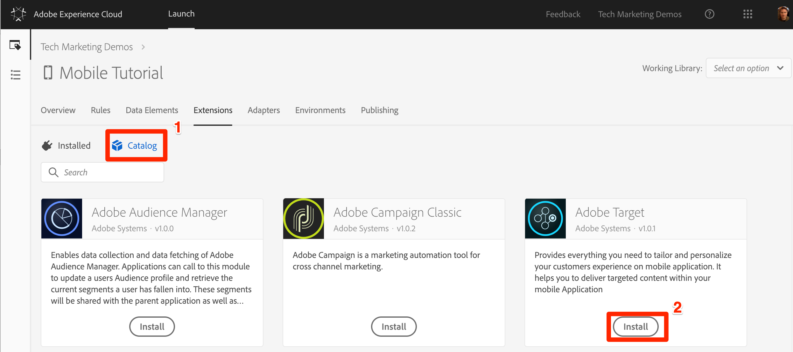
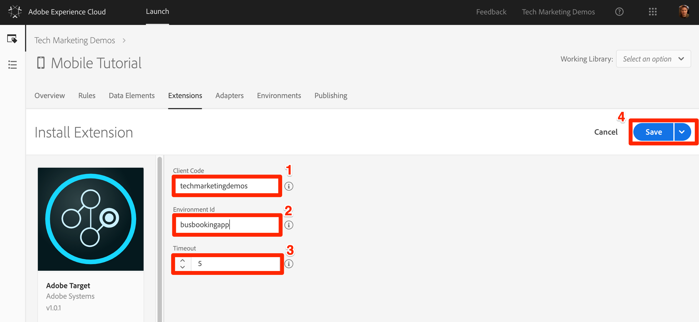
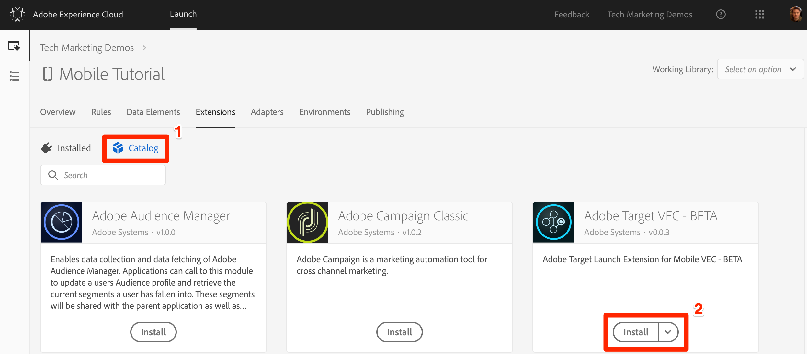
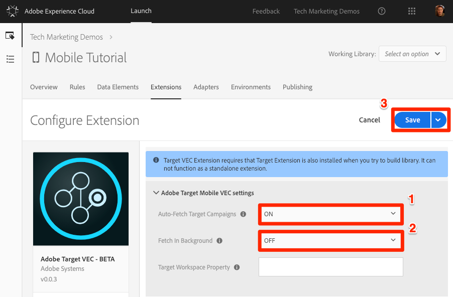

# Add Extensions

In this lesson, you will add extensions to your Launch property.

An extension is a packaged set of code that extends the Launch interface and the library functionality. Extensions give you the ability to choose only the parts of the Adobe Experience Platform SDK that you need for your specific app.

>[!NOTE] Adding and removing Extensions in mobile Launch properties requires you to update the embed codes in your app. This is different from web Launch properties, in which you can add or remove extensions at any time, without having to update your website.

## Prerequisites

In order to complete this lesson, you must have permission to Manage Extensions in Launch. If you are unable to complete any of these steps because the user interface options are not available to you, reach out to your Experience Cloud Administrator to request access. For more information on Launch permissions, see [the documentation](https://docs.adobelaunch.com/administration/user-permissions).

You will also need the following account details for the solutions you will be implementing:

* One Analytics report suite ID. If you don't have a test/dev report suite that you can use for this tutorial, please create one. If you are unsure how to do that, see [the documentation](https://marketing.adobe.com/resources/help/en_US/reference/new_report_suite.html).

* Your Analytics tracking server. You can retrieve your tracking server from your current implementation, Adobe Consultant or Customer Care representative.
  
* Your Target client code.

## Learning Objectives

At the end of this lesson, you will be able to:

* Add Extensions to your a mobile Launch property

## Review the Pre-installed extensions

1. Click the **[!UICONTROL Extensions]** tab to go to the extensions page
1. Note that the `Mobile Core` and `Profile` are pre-installed in every mobile property
1. Click the **[!UICONTROL Configure]** button for the Core extension to examine its settings

   

1. The `Mobile Core` extension represents the core Adobe Experience Platform SDK required for any app implementation. The core contains common set of functionality and frameworks such as a Experience Cloud Identity services, data event hub, rules engine, reusable networking, disk access routines, etc., which is required by all Adobe and third-party extensions.  For more information on the Mobile Core extension, see [the documentation](https://aep-sdks.gitbook.io/docs/using-mobile-extensions/mobile-core).

   1. Note that your Experience Cloud Org ID is detected automatically and pre-populated
   1. The Experience Cloud Server field allows you to specify a custom endpoint for Visitor ID Service requests. Keep the field blank for this tutorial.
   1. The Session Timeout field allows you to specify when new an app session should timeout. By default, if the app is in the background for 300 seconds or more, the Lifecycle session will timeout. Use the default setting for this tutorial.

1. Since you haven't changed any of the settings, click **[!UICONTROL Cancel]** to leave the extension configuration and **[!UICONTROL Discard Changes]** in the modal

    

1. The Profile extension allows the SDK to store data in a client-side profile. It has no configurations, so there is nothing to look at. For more information on the Mobile Core extension, see [the documentation](https://aep-sdks.gitbook.io/docs/using-mobile-extensions/profile).

## Add the Solution Extensions

Now it's time to get to the fun part and start adding the extensions for the solutions you will be implementing in this tutorial. When using Launch with mobile applications, the app must be updated every time an extension is added or removed. So, in order to save time later, we will add all of the extensions now. Just skip any extensions which your company has not licensed.

### Add the Adobe Analytics extension

**To add the extension**

1. Click on the Catalog tab to see the _uninstalled_ extensions

1. Find the **[!UICONTROL Adobe Analytics]** extension and click **[!UICONTROL Install]**
  
  

1. Enter your **[!UICONTROL Report Suite ID]**
1. Enter your **[!UICONTROL Analytics Tracking Server]**
1. Check the box for **[!UICONTROL Offline Enabled]**
1. Check the Box for **[!UICONTROL Audience Manager Forwarding]**, even if you have not licensed Audience Manager
1. Check the box to **[!UICONTROL Backdate Previous Session Info]**
1. Click the **[!UICONTROL Save]** button
  
  

### Add The Target extension

**To add the extension**

1. Click on the Catalog tab to see the _uninstalled_ extensions

1. Find the **[!UICONTROL Adobe Target]** extension and click **[!UICONTROL Install]**
  
   

1. Enter your **[!UICONTROL Client Code]**
1. Enter `busbookingapp` as the **[!UICONTROL Environment Id]** (this will create a new `host` in Target for the app)
1. Leave the **[!UICONTROL Timeout]** set to 5 seconds
1. Click the **[!UICONTROL Save]** button
  
    

### Add The Target VEC extension

**To add the extension**

1. Click on the Catalog tab to see the _uninstalled_ extensions

1. Find the **[!UICONTROL Adobe Target VEC]** extension and click **[!UICONTROL Install]**
  
   

1. Turn on **[!UICONTROL Auto-Fetch Target Campaigns]**. This will pre-fetch all of the Target activities when the app first loads, reducing the number of requests that need to be made.
1. Turn on **[!UICONTROL Fetch In Background]** (this option appears after)
1. Leave the **[!UICONTROL Target Workspace Property]** blank
1. Click the **[!UICONTROL Save]** button
  
    

That's it! Now that you have added the extensions to your property, you can add them to a library:

[Next "Create a Library" >](create-a-library.md)