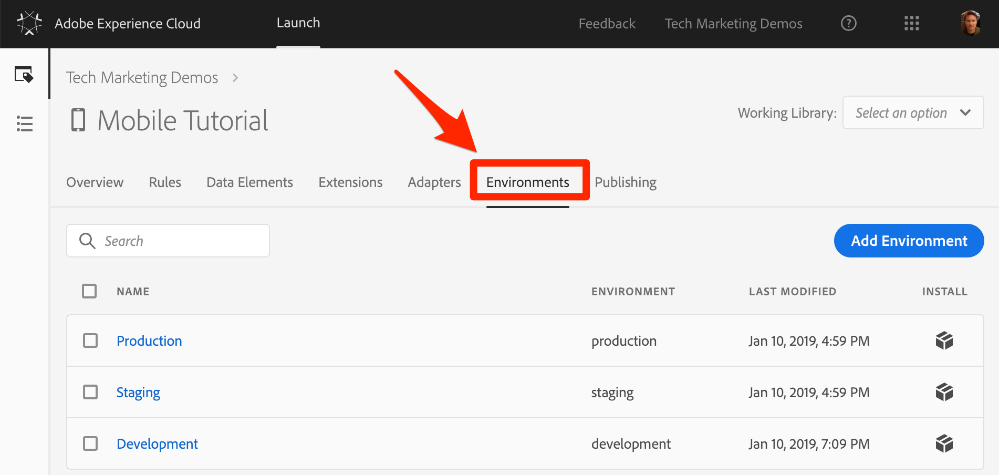
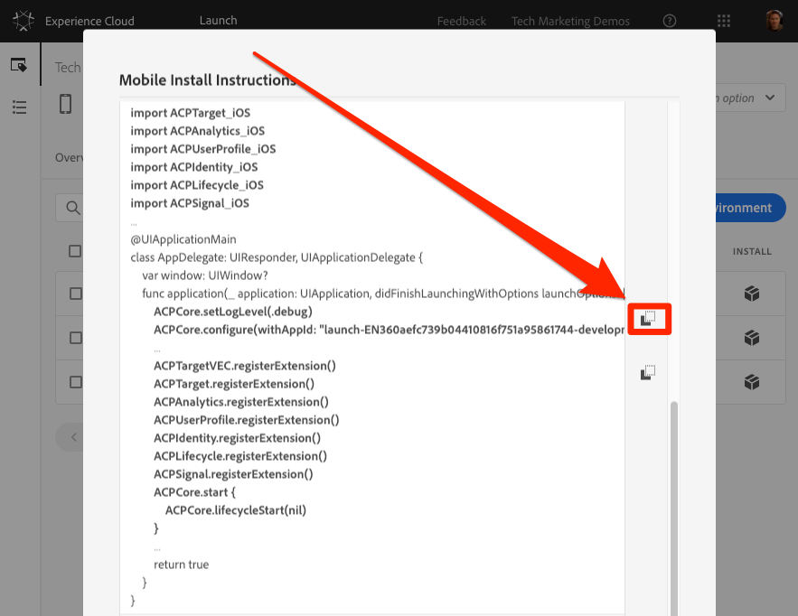

# Install the Mobile SDK

In this lesson, you will implement the Mobile SDK with the extensions and settings corresponding to your Launch property's Development environment. Along the way, you will learn about two main concepts of Launch&mdash;Environments and Embed Codes.

## Learning Objectives

At the end of this lesson, you will be able to:

* Obtain the installation instructions for your mobile Launch property
* Understand the difference between a Development, Staging, and Production environment
* Create and edit the Podfile
* Import the Mobile SDK into your AppDelegate file
* Verify that the SDK has been implemented successfully

## Get the Installation Instructions

The Installation Instructions for mobile Launch properties is a collection of code snippets that you either run in your Terminal or add to specific locations in your mobile app.

From the property Overview screen, click on the `Environments` tab to go to the environments page. Note that Development, Staging, and Production environments have been pre-created for you.

Development, Staging, and Production environments correspond to the typical environments in the code development and release process. Code is first written by a developer in a Development environment. When they have completed their work, they send it to a Staging environment for QA and other teams to review. Once the QA and other teams are satisfied, the code is then published to the Production environment, which is the public-facing environment  which your visitors experience when they come to your website.

Launch permits additional Development environments, which is useful in large organizations in which multiple developers are working on different projects at the same time.

These are the only environments we need to complete the tutorial. Environments allow you to have different working versions of your Launch libraries with different embed codes, so you can safely add new features and make them available to the right users (e.g. developers, QA engineers, the public, etc.) at the right time.

Now let's copy the embed code:

1. In the **[!UICONTROL Development]** row, click the Install icon  to open the modal.

1. If you have previously used Launch in websites, one of the first things you will notice is that there is a lot more information in this modal than for web Launch properties.

   

Let's go through the instructions step-by-step.

## Create the Podfile

The Adobe Mobile SDK for iOS uses the CocoaPods dependency manager to manage dependencies between its various components. If you don't already have CocoaPods installed in your development environment, [you need to install it first](https://cocoapods.org/).

**To create the Podfile**

1. Open the `Terminal` app in your mac
1. Navigate to the project folder where you saved the Bus Booking app (e.g. `cd Desktop/BusBooking/Swift`)
   
1. In the Launch interface, copy the first iOS instruction `pod init`, by clicking the  icon
   

1. In your Terminal app, run the `pod init` command and wait for it to complete
   
1. In your Terminal app, open the podfile with the `open podfile` command
   
1. Your computer may open a dialog asking which application you would like to open the podfile with. Choose any text editor, like `TextEdit`

1. In the Launch interface, copy the list of dependencies by clicking the  icon. Note how there is a line corresponding to each one of the extensions you added in the earlier lesson. Each extension has its own set of code which builds on the Mobile Core extension and can only be added or removed with an app update:
   

1. In your text editor, add paste the dependencies from your clipboard right after the  line `# Pods for BusDemoSwift`
1. Save the updates to the podfile in your text editor
   

1. In the Launch interface, copy the next iOS instruction `pod repo update`, by clicking the  icon
   

1. In your Terminal app, run the `pod repo update` command and wait for it to complete
   

1. In the Launch interface, copy the next iOS instruction `pod install`, by clicking the  icon
   

1. In your Terminal app, run the `pod install` command and wait for it to complete
   

1. Open a Finder window, navigate to the folder where you saved the Bus Booking app, and confirm that the podfile as well as a pods folder has been created
   

## Update the AppDelegate

Now it's time to update the App to import the SDK

1. Open the `BusDemoSwift.xcworkspace` file in XCode
1. Open the AppDelegate.swift file
   
1. In the Launch interface, choose which iOS language you are using. The Bus Booking app uses Swift, so choose Swift.
1. Copy the import statements, by clicking the  icon
   
1. In XCode, paste these import statements into the AppDelegate file after the import for the `UIKit`
   

1. In the Launch interface, copy the two lines related to the Core extension, by clicking the  icon. The first line turns on console logging statements (available options are "debug", "verbose", "warning", and "error"). The second line points to the unique identifier of the Launch environment. This is important, as you will need to update this value when we are ready to deploy the app to the production environment.
   
1. In XCode, paste these Core statements into the AppDelegate file at the top of the `application` function:
   

1. In the Launch interface, copy the extension statements, by clicking the  icon
   
1. In XCode, paste these extension statements into the AppDelegate file just before the `return true` line of the `application` function
   

## Verify the implementation

1. Build the app
1. Launch it in the emulator
1. Check for stuff in the console

Now you know how to add the the SDK to your site!

[Next "Add Target" >](target.md)