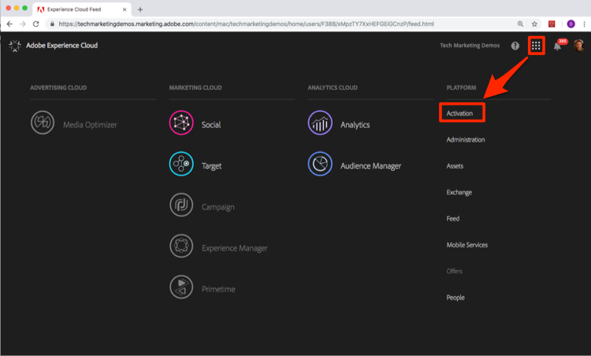
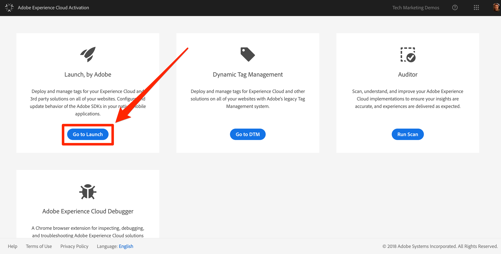
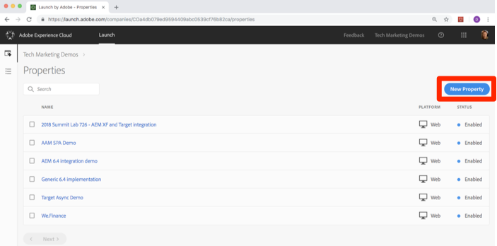

# General Launch Configuration & Settings

In this lesson, you will create your first Launch property.

A property is basically a container that you fill with extensions, rules, data elements, and libraries as you deploy tags to your site.

## Prerequisites

In order to complete the next few lessons, you must have permission to Develop, Approve, Publish, Manage Extensions, and Manage Environments in Launch. If you are unable to complete any of these steps because the user interface options are not available to you, reach out to your Experience Cloud Administrator to request access. For more information on Launch permissions, see [the documentation](https://docs.adobelaunch.com/administration/user-permissions).

## Learning Objectives

At the end of this lesson, you will be able to:

* Log into the Launch user interface
* Create a new Launch property
* Configure a Launch property

## Go to Launch

**To get to Launch**

1. Log into the [Adobe Experience Cloud](https://experiencecloud.adobe.com)

1. Click the  icon to open the solution switcher

1. Select **[!UICONTROL Activation]** from the menu 

1. Under **[!UICONTROL Launch, by Adobe]**, click the **[!UICONTROL Go to Launch]** button

   

You should now see the `Properties` screen (if no properties have ever been created in the account, this screen might be empty):

If you use Launch frequently, you can also bookmark the following URL and log in directly [https://launch.adobe.com](https://launch.adobe.com)

## Create a Property

A property is basically a container that you fill with extensions, rules, data elements, and libraries as you deploy tags to your site. A property can be any grouping of one or more domains and subdomains. You can manage and track these assets similarly. For example, suppose that you have multiple websites based on one template, and you want to track the same assets on all of them. You can apply one property to multiple domains. For more information on creating properties, see ["Create a Property"](https://docs.adobelaunch.com/administration/companies-and-properties#create-a-property) in the product documentation.

**To Create a Property**

1. Click the **[!UICONTROL New Property]** button:

1. Name your property (e.g. `Launch Tutorial` or `Daniel's Launch Tutorial`)
1. As the domain, enter `enablementadobe.com` since you will be using this property in conjunction with the We.Retail demo site which is hosted on this domain
1. Click the **[!UICONTROL Save]** button

   

Your new property should display on Properties page. Note that if you check the box next to the property name, options to **[!UICONTROL Configure]** or **[!UICONTROL Delete]** the property appear above the property list. Click on the name of your property (e.g. `Launch Tutorial`) to open the `Overview` screen.

[Next "Add the Launch Embed Code" >](launch-add-embed.md)
