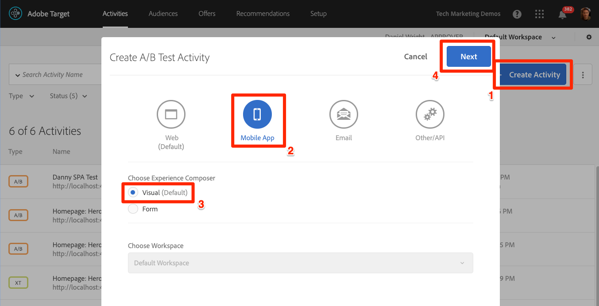
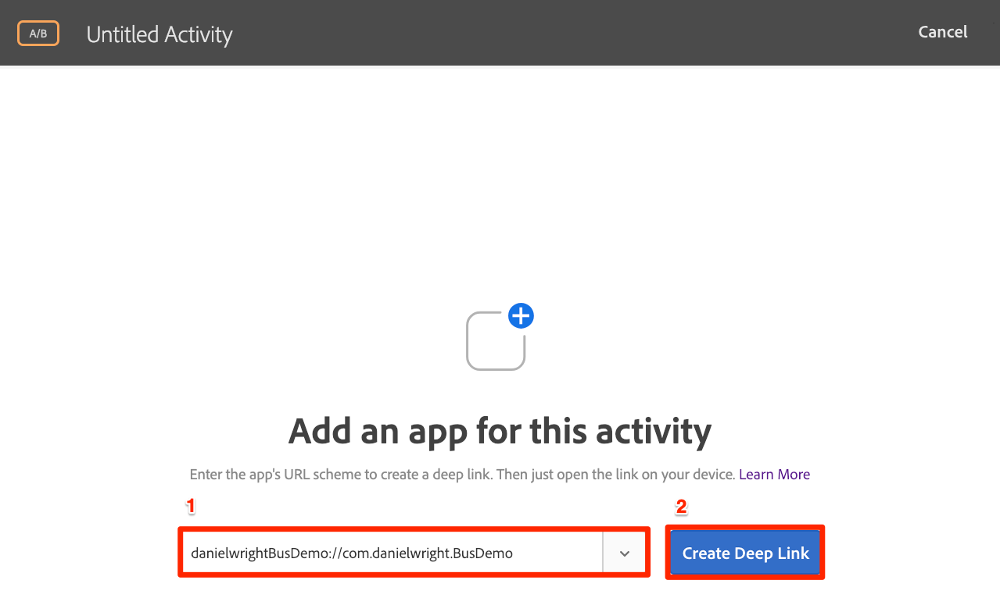

# Add Adobe Target Visual Experience Composer (VEC)

In this lesson, we will enable the Target Visual Experience Composer (VEC) for Mobile apps.

[Adobe Target](https://marketing.adobe.com/resources/help/en_US/target/) is the Adobe Marketing Cloud solution that provides everything you need to tailor and personalize your customers' experience, so you can maximize revenue on your web and mobile sites, apps, social media, and other digital channels.

## Learning Objectives

At the end of this lesson, you will be able to:

* Enable the sample app for the Target VEC
* Pair your device with the VEC
* Create an activity using the VEC

## Prerequisites

To complete the lessons in this section, you must first complete the lessons in [Configure Launch](launch-create-a-property.md) section.

## Enabling the VEC

In the lesson [Add Extensions](launch-add-extensions.md), you added the Target VEC extension to your Launch property, and in the lesson [Install the Mobile SDK](launch-install-the-mobile-sdk.md) you imported the extension into the sample application. Only a few minor updates are required to start setting up activities in Target's mobile visual experience composer!

>[!NOTE] Both the Target and Target VEC Launch extensions are required to use the Target VEC in your mobile application.

iOS supports the use of [custom URL schemes](https://developer.apple.com/documentation/uikit/core_app/allowing_apps_and_websites_to_link_to_your_content/defining_a_custom_url_scheme_for_your_app) to deep link to your app. You might already be using custom URL schemes in your app already.

**To register your URL Scheme**

1. In XCode, click on your app to open the Settings screen
1. On the Settings screen, click the `Info` tab
1. Enter the **[!UICONTROL Identifier]** (e.g. `com.adobe.sdktest`)
1. Enter the **[!UICONTROL URL Scheme]** (e.g. `vectester`)
1. Make sure  **[!UICONTROL Editor]** is selected as the **[!UICONTROL Role]**

   

1. Click on the `General` tab
1. Click back on the `Info` tab, expand the `URL type` section and verify that your URL type saved
  
The next step is to add a handler to the deep link.

**To handle the deep links**

1. Open the AppDelegate.swift file
1. Add the line `ACPTargetVEC.handleDeepLink(url)` to the `application(_:open:options;)` method `AppDelegate:application:openURL` section as pictured below
   
1. Rebuild the app in the simulator again

Now, when a user with your app installed opens the URL `vectester://com.adobe.sdktest` it will open your application.

## Create an activity in the Mobile VEC

Now let's create an activity in the Target UI.

**To Create an Activity with the Target VEC**

1. Log into the Experience Cloud
1. Use the solution switcher to go to Target
1. Launch Target
1. Click the **[!UICONTROL Create Activity]** button and select **[!UICONTROL A/B Test]**
1. Select **[!UICONTROL Mobile App]**
1. Make sure **[!UICONTROL Visual]** is selected under **[!UICONTROL Choose Experience Composer]**
1. Click the **[!UICONTROL Next]** button
  
   

1. Enter `vectester://com.adobe.sdktest` in the **[!UICONTROL Enter URL scheme ://]** field
1. Click **[!UICONTROL Create Deep Link]**
   
1. Select the **[!UICONTROL Email]** tab.
1. Enter your email address in the **[!UICONTROL Primary address]** field
1. Click the **[!UICONTROL Send]** button
1. Now open the app in the simulator
1. Log into your web-based email and...
   
   
  
[Next "Add Adobe Analytics" >](analytics.md)