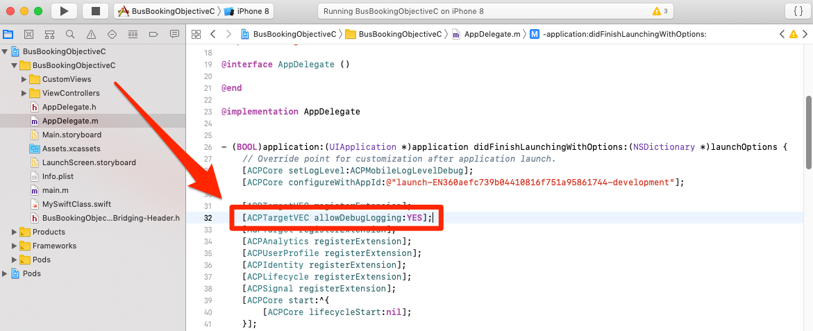
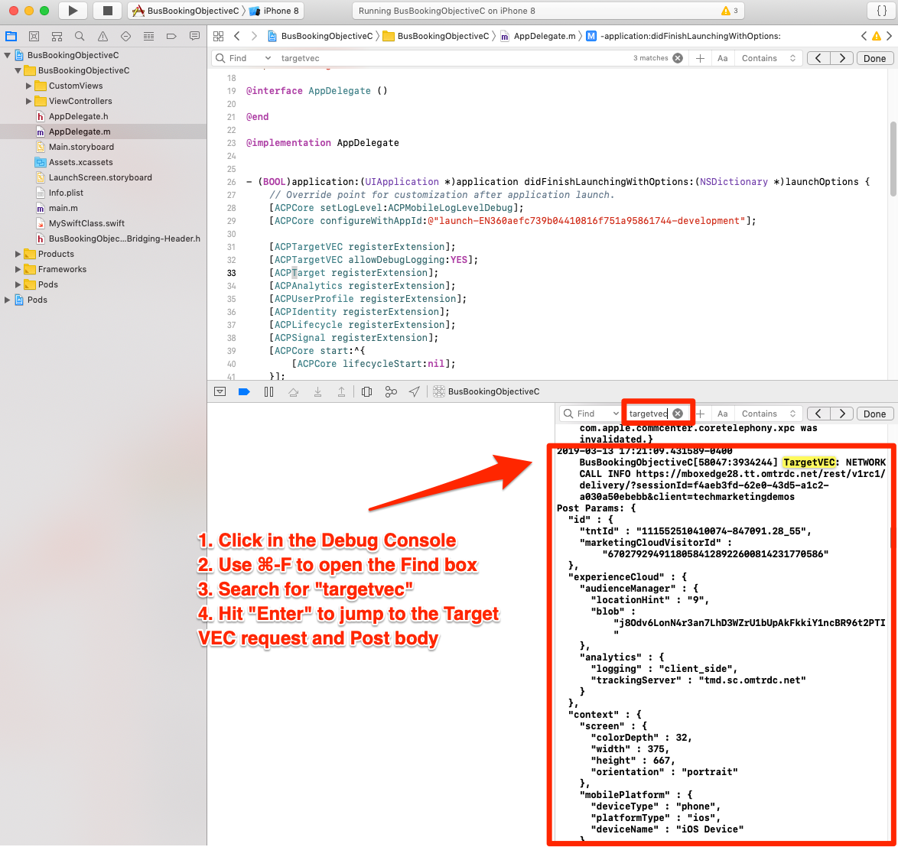
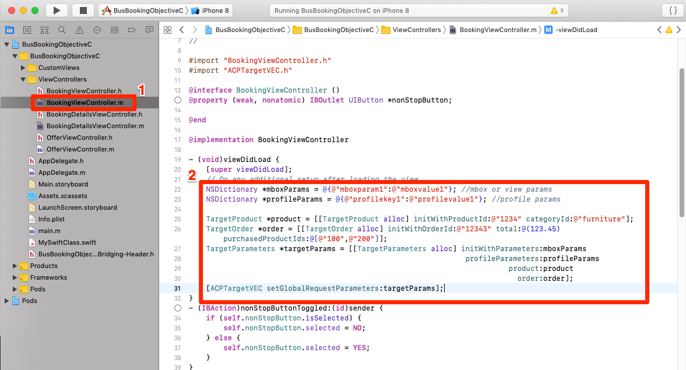
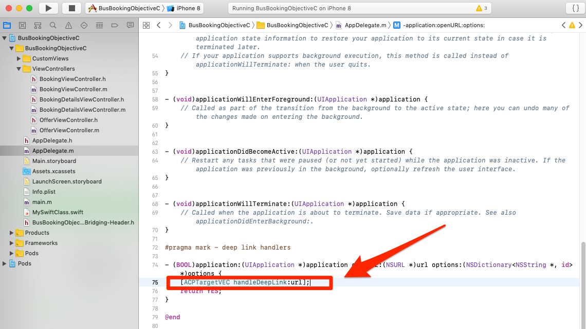
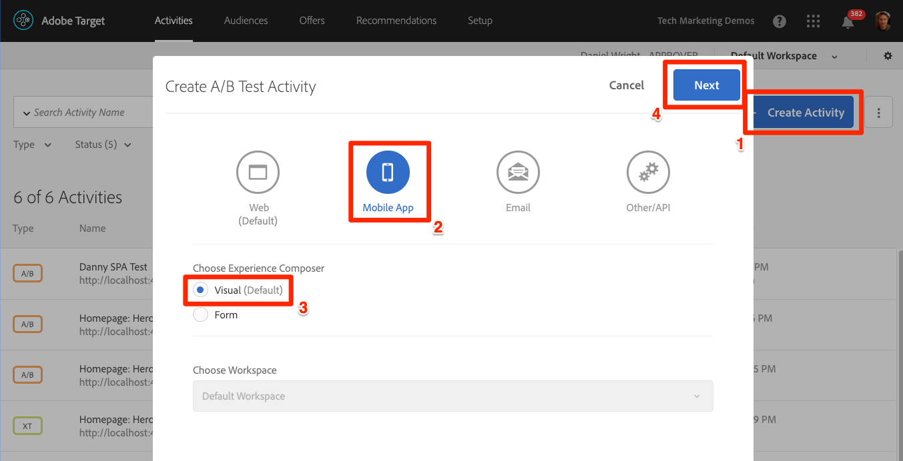
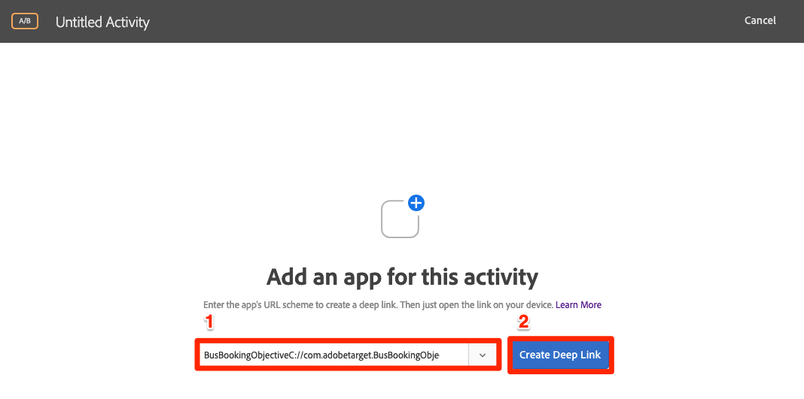

# Add Adobe Target's Visual Experience Composer (VEC)

In this lesson, you will enable the Target Visual Experience Composer (VEC) for Mobile apps.

[Adobe Target](https://marketing.adobe.com/resources/help/en_US/target/) is the Adobe Experience Cloud solution that provides everything you need to tailor and personalize your customers' experience, so you can maximize revenue on your web and mobile sites, apps, social media, and other digital channels.

The Visual Experience Composer (VEC) for Native Mobile Apps lets you create activities and personalize content on native mobile apps in a do-it-yourself fashion without continuous development dependencies and app-release cycles.

In the lesson [Add Extensions](launch-add-extensions.md), you added the Target VEC extension to your Launch property. In the lesson [Install the Mobile SDK](launch-install-the-mobile-sdk.md) you imported the extension into the sample application. Only a few minor updates are required to start setting up activities in Target's mobile visual experience composer!

>[!WARNING] The Visual Experience Composer for mobile apps is currently in Beta and may not be available in your Target account. You are encouraged to evaluate its capabilities, but we do not recommend launching real activities in your production app at this time.
>
>Both the Target and Target VEC Launch extensions are required to use the Target VEC in your mobile application.

## Learning Objectives

At the end of this lesson, you will be able to:

* Enable the sample app for the Target VEC
* Add parameters to the Target VEC request
* Pair your device with the VEC
* Create an activity using the VEC

## Prerequisites

To complete the lessons in this section, you must:

* Complete the lessons in [Configure Launch](launch-create-a-property.md) section.
* Have Approver-level access to the Adobe Target interface

## Enable logging for the Target VEC extension

This is an optional step that will turn on special console logging specific to the VEC extension.

**To enable logging**

1. Open the `AppDelegate.m` file in Xcode
1. Add the line of code `[ACPTargetVEC allowDebugLogging:YES];` just below the line where you register the Target VEC Extension

   

Now that you've enabled the logging, it's time to confirm that it is working.

**To verify the logging**

1. Save the Xcode project
1. Rebuild the app and wait for it to reopen in the Simulator
1. Click in the Console pane of Xcode
1. Use ⌘-F to open the Find box
1. Search for `targetvec` in the Find box
1. Hit `Enter` to jump to the Target request and Post body (Note that the Lifecycle parameters&mdash;which all begin with `a.`&mdash; are automatically included):

   

Because of the settings we selected when we configured the Target VEC extension, this request will fire whenever the app first loads. It will prefetch all of the Target VEC activities that you have created for your app.

Notice the parameters for the application name and version. All Target VEC activities that you create will automatically be Targeted to these properties.

## Add Parameters

As you just saw in the last exercise, app Lifecycle metrics are automatically included as parameters in the Target VEC request. You can also add custom parameters to the requests.

**To add custom parameters**

1. In Xcode, open the `BookingViewController.m` file. This file is used by the Home screen.
1. Import the Target VEC extension by adding `#import "ACPTargetVEC.h"` beneath the existing import
1. In the `viewDidLoad` function, after the line with `super.viewDidLoad` add the following code. This example code shows how mbox parameters, profile parameters, product (or entity) parameters, and order parameters can be added to the TargetVEC request. This example uses static values, while in your actual app you would want to use dynamic variables to populate the values. And of course, you would only want to populate the parameters that are related to the view:

    ```objective-c
    NSDictionary *mboxParams = @{@"mboxparam1":@"mboxvalue1"}; //mbox or view params
    NSDictionary *profileParams = @{@"profilekey1":@"profilevalue1"}; //profile params

    TargetProduct *product = [[TargetProduct alloc] initWithProductId:@"1234" categoryId:@"furniture"];
    TargetOrder *order = [[TargetOrder alloc] initWithOrderId:@"12343" total:@(123.45) purchasedProductIds:@[@"100",@"200"]];
    TargetParameters *targetParams = [[TargetParameters alloc] initWithParameters:mboxParams
                                                                profileParameters:profileParams
                                                                        product:product
                                                                            order:order];
    [ACPTargetVEC setGlobalRequestParameters:targetParams];
    ```

   

Now that you've added parameters to the app, it's time to confirm they are being passed in the request.

**To verify the parameters**

1. Save the Xcode project
1. Rebuild the app and wait for it to reopen in the Simulator
1. Click in the Console pane of Xcode
1. Use ⌘-F to open the Find box
1. Search for `targetvec` in the Find box
1. Hit `Enter` to jump to the Target request and Post body. Locate the custom parameters you just added to the request:

   

## Pairing the Mobile App with the Target Interface

In order to create VEC activities in the Target interface, you must first pair Target with your app. This pairing is achieved with the use of deep links.

### Creating the Deep Link Scheme

iOS supports the use of [Universal Links](https://developer.apple.com/documentation/uikit/core_app/allowing_apps_and_websites_to_link_to_your_content) and [custom URL schemes](https://developer.apple.com/documentation/uikit/core_app/allowing_apps_and_websites_to_link_to_your_content/defining_a_custom_url_scheme_for_your_app) to create deep links to your app. You probably already use custom URL schemes in your app. If so, you can use these existing links to pair with Target. For this tutorial, you must create a custom URL scheme.

**To register your URL Scheme**

1. In Xcode, double-click on your app to open the Settings screen
1. On the Settings screen, click the `Info` tab
1. Expand the `URL Types` section
1. Note that the **[!UICONTROL Identifier]** is set to `com.adobetarget.BusBookingObjectiveC`. You can use this identifier or change it if you like.
1. Note that the **[!UICONTROL URL Scheme]** is `BusBookingObjectiveC`. You can use this scheme or change it if you like.
1. Make sure  **[!UICONTROL Editor]** is selected as the **[!UICONTROL Role]**

   

1. If you updated the identifier or scheme, click on the `General` tab so the scheme will save.  Click back on the `Info` tab, expand the `URL type` section and verify that your identifier or scheme and saved.
  
The next step is to add a handler to the deep link.

**To handle the deep links**

1. Open the `AppDelegate.m` file
1. Add the line `[ACPTargetVEC handleDeepLink:url];` to the `AppDelegate:application:openURL` section as pictured below
   

### Verify the deep link

Now, when a user with your app installed opens a URL like `BusBookingObjectiveC://com.adobetarget.BusBookingObjectiveC` (or whatever scheme you defined) in the Simulator it will open your application.

**To verify the deep link scheme**

1. Save the Xcode project
1. Rebuild the app
1. In the Simulator, open Safari
1. Enter the url `BusBookingObjectiveC://com.adobetarget.BusBookingObjectiveC` (or whatever scheme you defined) into the address bar. If you have any difficulties, see the Tip section below.
1. You should get prompted with a modal to "Open this page in "BusBookingObjectiveC." If you have any difficulties, see the Tip section below.
1. Click `Open`
1. This should open the Bus Booking app

    > [!TIP] If you are unsuccessful when copy-and-pasting the URL from your Desktop to the Simulator it's usually for one of these two reasons:
    >
    >   1. **The URL copied from the Target interface doesn't paste into the Simulator** This happens when the Desktop and Simulator clipboards are not synced.  If this happens, try toggling off and on the `Automatically Sync Pasteboard` setting in the Simulator and copy/pasting again:
    >
    >      
    >
    >   1. **Pasting the URL lands on the Google Search results page** Try repasting the deep link URL into the address bar and hitting `Enter`. You might need to repeat this a few times.

   
  
Now that your deep link structure is set up, you are ready to use the Target VEC to set up activities!

## Create an activity in the Mobile VEC

Now let's create an activity in the Target UI.

**To Create an Activity with the Target VEC**

1. Log into the [Adobe Experience Cloud](https://experiencecloud.adobe.com)
1. Use the solution switcher to go to Target

   

1. Launch Target

   

1. Click the **[!UICONTROL Create Activity]** button and select **[!UICONTROL A/B Test]**
1. Select **[!UICONTROL Mobile App]**
1. Make sure **[!UICONTROL Visual]** is selected under **[!UICONTROL Choose Experience Composer]**
1. Click the **[!UICONTROL Next]** button
  
   

1. On the **[!UICONTROL Select an app to use]** screen, click **[!UICONTROL Add New App]**

   

1. Enter the url scheme you just defined in the  **[!UICONTROL Enter URL scheme]** field, e.g. `BusBookingObjectiveC://com.adobetarget.BusBookingObjectiveC`
1. Click **[!UICONTROL Create Deep Link]**

   

    >[!NOTE] You have a few options to send the deep link to the app. You can:
    >
    >   1. Take a photo of the QR code from your iOS Device (in our tutorial, the device would have to be linked to Xcode)
    >   1. Copy the deep link from the Target interface and send it to the device however you would like
    >   1. Email the deep link to a valid email address and then open the link with an email application on the device

1. Click on the **[!UICONTROL Copy & Send Link]** tab.
1. Click anywhere on the link to automatically copy the link to your clipboard

   

1. Switch back to the Simulator
1. Open Safari in the Simulator
1. Paste the deep link URL into the address bar
1. Click the `Open` button to open the app

    > [!TIP] If you are unsuccessful when copy-and-pasting the URL from your Desktop to the Simulator it's usually for one of these two reasons:
    >
    >   1. **The URL copied from the Target interface doesn't paste into the Simulator** This happens when the Desktop and Simulator clipboards are not synced.  If this happens, try toggling off and on the `Automatically Sync Pasteboard` setting in the Simulator and copy/pasting again:
    >
    >      
    >
    >   1. **Pasting the URL lands on the Google Search results page** Try repasting the deep link URL into the address bar and hitting `Enter`. You might need to repeat this a few times.

   

1. After the App has loaded, switch back to your browser tab where you have Target opened. You should see your app loaded in the VEC.
1. Click on text and image assets in your app and you should see options to edit and replace them!

   

1. Make some changes to the first screen in your app
1. Now position the Simulator next to the browser with the VEC open
1. Navigate to a different screen in the app and notice how the VEC updates with the Simulator!
1. You can make updates to multiple views in your app, in a single activity!
   
1. You can also visually add click-tracking metrics and use the A4T integration with Analytics!
1. Save and Approve your activity and verify that you can see it in the sample app

Pairing the device with the VEC is a one-time action. When you create more activities in the future on the same device, you will just be able to select the device from a list, as pictured below:
   

>[!TIP] If you have a device open, but it is "Unavailable" in the selection menu, background the app by returning to the Home screen and then move the app back into the foreground to make it "Available" again.

## Building Audiences based on Lifecyle metrics

Lifecycle metrics built-in metrics about the visitor's usage of your app that are automatically included in calls made by the Adobe Mobile SDK. You can easily build audiences in Target based on these metrics.

**To create an audience**

1. In the Target interface, click **Audiences** in the top navigation
1. Click the **Create Audience** button

   

1. Name the Audience `Launches < 5`
1. Click **Add Rule > Custom**

   

1. In the first dropdown, select the **a.Launches** parameter. All of the Lifecycle metric parameters begin with the "a." prefix. We will Target content based on the number of app Launches the user has, which is an excellent way to target first time users of your app with an instructional, first-time-user-experience (FTUE).
1. In the next dropdown, select **is less than**
1. In the third dropdown, enter **5**
1. Click **Save**

   

Note that there are a huge variety of out-of-the-box audience building options in Target. Additionally, you can send up custom data in the Target request for audience-building, use audiences shared from other Experience Cloud solutions such as Audience Manager and Analytics, and CRM data shared to Target using the Customer Attributes feature of the People Core Service.
  
[Next "Add Adobe Target" >](target.md)