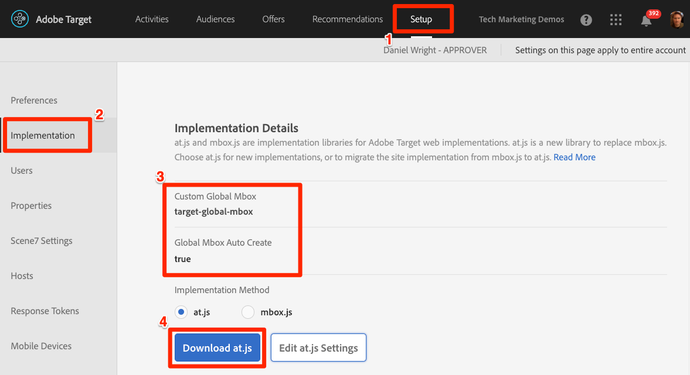
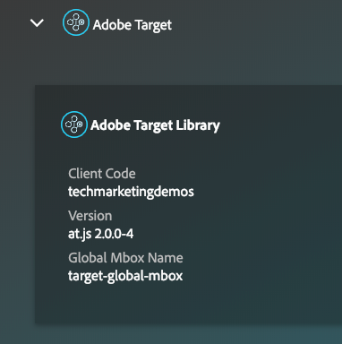
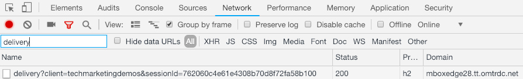

# Using Target in Single Page Applications

This tutorial will show you how to implement Adobe Target in a Single Page Application using Adobe Target's JavaScript SDK and build activities using Target's Visual Experience composer.

Adobe Target makes it easy to test and personalize in your single page applications:

* Easily implement our JavaScript SDK and identify the views in your app
* Easily create activities using Target's marketer-friendly Visual Experience Composer
* Easily integrate with Adobe Analytics, Experience Cloud Audiences, Customer Attributes, and Launch

## Exercise 1: Download the sample React app

## Exercise 2: Implement Target's JavaScript SDK&mdash;at.js

Target's JavaScript SDK at.js can easily be implemented in a single page application. You can add it as a standalone JavaScript file, using our tag manager Adobe Experience Platform Launch, or using a third-party tag manager.

### To download at.js from the Target interface**

1. From the top navigation, click **[UICONTROL Setup]**
1. From the left navigation, click **[UICONTROL Implementation]**
1. Confirm that the Global Mbox is set to Auto Create (if not, this setting can be changed by an Admin on the Edit at.js Settings screen)
1. Click the **[UICONTROL Download at.js]** button

   

Now you are ready to implement at.js on your website.

### To implement at.js on your website**

Implement at.js in the `<head>` of all of your HTML pages, including both single-page applications and traditional web pages. Be sure the pages are using the HTML5 doctype `<!doctype html>` as pictured below:

```html
<!doctype html>
<html lang="en">
<head>
    <meta charset="UTF-8">
    <title>Your Single Page App</title>
    <script src="at.js"></script>
</head>
<body>
    <div id="app"></div>
    <script src="app.js"></script>
</body>
</html>
```

If you are implementing at.js via Launch, for the time being you will need to download at.js from the Target interface as described above and paste it into a Custom Script action in a rule that fires on the Library Loaded event of all of your pages.

### Validation steps

The primary tool for debugging and validating Target implementations is the [Experience Cloud Debugger extension for Chrome browsers](https://chrome.google.com/webstore/detail/adobe-experience-cloud-de/ocdmogmohccmeicdhlhhgepeaijenapj). Currently, the Debugger supports the Summary tab display, the Target Console Logging toggle, and the Disable Target toggle for at.js 2.x versions. Unfortunately, network request-capture and mboxTrace are not supported yet.

1. Confirm the at.js version by opening the Debugger to the Summary tab and confirm that the 2.x version has loaded
   

1. Confirm the global request by opening your browser's Developer Tools to the Network tab and filter to "delivery":
   

at.js 2.x versions use Target's new Delivery API and have a significantly different structure from previous versions. Feel free to inspect the request details. Some details:

* Uses cross-domain XHR requests with CORS (like 1.x versions)
* POST method is always used, so look for request parameters in the Request Payload section of the headers
* Many name value pairs have been relabeled

## Exercise 3: Implement Target Views

A single-page application typically consists of multiple views or states (instead of pages) that a visitor navigates through as they interact with your brand.  Typically, there is a significant refresh of the visible screen and an update to the URL associated with a change in the view. (These URL changes are often called "routes" and are usually associated with the hash fragment or "#" portion). 

Target Views can be added to any of these states in your application to allow you to dynamically create a test or personalized experience.   triggerView() is a method in at.js that you use to specify the views in your single-page applications.

Our sample app contains multiple views associated with the following hash fragments:

* #/--the home screen
* #/products--the main products view
* #/cart--the shopping cart
* #/checkout--the checkout
* #/confirm--the order confirmation

In the demo app, triggerView() can easily be added to the application by listening for any changes to the URL.

1. Create a rule for all view changes
2. Trigger the rule on the `Core > History Change` event
3. Use a custom code action with the following JavaScript `adobe.target.triggerView(location.hash)`

This rule will not be triggered by the very first view that loads in the app. For that we will use another Launch rule

1. Create a rule for the first view load
1. Trigger the rule on the `DOM Ready` event
1. Add a condition that will target all views in your single-page app. For example, in our sample site, you could target XYZ

### Validation Steps

## Exercise 4: Create activities in the VEC

### Validation Steps

## Integrations