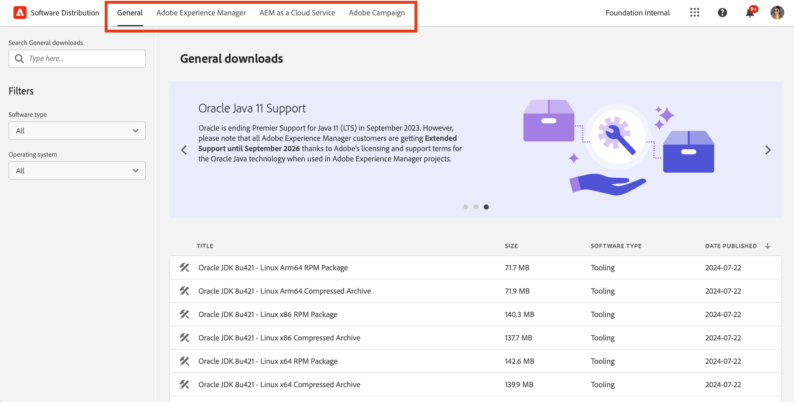
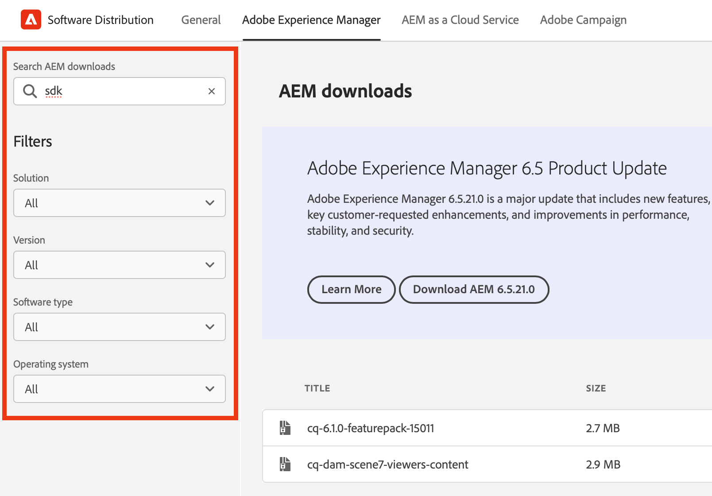
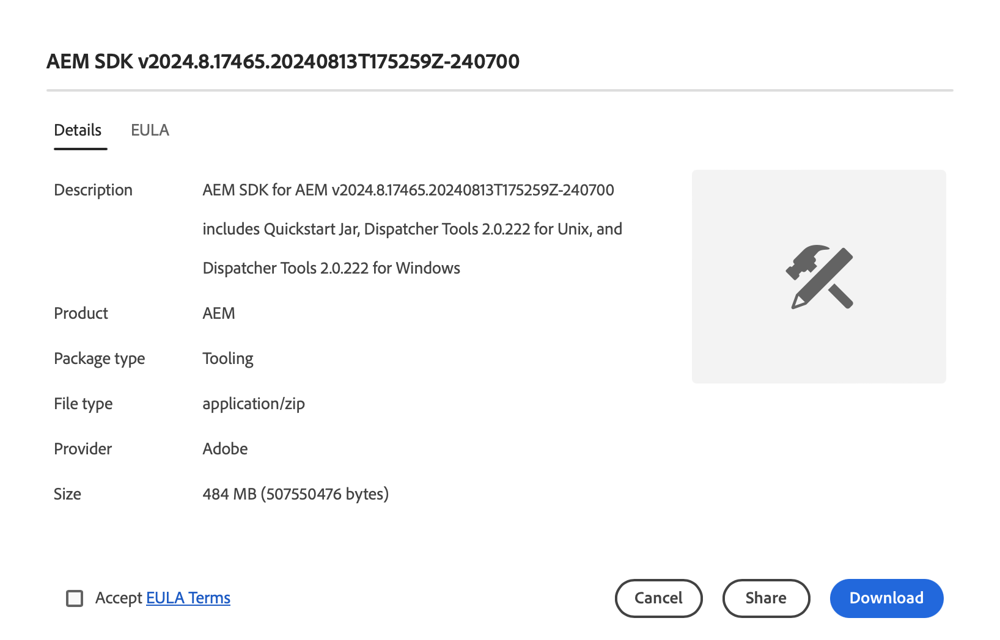

# Software Distribution

Learn how to use Software Distribution to download your Adobe Experience Cloud software.

## Introduction

Software Distribution provides an efficient experience to find and download your Adobe Experience Cloud software. Approved software packages from Adobe and packages from partner companies are available for the following products:

1. **Adobe Experience Manager** - Everything related to service and maintenance, security, tooling and more - for all supported AEM versions
1. **Adobe Experience Manager as a [!UICONTROL Cloud Service]** - [!UICONTROL AEM Cloud SDK], [!UICONTROL AEM Cloud] migration tools and more
1. **Adobe Campaign** - All current [!DNL Campaign] installer versions and related tools
1. **General** - General purpose tooling including [!DNL Oracle] JDKs for Adobe customers

Using Software Distribution is a simple as:

1. [Accessing Software Distribution](#accessing)
1. [Selecting your product](#selecting)
1. [Finding your download](#finding)
1. [Downloading your software](#downloading)

## Access to Software Distribution {#accessing}

To access Software Distribution, go to [`https://experience.adobe.com/downloads`](https://experience.adobe.com/downloads) and sign in to [!UICONTROL Software Distribution] with your Adobe ID.

## Selecting Your Product {#selecting}

The Software Distribution UI is organized by product as shown in the menu.

You arrive on the **General** tab, where you can find general-purpose software downloads.

Tap or click the product in the menu for which you want to download software. Only products that your organization has licensed are available to download.

## Finding Your Download {#finding}

Once you have selected the desired product tab, you will see all related downloads. Use the search filters in the left panel to quickly find your download. Filter options vary by product.

## Downloading Your Software {#downloading}

By tapping or clicking a displayed download, a dialog opens and provides you with more information about the download. For example, you can see a description, the provider name, and the EULA.

You must accept the EULA by selecting **Accept EULA Terms** to enable the **Download** button.

You can also share a link to that particular download by tapping or clicking **Share** to copy the URL.

## Package Share {#package-share}

In June 2020, [!UICONTROL Software Distribution] replaced [!UICONTROL Package Share] for AEM and [!DNL Neolane] for [!DNL Campaign]. An intuitive user interface, a simplified search, and a greatly improved download speed make downloading software packages for Experience Cloud products a better experience using Software Distribution.

>[!IMPORTANT]
>
>Login credentials from [!UICONTROL Package Share] or [!DNL Neolane] will not work for [!UICONTROL Software Distribution], which provides capabilities to sign in with Adobe-wide security standards. If you do not know your Adobe ID, please contact a support administrator within your organization.

>[!NOTE]
>
>[!UICONTROL Software Distribution] supports browser downloads only. When using AEM [!UICONTROL Package Manager] for new installations, it is recommended to download the package to a local folder and install the package from there.
