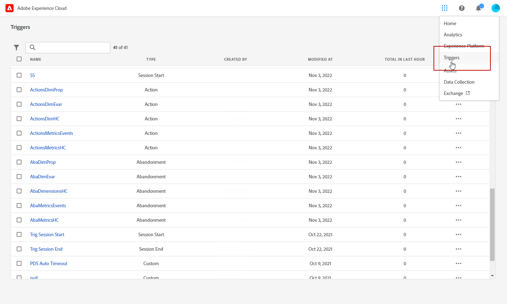
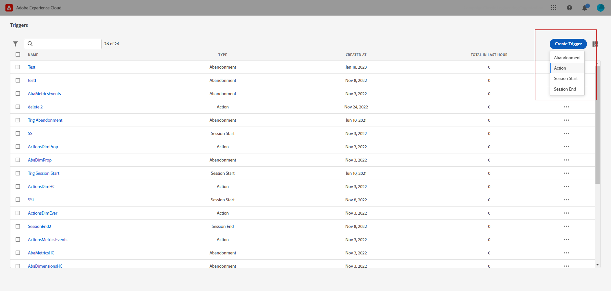
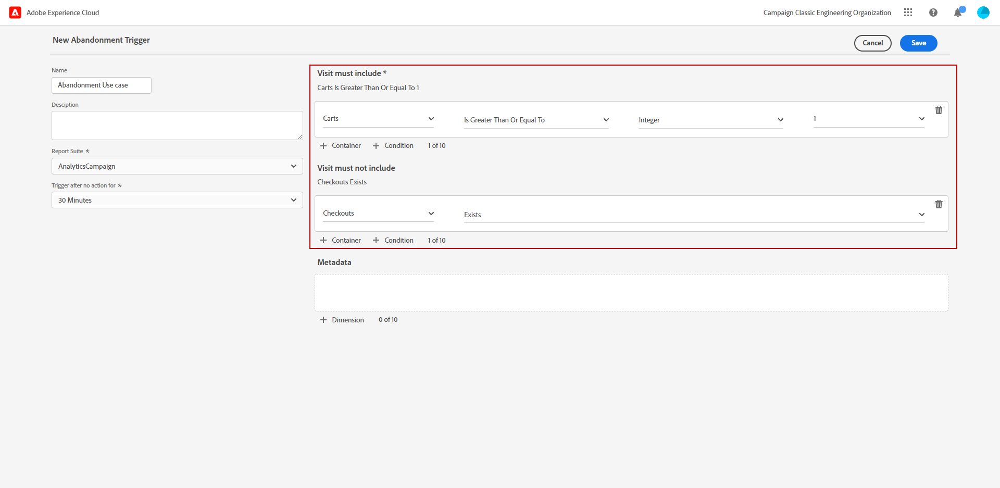
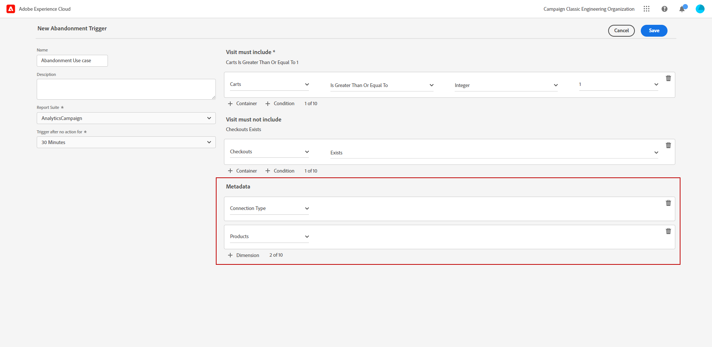
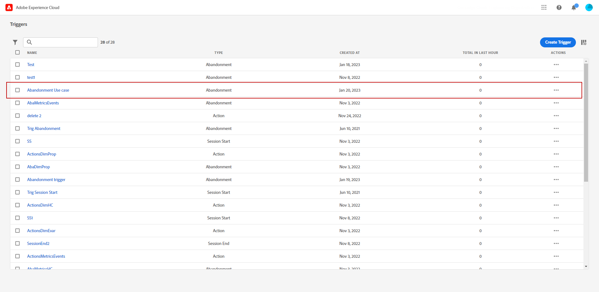
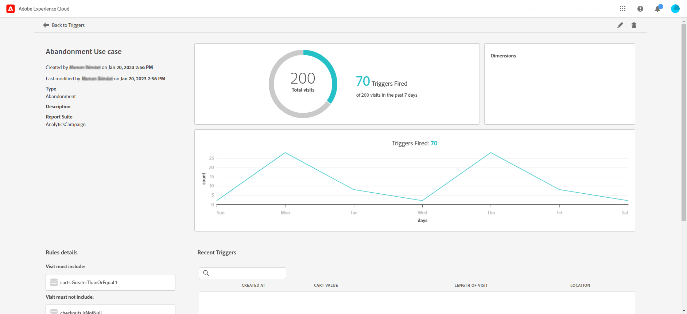

# Create an Experience Cloud trigger {#create-triggers}

>[!NOTE]
>
> The new user interface for Experience Cloud Triggers offers an intuitive experience to manage consumer behaviors and personalize user experiences. To switch back to the previous interface, click the **[!UICONTROL Go to classic mode]** button.

Create a trigger and configure the conditions for the trigger. For example, you can specify the criteria for a trigger's rules during a visit, such as metrics like Cart Abandon, or dimensions like the product name. When the rules are met, the trigger runs.

1. In the Experience Cloud, select the advanced menu, then Triggers.

    

1. From your Trigger homepage, click **[!UICONTROL Create Trigger]**, then specify the type of trigger.

    Three types of triggers are available:

    * **[!UICONTROL Abandonment]**: You can create a trigger to fire when a visitor views a product but does not add anything to the cart.

    *  **[!UICONTROL Action]**: You can create triggers, for example, to fire after newsletter sign-ups, email subscriptions, or applications for credit cards (confirmations). If you are a retailer, you can create a trigger for a visitor who signs up for a loyalty program. In media and entertainment, create triggers for visitors who watch a certain show, and perhaps you want to respond with a survey.

    *  **[!UICONTROL Session Start and Session End]**: Create a trigger for session start and session end events.

    

1. Add a **[!UICONTROL Name]** and a **[!UICONTROL Description]** to your trigger.

1. Select the Analytics **[!UICONTROL Report Suite]** used for this trigger. This setting identifies the reporting data to use. 
    
    [Learn more on Report suite](https://experienceleague.adobe.com/docs/analytics/admin/admin-tools/manage-report-suites/c-new-report-suite/t-create-a-report-suite.html).

1. Choose the **[!UICONTROL Trigger after no action for]** validity period.

1. From the **[!UICONTROL Visit must include]** and **[!UICONTROL Visit must not include]** categories, you can define criteria or visitor behaviors that you want or do not want to occur. You can specify **And** or **Or** logic within or between conditions, depending on the criteria you determine.

    For example, rules for a simple cart abandonment trigger can be:

    * **[!UICONTROL Visit must include]**: `Carts (metric) Is greater or equal to 1` to target visitors with at least one item in their carts.
    * **[!UICONTROL Visit must not include]**: `Checkout (metric) Exists.` to remove visitors who bought the items in their carts.

    

1. Click **[!UICONTROL Container]** to establish and save rules, conditions, or filters that define a trigger. To make events happen at the same time, you should place them in the same container. 

    Each container processes independently at the hit level, meaning that if two containers are joined with the **[!UICONTROL And]** operator, the rules will only qualify when two hits meet the requirements.

1. From the **[!UICONTROL Metadata]** field, click **[!UICONTROL + Dimension]** to choose a particular Campaign dimension or variables that are relevant to a visitor’s behavior.

    

1. Click **[!UICONTROL Save]**.

1. Select your newly created **[!UICONTROL Trigger]** from the list to access the detail report of your trigger.

    

1. From the detailed view of your trigger, you can access the reports on how many Triggers were fired. If needed, you can edit your trigger with the pencil icon.

    
