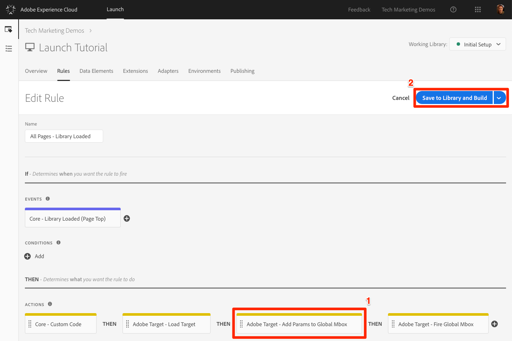

# Adobe Analytics

In this lesson, you will implement Adobe Analytics extension.

The Adobe Analytics extension supports client-side Analytics implementations using AppMeasurement.js.

## Prerequisites

The report suite ids and tracking servers you are going to use with this tutorial should be defined before you configure the extension and you should have the details readily available.

## Add the Analytics Extension

1. Go to **[!UICONTROL Extensions > Catalog]**

1. Locate the Adobe Analytics extension

1. Click **[!UICONTROL Install]**

   

1. Under **[!UI CONTROL Library Management > Report Suites]**, enter the report suite ids you would like to use with each Launch environment

   

   >![TIP]
   >
   >We recommend using the `Manage the library for me option` as the `Library Management` setting as it makes it much easier to keep the core `AppMeasurement.js` code up-to-date.

1. Under `General > Tracking Server`, enter your tracking server, e.g. "`tmd.sc.omtrdc.net`." Enter your SSL Tracking Server if your site supports `https://`

   

1. In the Global Variables section, set the `Page Name` variable using your `Page Name` data element

   

1. In the Link Tracking section, enter `enablementadobe.com` in the `Never Track` section and click the **[!UICONTROL Save]** button

1. Check the box to `Keep URL Parameters`

1. Click **[!UICONTROL Save to Library and Build]**

   

>[!NOTE]
>
>Global variables can be set in the extension configuration or in rule actions. Be aware that when setting variables with the extension configuration, the data layer must be defined before the Launch embed codes.

### What is different from DTM

* Support for Server Side Forwarding to Audience Manager is built-in
* Report Suites don't auto-populate---you have to know the specific report suite ids and manually enter them
* The managed library option ships with a specific version of AppMeasurement.js
* Multiple Analytics instances like having two Analytics "Tools" in DTM is not supported
* General: New options for *Custom* Character Set and Currency Code
* General: Data Center option has been removed
* Global Variables: New options for Server, State, Zip
* Global Variables: data elements must be defined before the Launch header embed code for variables set in the extension configuration(variables set in Rules can come from data elements set before the event)
* Custom Code: Option to load before or after the UI settings has been removed
* Some options have been rearranged to more intuitive locations

## Fire the Analytics Beacon in a Rule

Now you will use a rule to set the `Page Name` variable and fire the Analytics beacon.

1. Go to the **[!UICONTROL Rules]** in the top navigation and then click on `All Pages - Library Loaded` to open the rule editor.

   

1. Under Actions, click the  to add a new action

   

1. Select **[!UICONTROL Extension > Adobe Analytics]**

1. Select **[!UICONTROL Action Type > Send Beacon]**

1. Leave Tracking set to `s.t()`. Note that if you wanted to make an `s.tl()` call in a click-event rule you could do that using the Send Beacon action, as well.

1. Click the **[!UICONTROL Keep Changes]** button

   

1. Click **[!UICONTROL Save to Library and Build]**

  

1. Save the rule

## Add Variables and Events

### Add the pageName Variable

### Add the Purchase Event

The purchase event is one of the most critical parts of many Analytics implementations. It consists of:

* capture of the `s.purchaseID`
* setting of the `purchase` event in `s.events`
* setting of the `s.products`

1. Create a new rule called "Order Confirmation Page - Bottom - 30 "
1. Create a new event
   * Select the Core extension
   * Select the `Library Loaded (Page Top)` event type
   * Name the new event `Core -- Library Loaded (Page Top)`.
   * Set the Order to `30`

1. Create a new condition

   * Select the Core extension
   * Select the "Path Without Query String" Condition Type
   * Name the new condition "Core -- Path Without Query String"\

      

   * Set the Path field to the following string: thank-you.html.html\

      

   * Create a new action
   * Select the Adobe Analytics extension
   * Select the **[!UICONROL Set Variables]** Action Type
   * Name the new action `Adobe Analytics - Set Variables`

      

   * Under "Events", set "purchase":\

      

1. Save the new [!UICONTROL Order Confirmation Page - Top] rule

To validate this rule, follow the steps in the [Rule Validation: Product, Cart, and Checkout Flow](#Rule Validation: Product, Cart, and Checkout flow) section below.

## Click-tracking and s.tl

## Add Plugins

### User Sign-in -- Sign in Start

This rule reports when a user begins the sign in process on the reference site.

1. Create a new rule called "Sign In -- Start"
1. Create a new Event
   * Select the Core extension
   * Select the [!UICONTROL Library Loaded (Page Top)] event type
   * Name the new event `Core -- Library Loaded (Page Top)`

1. Create a new condition
   * Select the Core extension
   * Select the "Path Without Query String" Condition Type
   * Name the new condition "Core -- Path Without Query String"\

      

1. Set the Path field to the following string: `/content/we-retail/us/en/community/signin.html`

   

1. Create a new action
   * Select the "Adobe Analytics" extension
   * Select the "Set Variables" Action Type
   * Name the new action "Adobe Analytics - Set Variables"\

      

1. Under "Events", set event2:\

   

1. Save the new "Sign In -- Start" rule

To validate this rule, take the following steps:

1. Ensure your debugger or the Network tab of your browser's developer tools is open. Click the "preserve log" option, if available.

1. From any page on the example site, find the "Login" link in the upper right corner of the page and click it:\

   

1. In your debugger, verify that an image request was made to the Adobe tracking server.

1. In the query parameters of that image request, verify the following values:

   * The pageName parameter is set to `content:we-retail:us:en:community:signin`
   * The events parameter includes `event2`

   

### User Sign-in -- Sign in Confirmation

1. Create a new rule called "Sign In"
1. Create a new event

   * Select the Core extension
   * Select the "Data Element Change" event type
   * Name the new event \"Core -- Data Element Change\"\

   

1. Create a new condition

   * Select the Core extension

l. Select the "Data Element" Condition Type

   * Name the new condition "Core -- Data Element"\

   

1. Set this Condition to check that the Data Element "Authentication State" has the following value: "logged out"\

   

1. Create a new action

   * Select the "Adobe Analytics" extension

o. Select the "Set Variables" Action Type

p. Name the new action "Adobe Analytics - Set Variables"\

   

1. Under "Events", set event3:\

   

1. Create a (second) new action

q. Select the "Adobe Analytics" extension

r. Select the "Send Beacon" action type

s. Name the new action "Adobe Analytics -- Send Beacon"\

   

1. Under "Tracking":

t. Select "s.tl()"

u. Set Link Type to "Custom Link"

v. Set Link Name to "signin":\

   

1. Save the new "Sign In" rule

> To validate this rule, take the following steps:

1. Ensure your debugger or the Network tab of your browser's developer tools is open. Click the "preserve log" option, if available.

1. From any page on the example site, find the "Login" link in the upper right corner of the page and click it:\

   

1. Sign in to the site (see [Appendix: Test Account](#User account:) for information on creating an account)

1. When the following page loads, in your debugger, verify that an image request was made to the Adobe tracking server.

1. In the query parameters of that image request, verify the following values:

a. The events parameter includes "event3"

### Product Details

For Product Details pages, two rules are required: one at the page top,
and one at the bottom. The \"Product Details - Bottom\" rule is used for
Target deployments (see above).

For Analytics, the \"Product Details -- Top - 20\" rule is configured as
follows.

1. Create a new Rule, called \"Product Details - Top - 20\"

1. Create a new event

a. Select the Core extension

b. Select the "Library Loaded (Page Top)" event type

c. Name the new event \"Core -- Library Loaded (Page Top)\"

d. Set Order to 20\

   

1. Create a new condition

e. Select the Core extension

f. Select the "Data Element" Condition Type

g. Name the new condition "Core -- Data Element":\

   

1. Set this condition as follows:

h. Check that the Data Element "Product SKU (Target) has the
following value: (\[\^\\s\])

i. Enable the Regex flag\

   

1. Create a new action

j. Select the "Adobe Analytics" extension

k. Select the "Set Variables" Action Type

l. Name the new action "Adobe Analytics - Set Variables"\

   

1. In the Custom Code editor of the Action, enter the following code: (see the Appendix entry for [Product information (product details pages)](#product-information-product-details-pages) for details on configuring this data element)

1. Under "Events", set prodView:\

   

1. Save the new "Product Details -- Top" rule.

To validate this rule, follow the steps in the [Rule Validation: Product, Cart, and Checkout Flow](#Rule Validation: Product, Cart, and Checkout flow) section below.

### Shopping Cart Adds

This rule assumes a custom JavaScript event, "cart-add", has been created and executes on the submit action of the add-to-cart process. Adding a rule to the click of an add-to-cart button or form may result in less accurate reporting than using an event connected with the CMS or ecommerce platform.\

   

1. Create a new Rule called \"Cart Adds\"

1. Create a new event

a. Select the Core extension

b. Select the "Custom Event" event type

c. Name the new event \"Core -- Custom Event\"\

   

1. In the Event Configuration:

d. Set Custom Event Type to "cart-add"

e. Select the "specific elements" option

f. Set the CSS selector to "body"\

   

1. Create a new action

g. Select the "Adobe Analytics" extension

h. Select the "Set Variables" Action Type

i. Name the new action "Adobe Analytics - Set Variables"\

   

1. Create a new action

j. Select the "Adobe Analytics" extension

k. Select the "Send Beacon" Action Type

l. Name the new action "Adobe Analytics -- Send Beacon"\

   

1. Under Tracking:

m. Select s.tl()

n. Set Link Type to "Custom Link"

o. Set Link Name to "scAdd":\

   

To validate this rule, follow the steps in the [Rule Validation: Product, Cart, and Checkout Flow](#Rule Validation: Product, Cart, and Checkout flow) section below.

### Shopping Cart Removes

This rule assumes a custom JavaScript event, "cart-remove", has been created and executes on the submit action of the add-to-cart process. Adding a rule to the click of an add-to-cart button or form may result in less accurate reporting than using an event connected with the CMS or ecommerce platform

1. Create a new Rule called \"Cart Removes\"

1. Create a new event

a. Select the Core extension

b. Select the "Custom Event" event type

c. Name the new event \"Core -- Custom Event\"\

   

1. In the Event Configuration:

d. Set Custom Event Type to "cart-remove"

e. Select the "specific elements" option

f. Set the CSS selector to "body".

   

1. Create a new action

g. Select the "Adobe Analytics" extension

h. Select the "Set Variables" Action Type

i. Name the new action "Adobe Analytics - Set Variables"\

   

j. Add "scRemove" to the Events section:\

   

1. Create a (second) new action

k. Select the "Adobe Analytics" extension

l. Select the "Send Beacon" Action Type

m. Name the new action "Adobe Analytics -- Send Beacon"\

   

n. Under Tracking, select s.tl(), set Link Type to "Custom Link",
and set Link Name to "scRemove":\

   

To validate this rule, follow the steps in the [Rule Validation:
Product, Cart, and Checkout
Flow](#Rule Validation: Product, Cart, and Checkout flow) section below.

### Checkout Initiation

1. Create a new rule called "Checkout Page - Top"

1. Create a new event

a. Select the Core extension

b. Select the "Library Loaded (Page Top)" event type

c. Name the new event \"Core -- Library Loaded (Page Top)\"\

   

1. Create a new condition

d. Select the Core extension

e. Select the "Path Without Query String" Condition Type

f. Name the new condition "Core -- Path Without Query String"\

   

g. Set the Path field to the following string: checkout.html\

   

1. Create a new action

h. Select the "Adobe Analytics" extension

i. Select the "Set Variables" Action Type

j. Name the new action "Adobe Analytics - Set Variables"\

   

1. Under "Events", set scCheckout:\

   

1. Save the new "Checkout Page - Top" rule

To validate this rule, follow the steps in the [Rule Validation:
Product, Cart, and Checkout
Flow](#Rule Validation: Product, Cart, and Checkout flow) section below.

### Site Search

1. Create a new rule named "Search Results -- Top"

1. Create a new event

a. Select the Core extension

b. Select the "Library Loaded (Page Top)" event type

c. Name the new event \"Core -- Library Loaded (Page Top)\"\

   

1. Create a new condition

d. Select the Core extension

e. Select the "Query String Parameter" condition type

f. Name the new condition "Core - Query String Parameter"\

   

g. Set this Condition as follows:

i. Check that the URL Parameter Name "searchText" has the Regex wildcard "." (to match any single character)

ii. Enable the Regex flag:\

   

1. Create a new action

h. Select the "Adobe Analytics" extension

i. Select the "Set Variables" Action Type

j. Name the new action "Adobe Analytics - Set Variables"

k. In the new action, set eVar2 to %search term%:\

   

1. Save the "Search Results -- Top" rule.

To validate this rule:

1. Ensure your debugger or the Network tab of your browser's developer tools is open. Click the "preserve log" option.

1. Click the Search icon, located near the upper right of any page:\

   

1. Enter a search term, and press return to go to the search results page:\

   

1. In your debugger, verify that an image request was made to the Adobe tracking server.

1. In the query parameters of that image request, verify the following values:

a. The events parameter includes "event2"

b. The eVar2 parameter includes the search term you entered. In the
example above, eVar2 should be set to "jacket".

### Rule Validation: Product, Cart, and Checkout flow

The steps below validate each step of the product purchase flow rules
defined above. Before beginning the validation process, ensure your
debugger or the Network tab of your browser's developer tools is open.
Click the "preserve log" option, if available.

Product Details Page:

1. Browse to a product details page, or use the following example page:\ <https://aem100-us.adobevlab.com/content/we-retail/us/en/products/men/shirts/eton-short-sleeve-shirt.html#meotsuett-S>

1. In your debugger, verify that an image request was made to the Adobe tracking server. In the query parameters of that image request, verify the following values:

a. The events parameter includes "prodView"

b. The correct product string is present. For the example page above, that value should be ";meotsuett"\ 

Cart Adds:

1. From a product details page, click the Add To Cart button\

   

1. In your debugger, verify that an image request was made to the Adobe tracking server.

1. In the query parameters of that image request, verify the following values:

a. The events parameter includes "scAdd"

b. The correct product string is present. For the example page
above, that value should be ";meotsuett"\

Cart Removes:

1. Assuming the item from the previous step has been added to your cart, view your shopping cart by clicking the "My Cart" link in the upper right of the page:\

   

1. In the cart slide-out widget, click the "x" icon next to the product added above.\

   

1. In your debugger, verify that an image request was made to the Adobe tracking server.

1. In the query parameters of that image request, verify the following values:

a. The events parameter includes "scRemove"

b. The correct product string is present. For the example page above, that value should be ";meotsuett"\

   

Checkout Initiation:

1. Repeat the steps above to add a product to the shopping cart.

1. View your shopping cart by clicking the "My Cart" link in the upper right of the page:\  . . . or visit the following link:\ <https://aem100-us.adobevlab.com/content/we-retail/us/en/user/cart.html>

1. Click the "check out" button:\

   

1. Upon reaching the checkout page, in your debugger, verify that an image request was made to the Adobe tracking server.

1. In the query parameters of that image request, verify the following values:

a. The events parameter includes "scCheckout"

b. The correct product string is present. For the example page
above, and assuming a quantity of 1 item, that value should be
";meotsuett-S"\

   

> Order Confirmation:

1. From the Checkout page (link below), enter address and payment information. This demonstration site accepts fake information, as referenced in [Appendix: Test Account Information](#Order and address information:). (please don't submit personal data). For example:\

   

   

1. Once information has been entered, click Continue.

1. On the Review Order page, click "Place Order".

1. Upon reaching the order confirmation page, in your debugger, verify that an image request was made to the Adobe tracking server.

1. In the query parameters of that image request, verify the following values:

a. The events parameter includes "purchase"

1. The correct product string is present, including units and price. For the example product used here, and assuming a quantity of 1 item, that value should be `;meotsuett-S;1;24`

   

   Mozilla/5.0 (iPhone; CPU iPhone OS 11_0 like Mac OS X) AppleWebKit/604.1.38 (KHTML, like Gecko) Version/11.0 Mobile/15A372 Safari/604.1

   Mozilla/5.0 (Macintosh; Intel Mac OS X 10_14_0) AppleWebKit/537.36 (KHTML, like Gecko) Chrome/70.0.3538.77 Safari/537.36

[Next "Add Adobe Audience Manager"](audience-manager.md)
