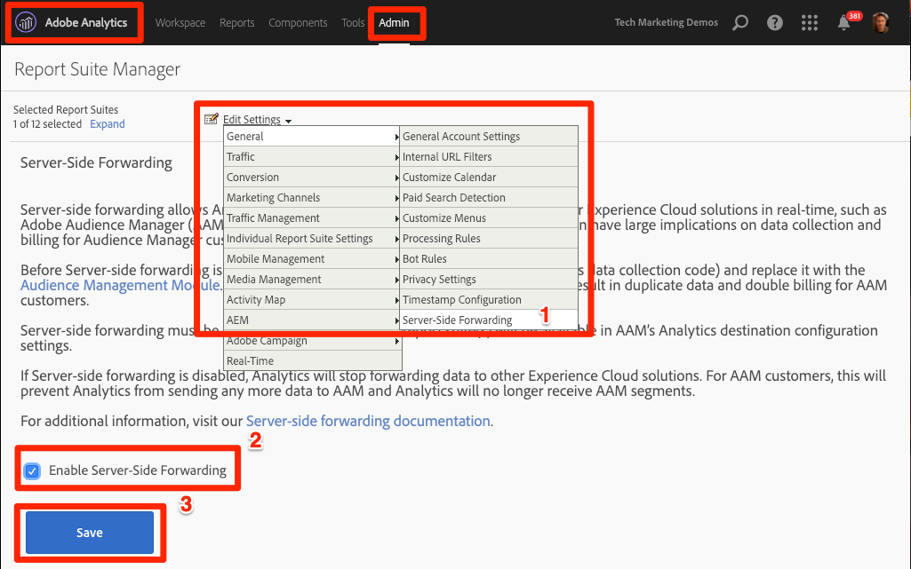
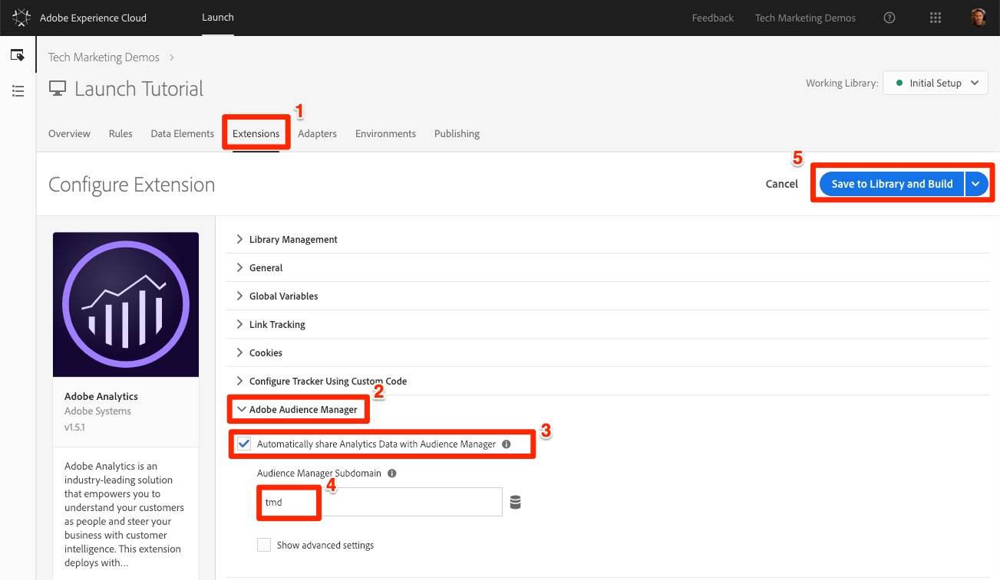

# Add Adobe Audience Manager

This lesson will guide you through the steps to enable [Adobe Audience Manager](https://marketing.adobe.com/resources/help/en_US/aam/) using Server-Side Forwarding.

Adobe Audience Manager (AAM) provides industry-leading services for online audience data management, giving digital advertisers and publishers the tools they need to control and leverage their data assets to help drive sales success.

## Learning Objectives

At the end of this lesson, you will be able to:

1. Describe the two main ways to implement Audience Manager in a website
1. Add Audience Manager using Server-Side Forwarding of the Analytics beacon
1. Validate the Audience Manager implementation

## Prerequisites

In order to complete this lesson, you will need:

1. Admin access to Adobe Analytics so that you can enable Server-Side Forwarding for the report suite you are using for this tutorial. Alternatively, you can ask an existing admin at your organization to do this for you, following the instructions below.

1. Your “Audience Manager Subdomain” (also known as the “Partner Name” “Partner ID,” or “Partner Subdomain”). If you already have Audience Manager implemented on your actual website, the easiest way to obtain it is to go to your actual website and open the Debugger. The subdomain is available on the Summary tab, in the Audience Manager section:

   

## Implementation Options

There are two ways to implement Audience Manager in a website:

* **Server-Side Forwarding (SSF)**&mdash;For customers with Adobe Analytics, this is the easiest and recommended way to implement. Adobe Analytics forwards data to AAM on Adobe's backend, allowing for one less request on the page. This enables key integration features and conforms with our best practices for Audience Manager code implementation and deployment.

* **Client-Side DIL**&mdash;This approach is for customers who do not have Adobe Analytics. DIL code (Data Integration Library Code) sends data directly from the web page into Audience Manager.

Since you have already deployed Adobe Analytics in this tutorial, you will deploy Audience Manager using Server-Side Forwarding.

## Enable Server-Side Forwarding

### Enable Server-Side Forwarding in the Analytics Admin Console

A configuration in the Adobe Analytics Admin Console is required to start forwarding  data from Adobe Analytics to Adobe Audience Manager. Since it can take up to four hours to start forwarding the data, you should do this step first.

**To Enable SSF in the Analytics Admin Console**

1. Log into Analytics
1. Go to [!UICONTROL Admin > Report Suites]
1. Select the [!UICONTROL Report Suite] you would like to enable
1. Go to Edit Settings > General > Server-Side Forwarding
1. Check the box to **[!UICONTROL Enable Server-Side Forwarding]**

   

>[!NOTE] Since SSF needs to be enabled per report suite, don't forget to repeat this step for your real report suites when you are deploying SSF on your actual site's report suite.

### Enable Server-Side Forwarding in Launch

Audience Manager Server-Side Forwarding is enabled in Launch by editing the configuration of the Adobe Analytics extension.

**To enable SSF in Launch**

1. Go to [!UICONTROL Extensions > Installed] and click to configure the Analytics extension.

1. Expand the [!UICONTROL Adobe Audience Manager] section

1. Check the box to **[!UICONTROL Automatically share Analytics Data with Audience Manager]** to add the Audience Manager Module to the AppMeasurement.js implementation.

1. Add your [!UICONTROL Audience Manager Subdomain] (also known as the “Partner Name” “Partner ID,” or “Partner Subdomain”)

1. Click **[!UICONTROL Save to Library and Build]** to save these changes to the Analytics extension

   

Adobe Audience Manager is now implemented!

>[!NOTE] In Launch, you will not need to configure the AAM extension to enable Server-Side Forwarding, as it is only used for client-side DIL implementations.

### Validate the Implementation

Doug, put steps here.

For a complete description and requirements list for Server-Side forwarding, please review the [documentation](https://marketing.adobe.com/resources/help/en_US/reference/ssf.html) as well, so that you are familiar with how it works, what is required, and how to validate.

>[!NOTE] If you have just enabled SSF in the interface, as described
above, it will take up to four hours to start working.

[Next "Experience Cloud Integrations"](integrations.md)