# Add the Experience Cloud ID Service

## Overview

This lesson will guide your through the steps required to implement the [Experience Cloud ID Service](https://marketing.adobe.com/resources/help/en_US/mcvid/).

The ID Service sets a common visitor id across all Adobe solutions in order to power Experience Cloud capabilities such as audience-sharing between solutions.  You can also send your own customer ids to the Service to enable cross-device targeting and integrations with your Customer Relationship Management (CRM) system.

## Learning Objectives

At the end of this lesson, you will be able to:

* Add the ID Service extension
* Create a data element to collect customer ids
* Add a Launch embed code to an html document
* Explain the optimal location of the Launch embed code in relation to other code in the `<head>` of an html document

## Add the Experience Cloud ID Service Extension

**To add the ID Service Extension**

1. In the top navigation, click **[!UICONTROL Extensions]**

1. Click **[!UICONTROL Catalog]** to go to the Extensions Catalog page

    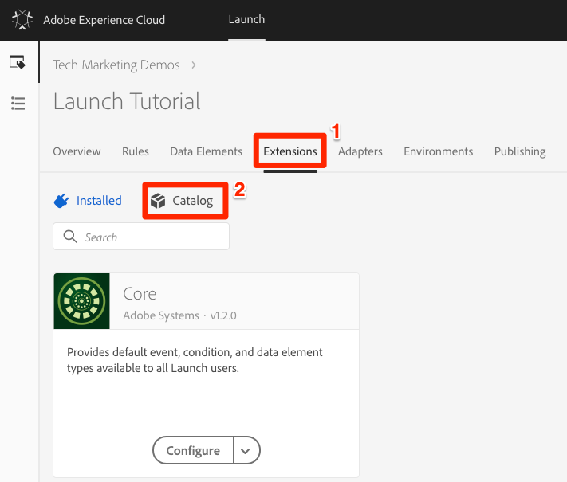

1. In the filter at the top, type "id" to filter the Catalog

1. On the card for the Experience Cloud ID Service, click **[!UICONTROL Install]**

    

1. Leave all of the default settings and click **[!UICONTROL Save to Library and Build]**

    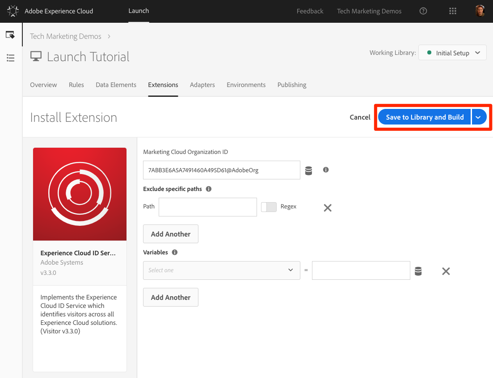

That's it! You've added the ID Service. For more details on the  options, see the [configuration options documentation](https://marketing.adobe.com/resources/help/en_US/mcvid/mcvid-function-vars.html).

>[!NOTE] Each version of the ID Service extension comes with a specific version of VisitorAPI.js. You update the VisitorAPI.js version by updating the ID Service extension.

## Add Data Elements for Customer IDs

Next, let's send a [Customer ID](https://marketing.adobe.com/resources/help/en_US/mcvid/mcvid-authenticated-state.html) to the ID Service. This is an optional feature that will allow you to [integrate your CRM](https://marketing.adobe.com/resources/help/en_US/mcloud/attributes.html) with the Experience Cloud as well as track visitors across devices.

In the earlier lesson, [Add Data Elements, Rules, and Libraries](launch-data-elements-rules.md) we created a data element and use it in a rule. Now, we will use those same techniques to send a Customer Id to the ID Service when the visitor is authenticated.  

We will start by creating two data elements:

1. `Authentication State`—to capture whether or not the visitor is logged in
1. `Email (Hashed)`—to capture the hashed version of the email address (used as the customer ID) from the data layer

**To create the data element for Authentication State**

1. Click **[!UICONTROL Data Elements]** in the top navigation
1. Click the **[!UICONTROL Add Data Element]** button

   

1. Name the data element `Authentication State`
1. For the **[!UICONTROL Data Element Type]**, select **[!UICONTROL Custom Code]**
1. Click the **[!UICONTROL Open Editor]** button

   

1. In the **[!UICONTROL Edit Code] window, use the following, which will return values of "logged in" or "logged out" based on an attribute in the We.Retail site's data layer:

        ``` javascript
        if (digitalData.user[0].profile[0].attributes.loggedIn)
            return "logged in"
        else
            return "logged out"
        ```

1. Click **[!UICONTROL Save]** to save the custom code

   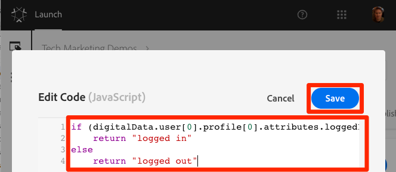

1. Leave all of the other settings on their default values
1. Click **[!UICONTROL Save]** to save the data element and return to the data elements page

   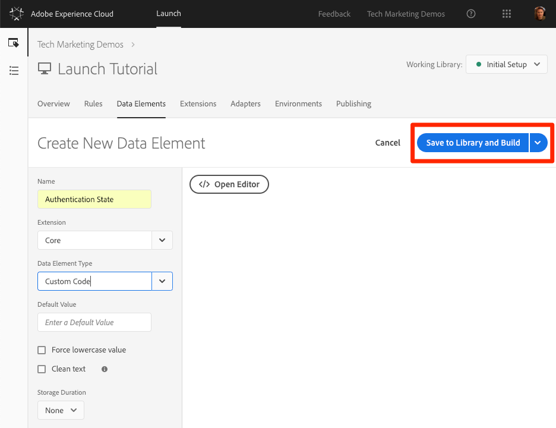

By knowing the authentication state of the user, you know when a customer id would exist on the page that you could send to the ID Service. The next step is to create a data element for the customer id you will send. On the We.Retail demo site, you will use the hashed version of the visitor's email address.

**To add the data element for the hashed email**

1. Click the **[!UICONTROL Add Data Element]** button

   

1. Name the data element `Email (Hashed)`
1. For the **[!UICONTROL Data Element Type]**, select **[!UICONTROL JavaScript Variable]**
1. As the **[!UICONTROL Path to variable]**, use the following pointer to a variable in the We.Retail site's data layer: `digitalData.user.0.profile.0.attributes.username`
1. Leave all of the other settings on their default values
1. Click **[!UICONTROL Save]** to save the data element

   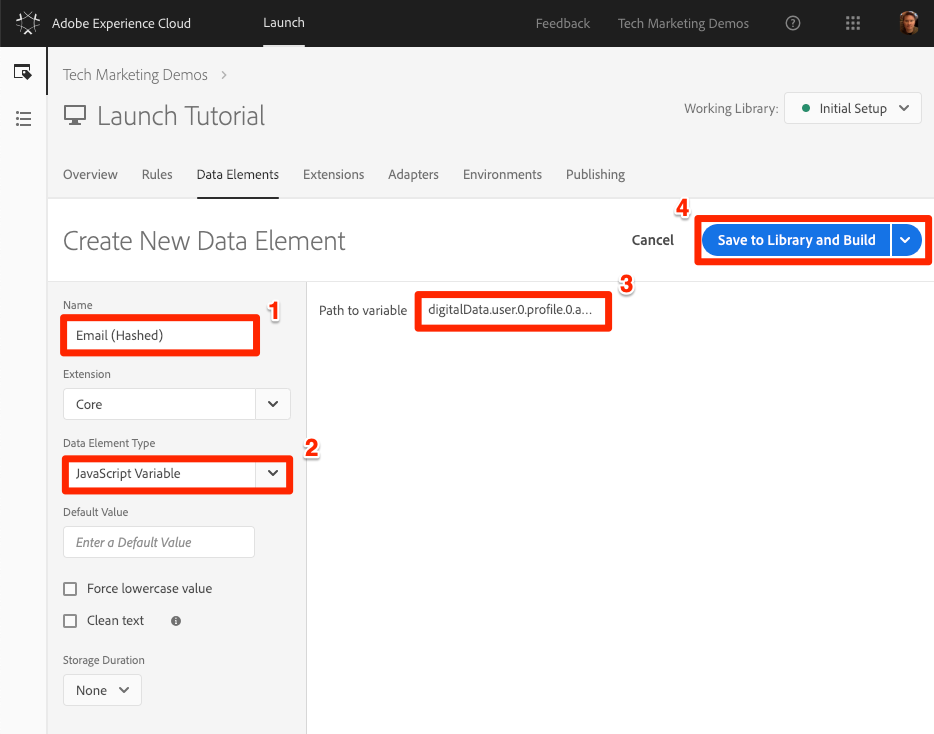

## Add a Rule to send the Customer IDs

The Experience Cloud ID Service passes the Customer IDs using a Rule Action called “Set Customer IDs.”  We will now create a rule to trigger this action when the visitor is authenticated.

**To create a rule to send the Customer IDs**

1. In the top navigation, click **[!UICONTROL Rules]**
1. Click **[!UICONTROL Add Rule]** to open the Rule Builder

   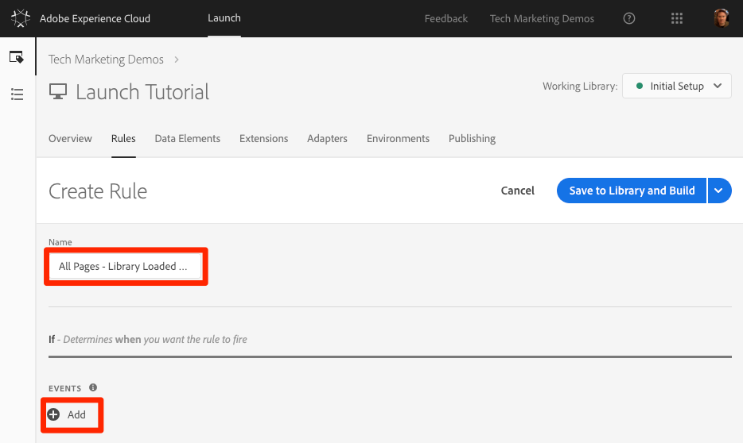

1. Name the rule `All Pages - Library Loaded - Authenticated - 10`
  
    >[!TIP] This naming convention indicates we are firing this rule at the top of all pages when the user is authenticated and it will have an order of “10”. Using a naming convention like this--instead of naming it for the solutions triggered in the actions will allow us to minimize the overall number of rules needed by our implementation

1. Under **[!UICONTROL Events]** click **[!UICONTROL Add]**

   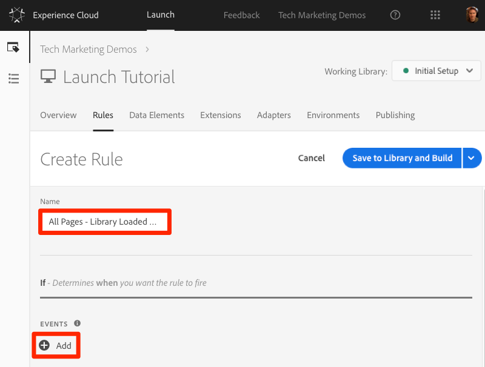

    1. For the **[!UICONTROL Event Type]** select **[!UICONTROL Library Loaded (Page Top)]**
    1. For the  **[!UICONTROL Order]** enter `10` (we are lowering the order because we want to make sure we set the customer ID before some of the rules we are going to create later)
    1. Click the **[!UICONTROL Keep Changes]** button to return to the Rule Builder

    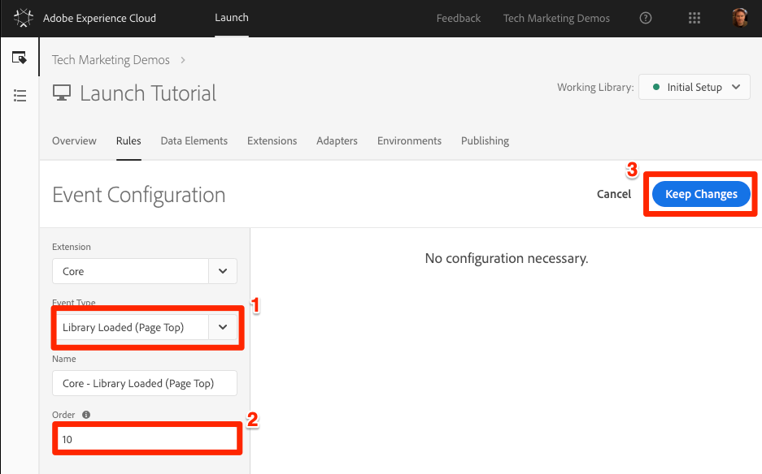

1. Under **[!UICONTROL Conditions]** click **[!UICONTROL Add]**

   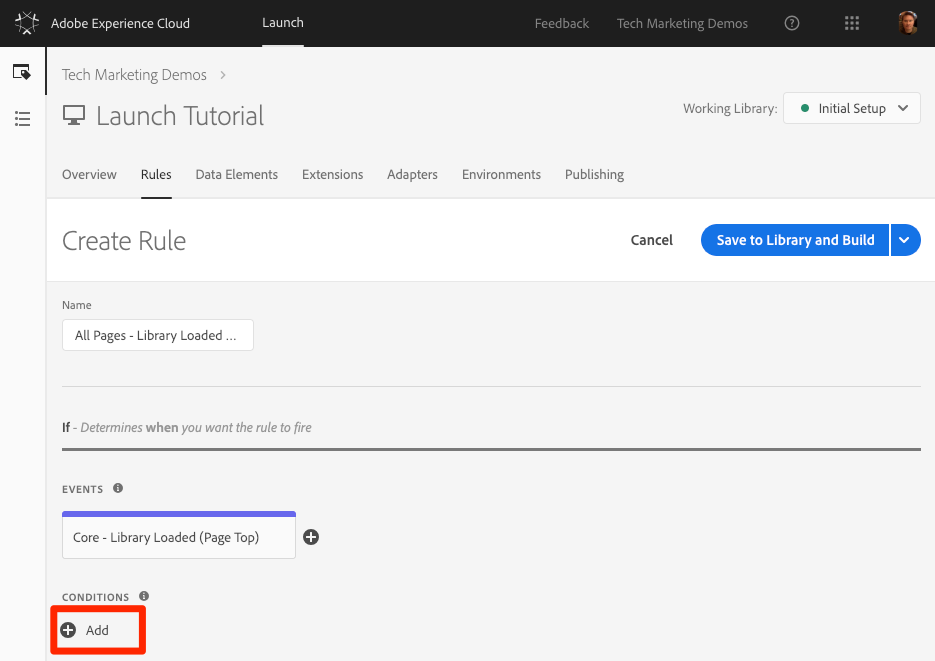

    1. For the **[!UICONTROL Condition Type]** select **[!UICONTROL Value Comparison]**
    1. Click the  icon to open the Data Element modal

        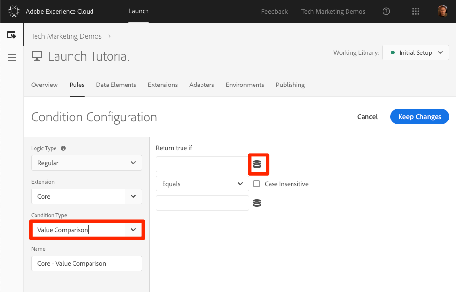

    1. In the Data Element Modal, click on **[!UICONTROL Authentication State]** and then click **[!UICONTROL Select]**

        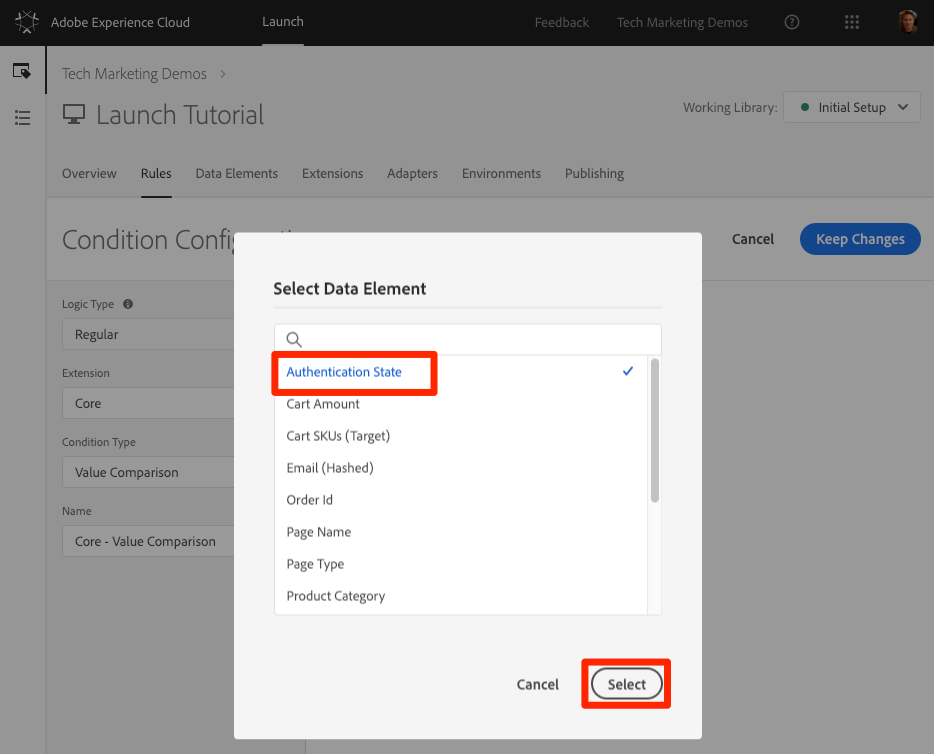

1. Type "logged in" in the `Equals` field, causing our rule fire whenever the Data Element “Authentication State” has has a value of “logged in”:

1. Click **[!UICONTROL Return trieKeep Changes]**

   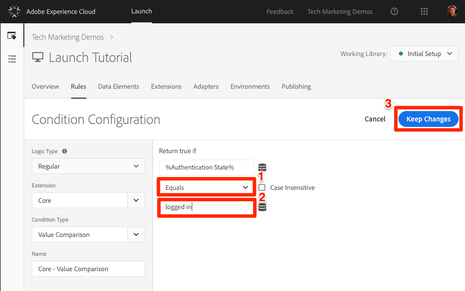

1. Under **[!UICONTROL Actions]** click **[!UICONTROL Add]**

   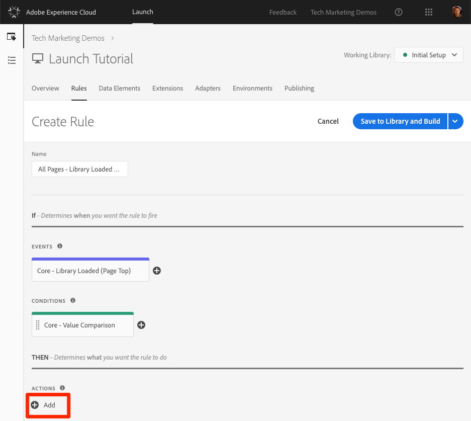

    1. For the **[!UICONTROL Extension]** select **[!UICONTROL Experience Cloud ID Service]**
    1. For the **[!UICONTROL Action Type]** select **[!UICONTROL Set Customer IDs]**
    1. For the **[!UICONTROL Integration Code]** enter `crm_id`
    1. For the **[!UICONTROL Value]** enter open the Data Element selector modal and select the `Email (Hashed)`
    1. For the **[!UICONTROL Auth State]** select **[!UICONTROL Authenticated]**
    1. Click the **[!UICONTROL Keep Changes]** button to save the action and return to the Rule Builder

        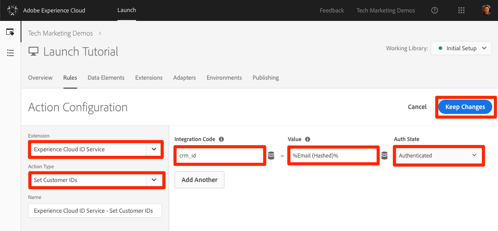

1. Click the **[!UICONTROL Save]** button to save the action

   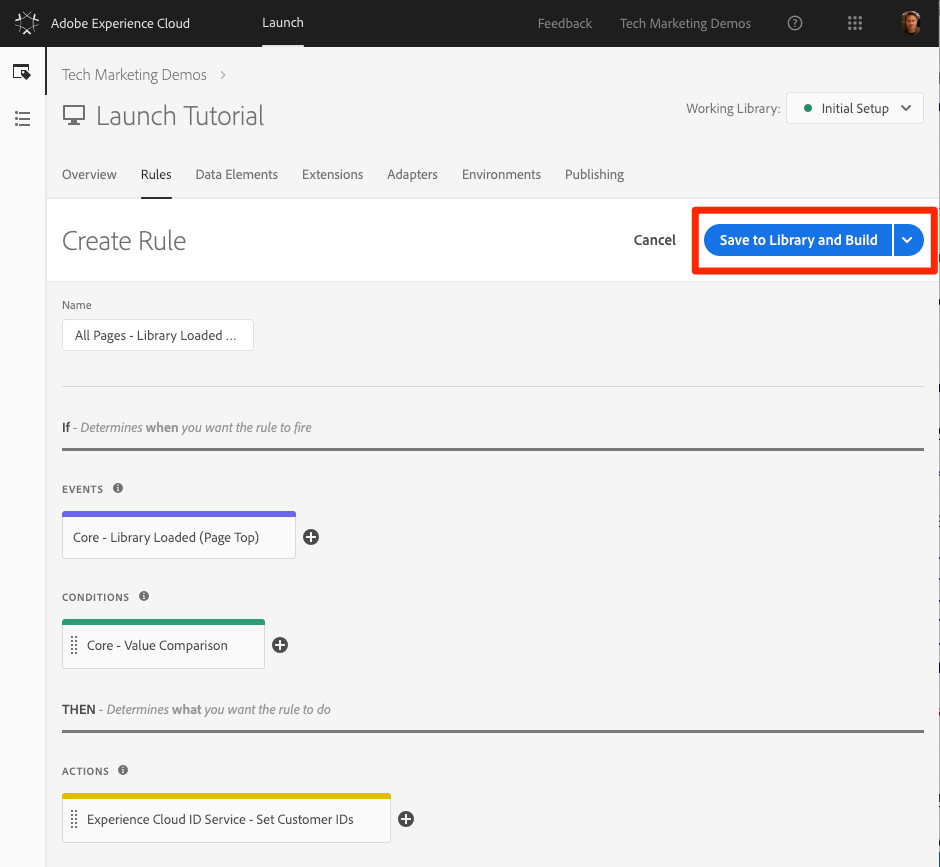

You've now created a rule that will send the Customer Id as a variable `crm_id` when the visitor is Authenticated. Since we specified the Order as `10` this rule will fire before our `All Pages - Library Loaded` rule created in the [Add Data Elements, Rules and Libraries](launch-data-elements-rules.md) lesson which uses the default Order value of `50`.

## Validation Steps

To validate your work, you will log into the We.Retail site to confirm the behavior of the new rule.

**To log into the We.Retail site**

1. Open the [We.Retail site](https://aem.enablementadobe.com/content/we-retail/us/en.html)

1. Make sure the Debugger is mapping the Launch property to *your* Development environment, as described in the [earlier lesson](launch-switch-environments.md)

   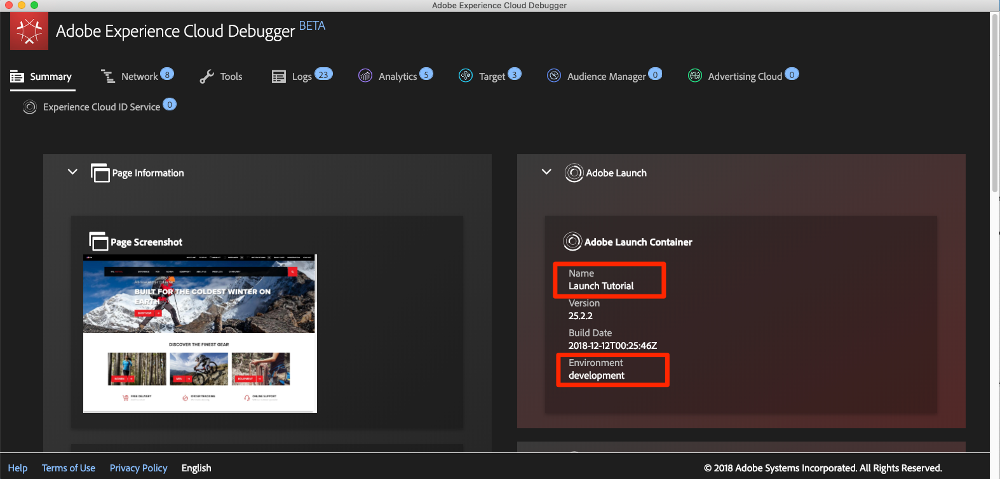

1. Click the **[!UICONTROL LOGIN]** link in the top right corner

   

1. Enter `test@adobe.com` as the username
1. Enter `test` as the password
1. Click the **[!UICONTROL LOGIN]** button

   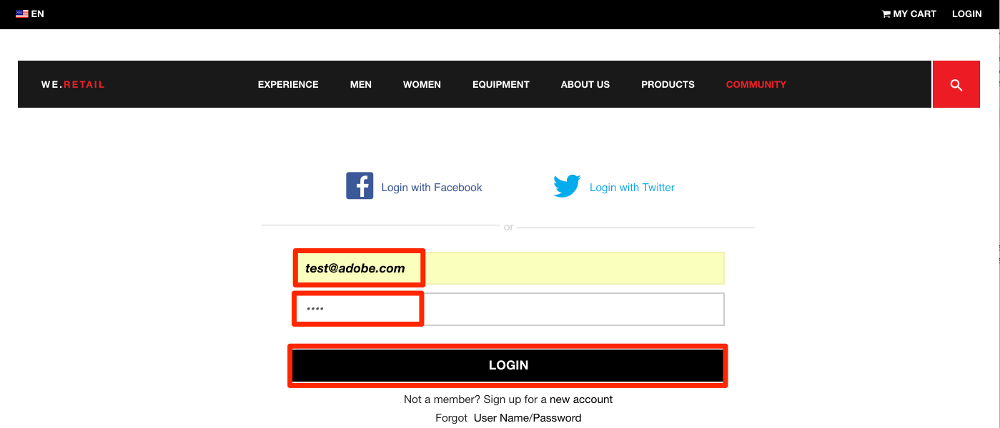

1. Return to the Homepage

Now, confirm the customer id is sent to the Service using the Debugger extension.

**To validate that the ID Service is passing the customer id**

1. Go to the Experience Cloud ID Service tab
1. Click on the cell with the `Customer ID - crm_id` value
1. In the modal, note the customer id value and that the `AUTHENTICATED` state is reflected:

   

1. Note that you can confirm the hashed email value by viewing the source code of the page and looking at the username property. It should match the value you see in the Debugger:

   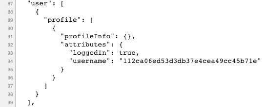

### Additional Debugging Tips

Launch also has rich console logging features. To turn them on, go to the **[!UICONTROL Tools]** tab in the Debugger and turn on the **[!UICONTROL Launch Console Logging Toggle]**.

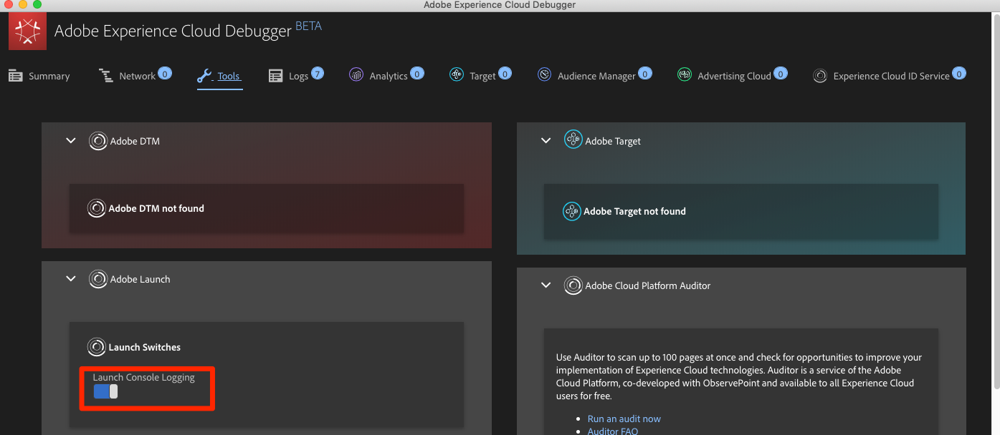

This will turn on console logging both in your browser console and in the Logs tab of the Debugger. You should see the logging of all of the rules you have created so far!:


[Next "Add Adobe Target" >](target.md)