# Add a Data Element, a Rule and a Library

This lesson will introduce you to some of the main concepts of Launch—Data Elements, Rules, and Libraries.

Data Elements and Rules are the basic building blocks of Launch. Data Elements store the attributes you want to send to your marketing and advertising solutions, while Rules fire the requests to those solutions under the right conditions.  Libraries are the JavaScript files that load on the page to do all of the work. In this lesson, we will use all three to make our sample page do something.

## Data Element for Page Name

Data elements are Launch’s version of a data layer. They can store values from your own data layer object, cookies, local storage objects, query string parameters, page elements, meta tags, etc. In this exercise, we will create a data element for Page Name, which we will use later in our Target and Analytics implementations.

1. In the top navigation, click **[!UICONTROL Data Elements]**

1. Since you haven't created any data elements yet in this property, a brief video appears with additional information on this topic. Watch this video, if you like.

1. Click the **[!UICONTROL Create New Data Element]** button:

   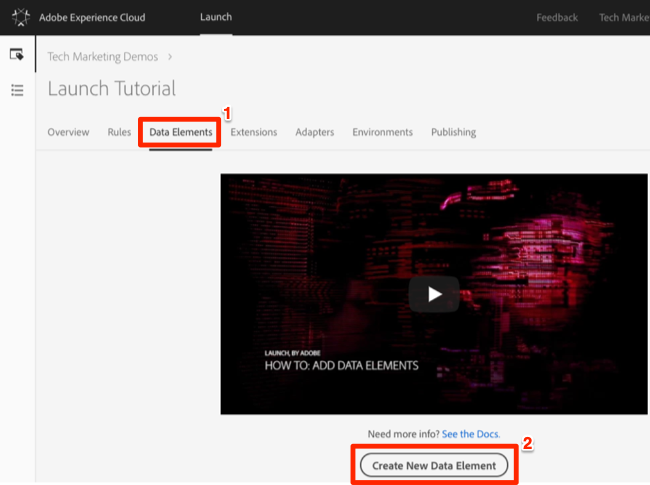

1. Name the data element, e.g. `Page Name`

1. Use the JavaScript Variable Data Element type to point to a value in our sample page's data layer: `digitalData.page.pageInfo.pageName`

1. Use `not available` as the Default Value

1. Check the boxes for **[!UICONTROL Force lowercase value]** and **[!UICONTROL Clean text]** to standardize the case and remove extraneous spaces

1. Leave **[!UICONTROL None]** as the **[!UICONTROL Storage Duration]** setting since this value will typically be different on every page

1. Save the data element

   .

### Differences in Data Elements between Launch and DTM

* Data Elements have their own top navigation element
* New data element types have been added, such as Local Storage, Session Storage, Page Info, and Random Number
* Data element capabilities _can be extended with Extensions_. For example, the ContextHub extension allows you to add data elements using features of the extension.

## Create a Rule

Next we will use this data element in a simple rule. Rules are one of the most powerful features in Launch and allow you to specify what should happen when. When the criteria outlined in your rules are met, the rule triggers the extension, script, or HTML you identified.

We are going to create a rule that outputs the Page Name data element value to the browser console.

1. In the top navigation, click **[!UICONTROL Rules]**

1. Since you haven't created any rules yet in this property, a brief video appears with additional information on the topic. Watch this video, if you like.

1. Click the **[!UICONTROL Create New Rule]** button:

   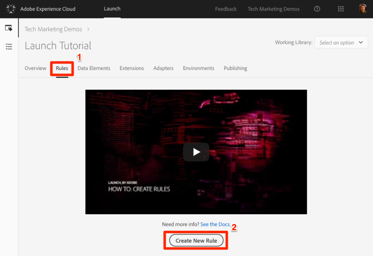

1. Name the Rule `All Pages - Library Loaded`. We will use a naming convention that indicates where and when the rule will fire.

1. Under Events, click **[!UICONTROL Add]**

   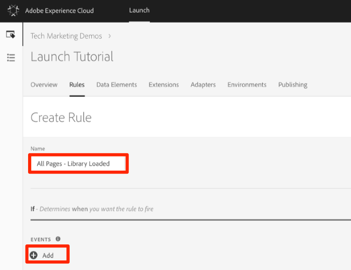
  
   1. As the Event Type, select **[!UICONTROL Library Loaded (Page Top)]**

   1. Click the **[!UICONTROL Keep Changes]** button
  
   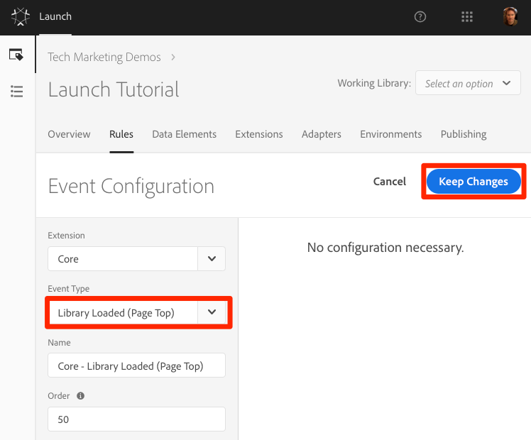

1. Since we want to fire this rule on all pages, we are going to leave **[!UICONTROL Conditions]** blank. If you open the Conditions modal, you will see that conditions can add both restrictions and exclusions based on a large variety of options including, URLs, data element values, date ranges, and more.

1. Under Actions, click **[!UICONTROL Add]**

1. Select **[!UICONTROL Action Type > Custom Code]**

1. Select **[!UICONTROL </> Open Editor]** to open the code editor

   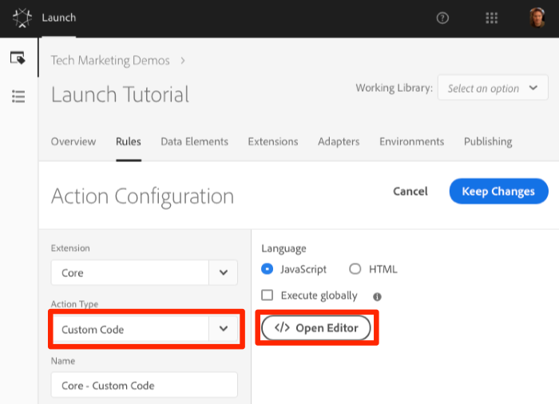

1. Add the following to the code editor. This code will output the value of the Page Name data element to the browser console so we can confirm it's working: `console.log('The page name is '+_satellite.getVar('Page Name'));`

1. Save the code editor

   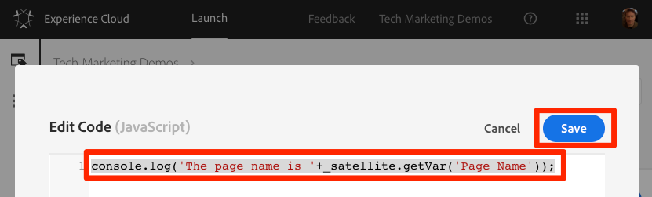

1. On the Action configuration screen click **[!UICONTROL Keep Changes]**

1. Click **[!UICONTROL Save]** to save the rule

>[!NOTE]**DTM Migrators:** In Launch, rules are required in order to fire most marketing pixels. For example, in order to fire the Adobe Analytics Beacon, we must use a Rule to instruct Launch to do so.
>
> The Rule builder has been dramatically redesigned and rebuilt in Launch.
> Some of the main changes are:
>
> * There is just one Rule builder. DTM rule-types like "Page Bottom", "Click", and "Direct Call" are all just event-types in the Rule builder. This makes it much easier to update a rule should you need to change the trigger from, say, a DOM Ready event to a custom event.
> * There is a new "Custom Code" event-type
> * Extensions can add new event types to the Rule builder. For example, the Target extension could eventually add built-in support for its [at.js custom events](https://marketing.adobe.com/resources/help/en_US/target/ov2/r_target-atjs-notification.html), so custom code wouldn't be needed to use this feature.
> * Extensions can add new actions to the Rule builder, reducing issues by deprecating reliance on custom code. You will be using many of these extension actions in this Tutorial.
> * Rules are required to fire requests associated with most marketing tools. This will require a mindset adjustment, especially for things    like setting Customer IDs, firing Analytics beacons, and firing the    global mbox.

## Save the Rule to a Library

1. Go to the Publishing tab

1. Click **[!UICONTROL Add New Library]**

   

1. Name the Library "Initial Setup"

1. Select **[!UICONTROL Environment > Development]**

1. Click **[!UICONTROL Add All Changed Resources]**

   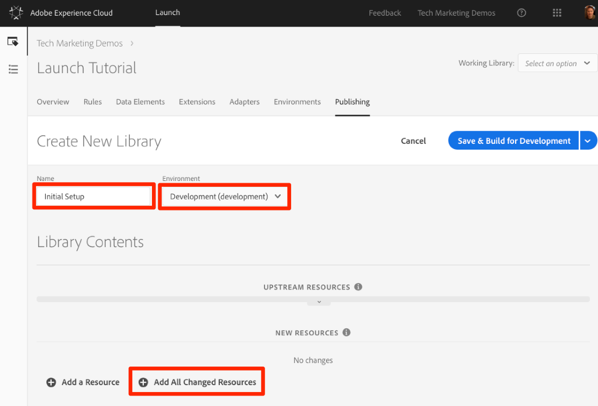

1. Note that after clicking **[!UICONTROL Add All Changed Resources]** Launch summarizes the changes you just made.

1. Click **[!UICONTROL Save & Build for Development]**

   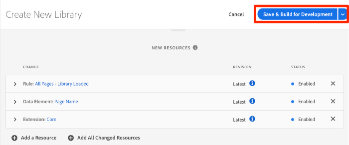

After a few moments, the status dot will turn green indicating the library successfully built.

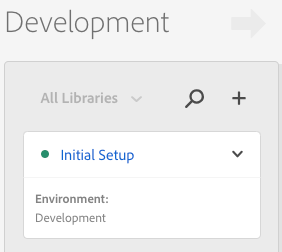

### Differences in Libraries between Launch and DTM

* The ability to have multiple development libraries

## Validate Your Work

Now let's validate that your rule is working as expected.

Reload your sample page. If you look at the Developer Tools -> Network tab, you should now see a 200 response for your Launch Library!

If you look at the Developer Tools -> Console, you should see the text "The page name is home"

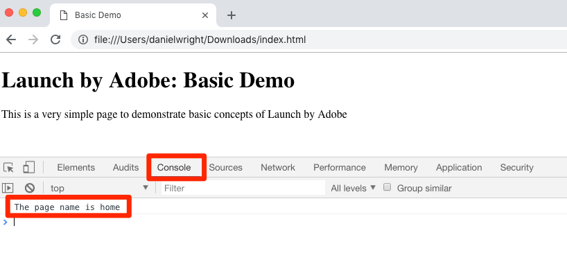

Congratulations, you created your first Data Element and Rule and built your first Launch Library!

## Use the Working Library Feature

Now that you have created your "Initial Setup" library, let's look at a feature in Launch that will let you rapidly save your changes and rebuild the library at the same time.

Let's make a small change to our "All Pages - Library Loaded" rule. In the top navigation, click **[!UICONTROL Rules]** and then click on the `All Pages - Library Loaded` rule to open it up.

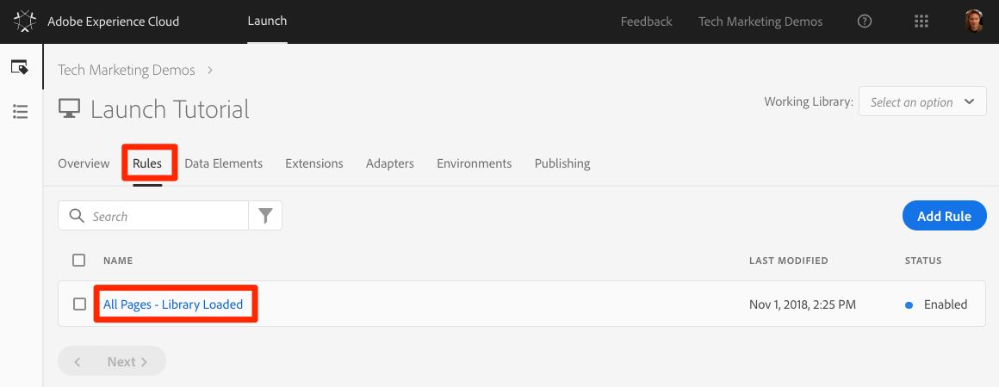

On the `Edit Rule` page, click the ***[!UICONTROL Select an option]*** dropdown to show the `Working Library` options. Select your `Initial Setup` library.

Once you've selected the library, you should see that the **[!UICONTROL Save]** button now defaults to **[!UICONTROL Save and to Library and Build]**. When you make a change in Launch, you can use this option to automatically add the change directly to your working library and rebuild the JavaScript files with the changes. You won't have to add the changes and rebuild on the Publishing page like you did earlier:

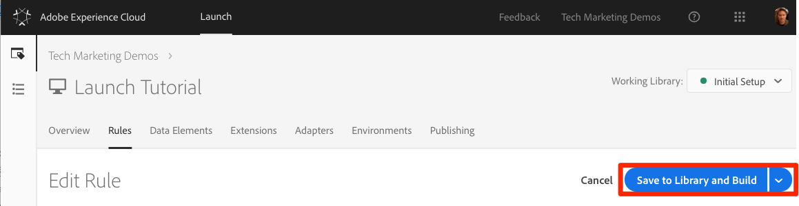

Let's test it out. Open your Custom Code action and just add a colon after the text "The page name is" so the entire code block reads `console.log('The page name is: '+_satellite.getVar('Page Name'));`

Save the code, keep the changes in the action, and now click the **[!UICONTROL Save to Library and Build]** button.

Reload your sample page and you should see your change reflected in the console message (you may have to clear your browser cache and reload, in order to see the change to the page):

This is a much faster way of working and we will use this approach for the rest of the tutorial.

[Next "Switch Environments with the Experience Cloud Debugger" >](launch-switch-environments.md)
