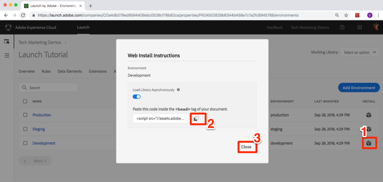

# Switch Launch Environments with the Experience Cloud Debugger

In this lesson you will use the [Adobe Experience Cloud Debugger extension](https://chrome.google.com/webstore/detail/adobe-experience-cloud-de/ocdmogmohccmeicdhlhhgepeaijenapj) to replace the Launch property hardcoded on the [We.Retail demo site](https://aem.enablementadobe.com/content/we-retail/us/en.html) with your own property. This technique will be helpful outside of this tutorial, when working with Launch own website. You will be able to test changes in a Development environment before you publish them to your Production. This will enable you to confidently make and QA Launch changes independently from your regular code releases.  After all, this separation of marketing tag releases from your main codebase releases is probably one of the main reasons you are using Launch in the first place!

## Get the URL of your Development Environment

1. In your Launch property, open the `Environments` page

1. In the **[!UICONTROL Development]** row, click the Install icon

    to open the modal

1. Click the Copy icon  to copy the embed code to your clipboard

1. 1. Click **[!UICONTROL Close]** to close the modal

   

## Replace the Launch URL on the We.Retail Demo Site

1. Open the [We.Retail demo site](https://aem.enablementadobe.com/content/we-retail/us/en.html) in your Chrome browser

1. Open the [Experience Cloud Debugger extension](https://chrome.google.com/webstore/detail/adobe-experience-cloud-de/ocdmogmohccmeicdhlhhgepeaijenapj) by clicking the  icon

   

1. Note that the currently implemented Launch property is shown on the Summary tab

   

1. Go to the Tools Tab

1. Click **[!UICONTROL Adobe Launch > Dynamically Insert Launch > Embed Code]** button to open the text input field:

   

1. Paste the embed code that is in your clipboard

1. Click the disk icon to save

   

1. Reload and check the Summary tab of the Debugger. Under the Launch section, you should now see your Development Property is implemented, showing your property name (I.e. "Launch Tutorial" or whatever you named your property)!

   

>[!NOTE] The Debugger will save this configuration and replace the Launch embed codes whenever you come back to the We.Retail site. It will not impact other sites you visit in other open tabs.

As you continue the tutorial, you will use this technique of mapping the We.Retail site to your own Launch property to validate your Launch implementation. When you start using Launch on your production website, you can use this same technique to validate changes you make to your Development and Staging Environments before you publish them to Production.

[Next "Add the Experience Cloud ID Service" >](id-service.md)