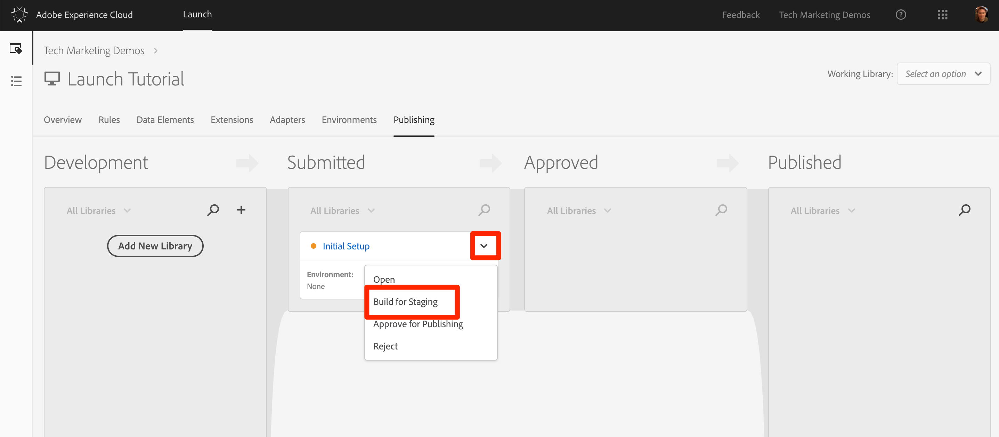
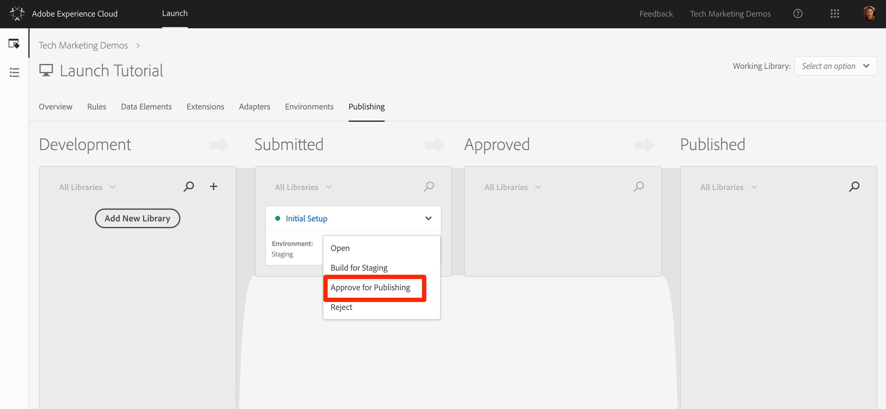
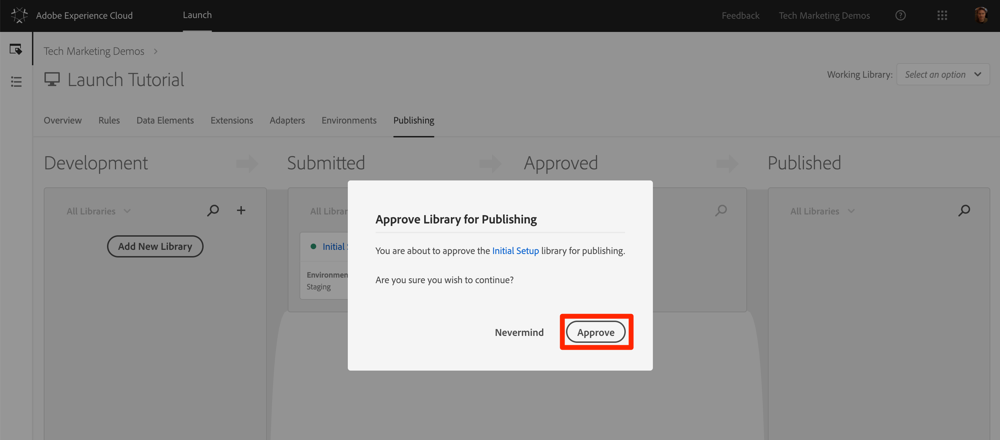
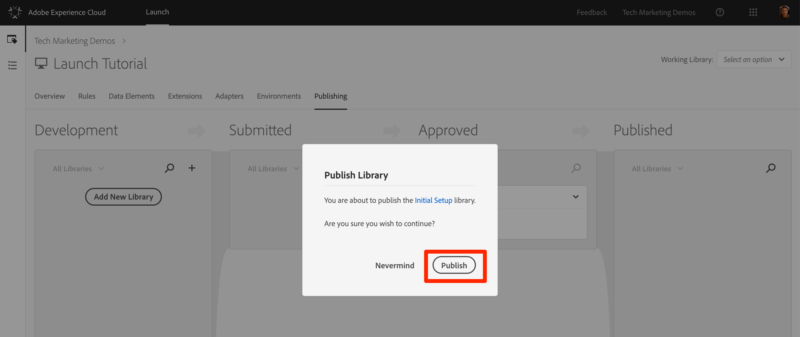

# Publish your changes

Now that you have implemented and validated some key solutions of the Adobe Experience Cloud in your Development environment, it's time to publish your property to become familiar with this workflow in Launch.

## Learning Objectives

At the end of this lesson, you will be able to:

1. Publish a Development library to the Staging environment
1. Map a Staging library to your production environment using the Debugger
1. Publish a Staging library to the Production environment

## Publish to Staging

 Once you have validated your changes in the Development environment, it is time to publish them to the Staging environment.

1. Go to the `Publishing` page in Launch

1. Open the dropdown next to your library and select **[!UICONTROL Submit for Approval]**

   

1. Click the **[!UICONTROL Submit]** button in the dialog:

   

1. Your library will now appear in the Submitted column in an unbuilt state:

1. Open the dropdown and select “Build for Staging:”

   

1. Once the green-dot icon appears, the library can be previewed in the Staging environment.

Once your QA team has signed off by reviewing the changes in the Staging environment it is time to publish to production.

## Publish to Production

1. From the “Publishing” page, click “Approve for Publishing”:

   

1. Click “Approve” in the dialog box:

   

1. The library will now appear in the Approved column in the unbuilt state (yellow dot):

1. Open the dropdown and select “Build and Publish to Production:”

   

1. Click “Publish” in the dialog box:

   

1. The library will now appear in the Published column:

That’s it! You have now implemented the Experience Cloud using Launch!

   