# Adobe Target

In this lesson, we will implement Adobe Target with a global mbox and custom parameters. There are  optional exercises for Target Premium customers seeking to implement Recommendations and Enterprise User permissions.

The Adobe Target extension supports client-side implementations using Target's JavaScript SDK for the modern web, at.js. Customers still using Target's older library, mbox.js, [should upgrade to at.js](https://marketing.adobe.com/resources/help/en_US/target/ov2/t_target-migrate-atjs.html) in order to use Launch.

The Target extension consists of two main parts:

1. The extension configuration, which manages the core library settings
1. Rule actions to do the following:
    1. Load Target (at.js)
    1. Add Params to All Mboxes
    1. Add Params to Global Mbox
    1. Fire Global Mbox

## Pre-requisites

To complete the lessons in this section, you must first complete the lessons in [Configure Launch](launch.md) and [Add the ID Service](id-service.md).

## Add the Target Pre-Hiding Snippet

Before we get started, we need to make a slight update to the Launch embed codes. When the Launch embed codes are loaded asynchronously, the page may finish rendering before the Target library is fully loaded and has performed its content swap. This can lead to what is known as "flicker" where  default content briefly displays before being replaced by the personalized content specified by Target. If you want to avoid this flicker, we strongly recommend hardcoding a special pre-hiding snippet immediately before Launch's asynchronous embed codes.

This has already been done on the We.Retail site, but let's go ahead and do this on the sample page so you understand the implementation. Copy the following lines of code:

```html
<script>
    //prehiding snippet for Adobe Target with asynchronous Launch deployment
    (function(g,b,d,f){(function(a,c,d){if(a){var e=b.createElement("style");e.id=c;e.innerHTML=d;a.appendChild(e)}})(b.getElementsByTagName("head")[0],"at-body-style",d);setTimeout(function(){var a=b.getElementsByTagName("head")[0];if(a){var c=b.getElementById("at-body-style");c&&a.removeChild(c)}},f)})(window,document,"body {opacity: 0 !important}",3E3);
</script>
```

Open the sample page and paste it just before your Launch embed code as pictured below:
   

Reload your sample page. You will notice that the page will be hidden for three seconds before it shown. This behavior is temporary and will go away after you have deployed Target. This behavior is controlled by two configurations at the very end of the pre-hiding snippet, which can be customized but are usually best left on the default settings:

* `body {opacity: 0 !important}` specifies the css definition to use for the pre-hiding until Target loads. By default, the entire body will be hidden. If you have a consistent DOM structure with an easily identifiable container element wrapping all of the content below your navigation, for example, and you never wanted to test or personalize your navigation, you could use this setting to limit the pre-hiding to that container element.
* `3E3` which specifies the timeout setting for the pre-hiding. By default, if Target hasn't loaded in three seconds the page will be shown. This should be extremely rare.

For more details and to obtain the un-minified pre-hiding snippet, please see [the Adobe Target extension with an asynchronous deployment​](https://docs.adobelaunch.com/extension-reference/web/adobe-target-extension#adobe-target-extension-with-an-asynchronous-deployment.)

## Add the Target Extension

1. Go to **[!UICONTROL Extensions > Catalog]**
1. Type `Target` in the filter to quickly locate the Adobe Target extension
1. Click **[!UICONTROL Install]**

   

1. When you add the extension, it will import many of your at.js settings from the Target interface, as pictured below, although the Timeout will always be 3000ms. Leave the default settings. Note, that on the left hand side it will show the at.js version that ships with the current version of the extension.

1. Click **[!UICONTROL Save to Library and Build]** 

## Load Target and Add the Global Mbox

Marketers use Target to control the visitor experience on the page when testing and targeting content. Because of this important role the final display of the page, Target should be loaded as early as possible to minimize the impact on page visibility. In this section, we will load the Target JavaScript SDK library&#8212;at.js&#8212;as well as fire the global mbox.

You can use the `All Pages - Library Loaded` rule you created in the lesson "[Add Data Elements, Rules and Libraries](launch-data-elements-rules.md)" to implement Target because is triggered as early as possible on every page.

1. Go to the **[!UICONTROL Rules]** in the top navigation and then click on `All Pages - Library Loaded` to open the rule editor.

   

1. Under Actions, click the  to add a new action

   

1. Select **[!UICONTROL Extension > Adobe Target]**

1. Select **[!UICONTROL Action Type > Load Target]**

1. Click **[!UICONTROL Keep Changes]**

   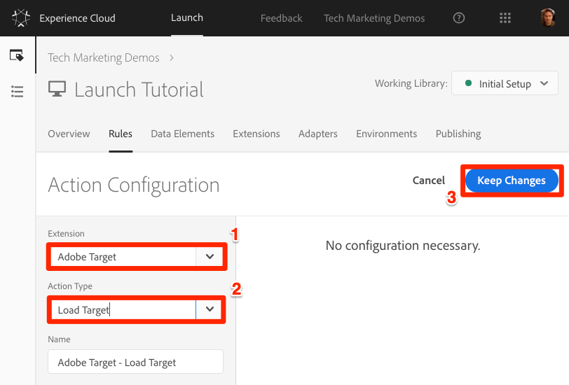

1. Under Actions, click the  again to add another action

   

1. Select **[!UICONTROL Extension > Adobe Target]**

1. Select **[!UICONTROL Action Type > Fire Global Mbox]**

1. There are some configurations available for the global mbox related to whether or not to hide the page and CSS selector to use for pre-hiding. These settings work in conjunction with the pre-hiding snippet hardcoded on the page. Leave the default settings.

1. Click **[!UICONTROL Keep Changes]**

1. The new action is added in sequence after the `Load Target` action and the actions will execute in this order. You can drag and drop to rearrange the order, although because of dependencies, `Load Target` should always fire before the Fire Global Mbox Target action.

1. Click **[!UICONTROL Save to Library and Build]**

   

1. Wait until the green dot appears next to your working library, indicating that the new version of the library has been built.

   

1. Now, reload your sample page. You should no longer see a delay of three seconds before the page is visible. If you are loading the sample page using the `file://` protocol, you should do this step in Firefox or Safari browsers since Chrome will not fire a Target request when using the `file://` protocol.

## Add Parameters

Passing parameters in the Target request will add powerful capabilities to your targeting, testing, and personalization activities. The Launch extension provides two actions to pass parameters:

1. `Add Params to All Mboxes`, which includes parameters in all mbox requests made in the scope of the page, e.g. additional mbox requests made from Custom Code actions or hardcoded on your site. It is equivalent to using the [targetPageParamsAll()](https://marketing.adobe.com/resources/help/en_US/target/ov2/cmp_at.js_Functions.html) method in at.js.
1. `Add Params to Global Mbox`, which includes parameters only in the global mbox requests. It is equivalent to using the [targetPageParams()](https://marketing.adobe.com/resources/help/en_US/target/ov2/cmp_at.js_Functions.html) method in at.js.

>[!NOTE] Since most implementations only use the global mbox for activity delivery, it usually good to just use the `Add Params to Global Mbox` action.

### Add an Mbox Parameter

Mbox parameters are used to pass custom data to Target, enriching your personalization capabilities. They are ideal for attributes that change frequently during a browsing session such as the page name, template, etc. and do not persist.

Let's add the `Page Name` data element that we created earlier in the [Add Data Elements, Rules and Libraries](launch-data-elements-rules.md) lesson as an mbox parameter.

1. Go to the **[!UICONTROL Rules]** in the top navigation and then click on `All Pages - Library Loaded` to open the rule editor.

   

1. Under Actions, click the  to add a new action

   

1. Select **[!UICONTROL Extension > Adobe Target]**

1. Select **[!UICONTROL Action Type > Add Params to Global Mbox]**

1. Enter `pageName` as the **[!UICONTROL Name]**

1. Click the  to open the data element modal

   

1. Click the `Page Name` data element

1. Click the **[!UICONTROL Select]** button

  

1. Click **[!UICONTROL Keep Changes]**

   

1. Click-and-drag on the left edge of the `Add Parames to Global Mbox` action to rearrange the actions so that `Add Parames to Global Mbox` is between `Load Target` and `Fire Global Mbox`

1. Click **[!UICONTROL Save to Library and Build]**

  

#### Validate the Mbox Parameter

Reload the We.Retail site with it mapped to your property with Experience Cloud Debugger. Now go to the **[!UICONTROL Target]** tab in the Debugger. Expand your client code and look at the requests. You should see the new `pageName` parameter passed in the request:


### Profile Parameters

Profile parameters passed through mbox calls are written to Target visitor profile database where they will persist for the [duration of the visitor profile](https://marketing.adobe.com/resources/help/en_US/target/ov/c_visitor_profile_lifetime.html). They are ideal for attributes that rarely change or are only available on certain pages.

Just give the profile parameter a name prefixed with "profile." and map it to the relevant data element. This is what it would look like to set a profile parameter called "userType":


### Add Customer ID Parameters

The collection of customer ids with the Experience Cloud ID Service makes it easy to import CRM data into Target using the [Customer Attributes](https://marketing.adobe.com/resources/help/en_US/target/target/c_working-with-customer-attributes.html) feature of the Adobe Experience Cloud. It also enables [cross-device visitor stitching](https://marketing.adobe.com/resources/help/en_US/target/target/c_experience-cloud-device-co-op.html), allowing you to maintain a consistent user experience as your customers switch between say a laptop and their mobile device.

It is imperative that the Customer ID is sent before firing the global mbox. To that end, make sure you have the following capabilities on your site:

* The customer ID must be available on the page before the Launch Embed Code
* The Experience Cloud ID Service extension must be installed
* You must use the "Set Customer IDs" action in a rule that fires at the "Library Loaded (Page Top)" event
* Use the "Fire global mbox" action in a rule that fires *after* the "Set Customer IDs" action

In the previous lesson, [Add the Experience Cloud ID Service](id-service.md), you created the `All Pages - Library Loaded - Authenticated - 10` rule to fire the "Set Customer ID" action. Because this rule has an  `Order` setting of `10`, the customer ids are set before our our global mbox fires from the `All Pages - Library Loaded` rule with its `Order` setting of `50`. So, you have already implemented the collection of customer ids for Target!

#### Validate the Customer ID

1. Open the [We.Retail site](https://aem.enablementadobe.com/content/we-retail/us/en.html)

1. Make sure the Debugger is mapping the Launch property to *your* Development environment, as described in the [earlier lesson](launch-switch-environments.md)

   

1. Log into the We.Retail site using the credentials `test@adobe.com`/`test`
1. Return to the [We.Retail homepage](https://aem.enablementadobe.com/content/we-retail/us/en.html)
1. Open the Debugger
1. Go to the Target tab
1. Expand your client code
1. You should see parameters in the latest Target request for `vst.crm_id.id` and `vst.crm_id.authState`. `vst.crm_id.id` should have a value of the hashed email address and `vst.crm_id.authState` should have a value of `1` to represent `authenticated`. Note that `crm_id` is the `Integration Code` you specified in the ID Service configuration and must align with the key you use in your [Customer Attributes data file](https://marketing.adobe.com/resources/help/en_US/mcloud/t_crs_usecase.html):

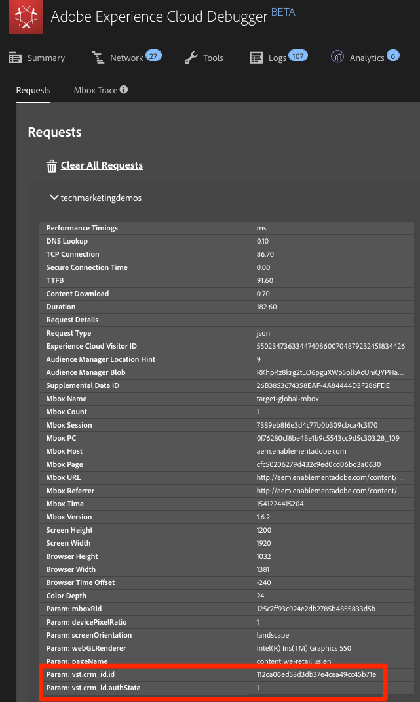

>[!WARNING] The Experience Cloud ID Service will allow you to send multiple ids to the Service, however, only the first one will be sent to Target.

### Optional: Add Property Token Parameter for Enterprise User Permissions (Target Premium)

The property token is a reserved parameter used with the Premium [Enterprise User Permissions](https://marketing.adobe.com/resources/help/en_US/target/target/property_channel.html) . It is used to define different properties so that different members of an Experience Cloud Organization can be assigned different permissions to each one (e.g. a group of users can set up activities on the web site, but not on the mobile application). Target properties are analogous to Launch properties and Analytics report suites. An enterprise with multiple brands, websites, and marketing teams might use a different Target property, Launch property and Analytics report suite for each website or mobile app. Launch properties are differentiated by their embed codes, Analytics report suites are differentiated by their report suite id, and Target properties are differentiated by their property token parameter.

The property token is implemented just like an mbox parameter. Just name the parameter "at_property" and paste in the value provided in the Target interface.  If you are implementing multiple sites with a single Launch property, you could manage the at_property value via a data element.

Here is an optional exercise, if you would like to implement a property token in your Tutorial property:

1. In a separate tab, open the Target user interface

1. Go to **[!UICONTROL Setup > Properties ]**

1. Identify the Property that you want to use and click the **[!UICONTROL </> ]** (or create a new property)

1. Copy the `at_property` value to your clipboard

   

1. In your Launch tab, go to the **[!UICONTROL Rules]** in the top navigation and then click on `All Pages - Library Loaded` to open the rule editor.

   

1. Under Actions, click the `Adobe Target - Add Params to Global Mbox` action top open the `Action Configuration`

   

1. Under the `pageName` parameter, click the **[!UICONTROL Add]** button

   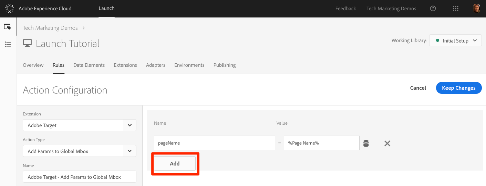

1. Name the parameter `at_property` and paste in the value you copied from the Target interface

1. Click **[!UICONTROL Keep Changes]**

   

1. Click **[!UICONTROL Save to Library and Build]**
   

#### Validate the Property Token

1. Open the [We.Retail site](https://aem.enablementadobe.com/content/we-retail/us/en.html)
1. Make sure the Debugger is mapping the Launch property to *your* Development environment, as described in the [earlier lesson](launch-switch-environments.md)

   
1. Open the Debugger
1. Go to the Target tab
1. Open your client code
1. You should see the parameter for "at_property" in every global mbox request:


### Optional: Add Entity Parameters for Recommendations (Target Premium)

Entity parameters are used in [Recommendations implementations](https://marketing.adobe.com/resources/help/en_US/target/recs/c_plan_implement.html) for three main reasons:

1. As a key to trigger product recommendations. For example, when using a recommendations algorithm like "People who viewed Product X, also viewed Y," "X" is the "key" of the recommendation. It is usually the product sku (`entity.id`) or category (`entity.categoryId`) that you are currently viewing.
1. To collect visitor behavior to power recommendations algorithms, such as "Recently Viewed Products" or "Most Viewed Products"
1. To populate the Recommendations catalog. Recommendations contains a database of all of the products or articles on your website, so they can be served in the recommendation offer. For example, when recommending products, you typically want to display attributes like the product name (`entity.name`) and image (`entity.thumbnailUrl`). Some customers populate their catalog using backend feeds, but they can also be populated using entity parameters in mbox calls.

Just give the parameter a name prefixed with "entity." and map it to the relevant data element. Note that some common entities have reserved names that must be used (e.g. entity.id for the product sku).


Below is an optional exercise for Target Premium customers to add the `entity.id` and `entity.categoryId` parameters to relevant pages in the global mbox request. In order to deliver recommendations without flicker, it is critical to pass the `entity.id` and `entity.categoryId` parameters at the top of the page, in the global mbox. If your data layer id defined before the Launch embed codes, you can pass the other catalog entities here, too. Since you have already created multiple data elements in this tutorial, screenshots are not included for every step.

>[!WARNING] If you have already implemented Recommendations in your Target account, completing the steps in this exercise add invalid products to your catalog. Create a new Host Group in Target and associate the `enablementadobe.com` domain with this new Group before proceeding. Alternatively, you can read through the instructions to understand the implementation

#### Create Data Element for Product Id

You will use this to set the reserved `entity.id` parameter to key recommendations algorithms, collect visitor behavior, and populate the catalog

1. Click **[!UICONTROL Data Elements]** in the top navigation
1. Click **[!UICONTROL Add Data Element]**
1. Name the data element `Product SKU (Target)`
1. Select **[!UICONTROL Data Element Type > JavaScript Variable]**
1. Use `digitalData.product.0.productInfo.sku` as the `Path to Variable`
1. Check the `Force lowercase value` option
1. Check the `Clean text` option
1. Click **[!UICONTROL Save to Library and Build]**

#### Create Data Element for Product Category

You will use this to set the reserved `entity.categoryId` parameter to key recommendations algorithms, collect visitor behavior, and populate the catalog. It is possible to collect multiple category ids in a comma-separated list.

1. Click **[!UICONTROL Add Data Element]**
1. Name the data element `Product Category`
1. Select **[!UICONTROL Data Element Type > JavaScript Variable]**
1. Use `digitalData.product.0.productInfo.description` as the `Path to Variable`
1. Check the `Clean text` option
1. Click **[!UICONTROL Save to Library and Build]**

#### Create Data Element for Product Name

You will use this to set the reserved `entity.name` parameter to populate the catalog with the product name

1. Click **[!UICONTROL Add Data Element]**
1. Name the data element `Product Name`
1. Select **[!UICONTROL Data Element Type > JavaScript Variable]**
1. Use `digitalData.product.0.productInfo.title` as the `Path to Variable`
1. Check the `Clean text` option
1. Click **[!UICONTROL Save to Library and Build]**

#### Create Data Element for Product Path

You will use this to set the reserved `entity.pageUrl` parameter to populate the catalog with the URL path of the product detail page so you can create links in Recommendations offers

1. Click **[!UICONTROL Add Data Element]**
1. Name the data element `Product Path`
1. Select **[!UICONTROL Data Element Type > Page Info]**
1. Select  **[!UICONTROL Attribute > Pathname]**
1. Click **[!UICONTROL Save to Library and Build]**

#### Create Data Element for Product Thumbnail Path

You will use this to set the reserved `entity.thumbnailUrl` parameter with the URL of a thumbnail image so you present visual product Recommendations

1. Click **[!UICONTROL Add Data Element]**
1. Name the data element `Product Thumbnail Path`
1. Select **[!UICONTROL Data Element Type > Custom Code]**
1. Use the following custom code:

   ```javascript
   var myStr = digitalData.page.pageInfo.pageName;
   var newStr = myStr.replace(/:/g, '/');
   return '/' + newStr + '/jcr:content/root/product/image.thumbnail.160.png';
   ```

1. Click **[!UICONTROL Save to Library and Build]**

#### Add a Rule to Pass the Entity Parameters to the Global Mbox

Now that you have created all of the data elements you need to add them to the global mbox call. Most of these data elements only exist on the product detail pages, so you will need a new rule that will only fire on the product details page.

1. Go to the **[!UICONTROL Rules]** in the top navigation and then click **[!UICONTROL Add Rule]**

    

1. Name the rule `Product Details - Library Loaded - 40`

1. Click **[!UICONTROL Events > Add]** to open the `Event Configuration` screen

    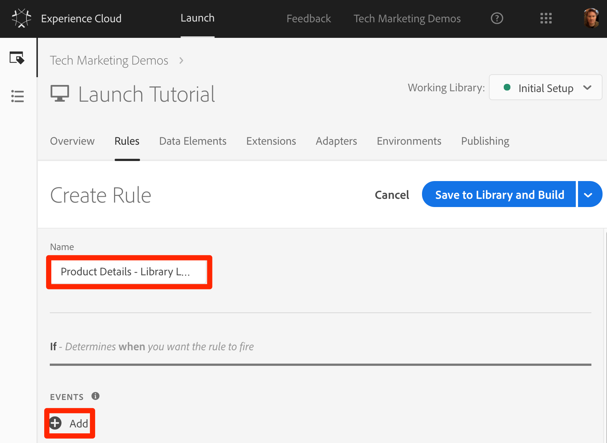

   1. Select **[!UICONTROL Event Type > Library Loaded]**

   1. Change the `Order` to `40`

   1. Click **[!UICONTROL Keep Changes]**
  
    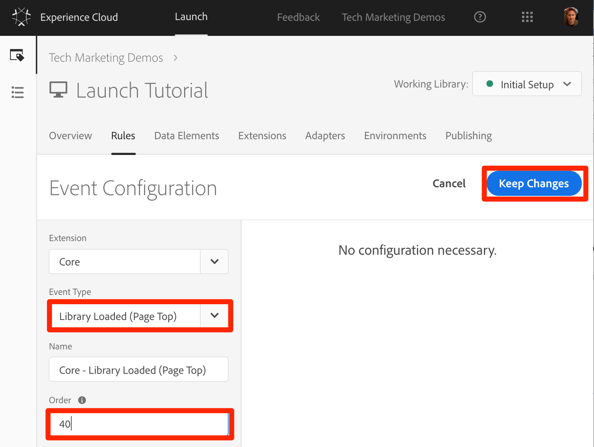

1. Click **[!UICONTROL Conditions > Add]** to open the `Condition Configuration` screen

    

   1. Select **[!UICONTROL Condition Type > Value Comparison]**
   1. Use the data element picker, choose `Product SKU (Target)`
   1. Select  **[!UICONTROL Is Truthy]** from the comparison operator dropdown
   1. Click **[!UICONTROL Keep Changes]**

   

1. Click **[!UICONTROL Actions > Add]** to open the `Action Configuration` screen

   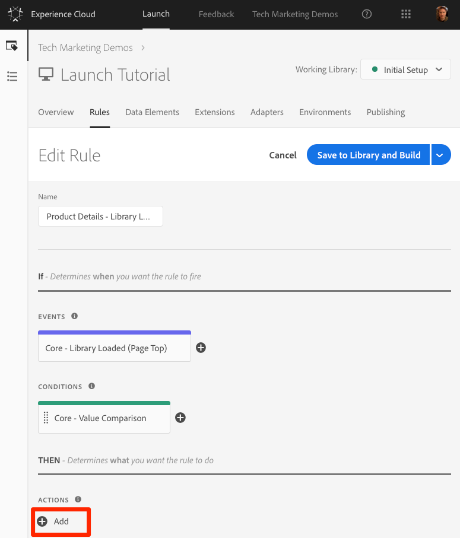

   1. Select **[!UICONTROL Extension > Adobe Target]**

   1. Select **[!UICONTROL Action Type > Add Params to Global Mbox]**

   1. Add the parameters for `entity.id`, `entity.name`, `entity.pageUrl`, `entity.categoryId`, `entity.thumbnailUrl`, assigning their values to the data elements created earlier

   1. Click  **[!UICONTROL Keep Changes]**

   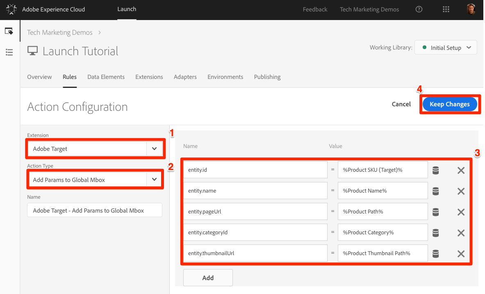

1. Click **[!UICONTROL Save to Library and Build]**

   

Typically, you would set up a similar rule on the product category pages that would that would pass the `entity.categoryId` to Target on the category pages. You could then deliver category-based recommendations to these pages.

#### Validate the Entity Parameters

1. Open the We.Retail site to a [product details page](https://aem.enablementadobe.com/content/we-retail/us/en/products/men/coats/portland-hooded-jacket.html#meotwipot-S)
1. Make sure the Debugger is mapping the Launch property to *your* Development environment, as described in the [earlier lesson](launch-switch-environments.md)

   
1. Open the Debugger
1. Go to the Target tab
1. Open your client code
1. You should see the entity parameters in every global mbox request on a product detail page:

   

1. Also, if you turn on console logging for Launch on the `Tools` tab

   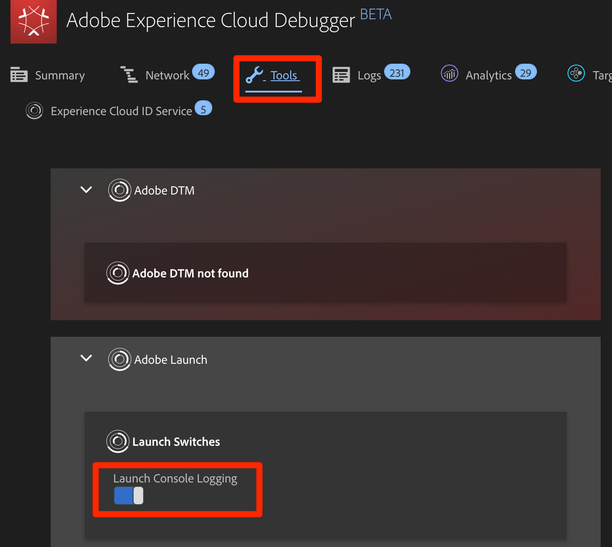

1. You should see that the rule fires

   

1. Now go to some pages that are not Product Detail pages. Do the Debugger logs show that the rule fires? Are the entity parameters added to the global mbox request?

## Add Custom Mboxes

### Add an Order Confirmation mbox

The order confirmation mbox is a special type of mbox used to define order submissions in Target. The inclusion of three specific mbox parameters---orderId, orderTotal, and productPurchasedId---is what turns an mbox into an order mbox. In addition to reporting revenue, the order mbox also does the following:

1. De-duplicates accidental order resubmissions
1. Filter extreme orders (any order whose total was more than three standard deviations from the mean)
1. Uses a different algorithm behind the scenes to calculate statistical confidence
1. Creates a special, downloadable Audit report of individual order details

We recommend that all Target customers with order funnels implement the order confirmation mbox, even on non-retail sites. For example, lead generation sites with lead funnels that end with a lead id being generated should implement an order mbox (just use "1" for the orderTotal). Customers using the Analytics for Target (A4T) integration for most of their reporting should also implement the order mbox, since A4T is not compatible with all activity types (e.g. Automated Personalization, Auto Allocate, and Auto Target). Additionally, this mbox is used to power Recommendations algorithms based on purchase behavior.

The order confirmation mbox should fire from a rule that is only triggered on your order confirmation event. Often, it can be combined in a rule that also sets the Adobe Analytics purchase event. It must be configured by using the Custom Code action of the Core extension, using the appropriate data elements to set the orderId, orderTotal, and productPurchasedId parameters.

Let's add the data elements and rule we need to fire an order confirmation mbox on the We.Retail site! Since you have already created several data elements, these instructions will be abbreviated.

#### Create Data Element for Order Id

1. Click **[!UICONTROL Rules]** in the top navigation
1. Click **[!UICONTROL Add Data Element]**
1. Name the data element `Order Id`
1. Check the `Clean text` option
1. Select **[!UICONTROL Data Element Type > JavaScript Variable]**
1. Use `digitalData.cart.orderId` as the `Path to Variable`
1. Click **[!UICONTROL Save to Library and Build]**

#### Create Data Element for Cart Amount

1. Click **[!UICONTROL Add Data Element]**
1. Name the data element `Cart Amount`
1. Check the `Clean text` option
1. Select **[!UICONTROL Data Element Type > JavaScript Variable]**
1. Use `digitalData.cart.cartAmount` as the `Path to Variable`
1. Click **[!UICONTROL Save to Library and Build]**

#### Create Data Element for Cart SKUs (Target)

1. Click **[!UICONTROL Add Data Element]**
1. Name the data element `Cart SKUs (Target)`
1. Check the `Force lowercase value` option
1. Check the `Clean text` option
1. Select **[!UICONTROL Data Element Type > Custom Code]**
1. For Target, the skus must be a comma separated list. This custom code will reformat the data layer array into the proper format. In the custom code editor, paste the following:

   ```javascript
   var targetProdSkus="";
   for (var i=0; i<digitalData.cart.cartEntries.length; i++) {
     if(i>0) {
       targetProdSkus = targetProdSkus + ",";
     }
     targetProdSkus = targetProdSkus + digitalData.cart.cartEntries[i].sku;
   }
   return targetProdSkus;
   ```

1. Use `digitalData.cart.cartAmount` as the `Path to Variable`
1. Click **[!UICONTROL Save to Library and Build]**

#### Create Rule for Order Confirmation page

1. Click **[!UICONTROL Rules]** in the top navigation
1. Click **[!UICONTROL Add New Rule]**
1. Name the rule `Order Confirmation Page - Library Loaded - 60`
1. Click **[!UICONTROL Events > Add]**
   1. Select **[!UICONTROL Events > Library Loaded (Page Top)]**
   1. Change the `Order` to `60` so that it will fire after the `Load Target` action (which is in our `All Pages - Library Loaded` rule where `Order` is set to `50`)
   1. Click **[!UICONTROL Keep Changes]**
1. Click **[!UICONTROL Conditions > Add]**
   1. Select **[!UICONTROL Condition Type > Path Without Query String]**
   1. For `Path equals` enter `thank-you.html`
   1. Toggle on the Regex option to change the logic from `equals` to `contains` (you can use the `Test` feature to confirm the test will pass with the URL `https://aem.enablementadobe.com/content/we-retail/us/en/user/checkout/order/thank-you.html`

      

   1. Click **[!UICONTROL Keep Changes]**
1. Click **[!UICONTROL Actions > Add]**
   1. Select **[!UICONTROL Action Type > Custom Code]**
   1. Click **[!UICONTROL Open Editor]**
   1. Paste the following code into the `Edit Code` modal

      ```javascript
      adobe.target.getOffer({
        "mbox": "orderConfirmPage",
        "params":{
           "orderId": _satellite.getVar('Order Id'),
           "orderTotal": _satellite.getVar('Cart Amount'),
          "productPurchasedId": _satellite.getVar('Cart SKUs (Target)')
        },
        "success": function(offer) {
          adobe.target.applyOffer({
            "mbox": "orderConfirmPage",
            "offer": offer
          });
        },
        "error": function(status, error) {
          console.log('Error', status, error);
        }
      });
      ```

   1. Click **[!UICONTROL Save]** to save the custom code
   1. Click **[!UICONTROL Keep Changes]** to keep the action
1. Click **[!UICONTROL Save to Library and Build]**

#### Validate the Order Confirmation Mbox

1. Open the We.Retail site
1. Make sure the Debugger is mapping the Launch property to *your* Development environment, as described in the [earlier lesson](launch-switch-environments.md)

   
1. Browse the site and add several products to your cart
1. During the checkout process the only required fields are `First Name` and `Last Name`

   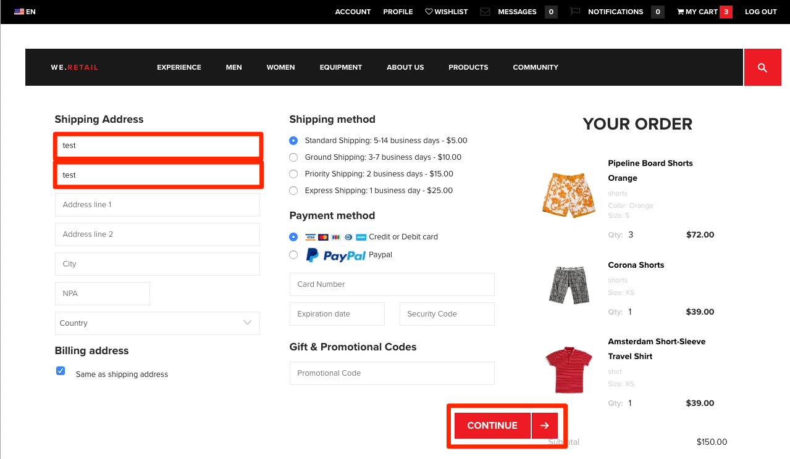

1. 1. Open the Debugger
1. Go to the Target tab
1. Open your client code
1. You should see the `orderConfirmPage` request as the latest Target request with the orderId, orderTotal, and productPurchasedId parameters populated with the details of your order

   

### Optional: Add Custom Mboxes for Profile or Entity Values

Sometimes important data you would like to use for personalization is not defined on the page before the Launch embed codes. For example, it might be hardcoded on the bottom of the page or get returned from an asynchronous API request.

This data can still be sent to Target using an additional request. Although it will not be optimal to use this request for content delivery since the page will already visible, it can still be used to enrich the visitor profile for later use or to populate the Recommendations catalog.

Below is an optional exercise for Target Premium customers to add the `entity.value` and `entity.message` parameters to Product Detail pages to enrich the Recommendations catalog. The same technique can be used by Target Standard customers to pass profile parameters to enrich the visitor profile.

>[!WARNING] As mentioned in the earlier section `Add Entity Pararameters for Recommendations (Target Premium)`, if you have already implemented Recommendations in your Target account, completing the steps in this exercise add invalid products to your catalog. Create a new Host Group in Target and associate the `enablementadobe.com` domain with this new Group before proceeding. Alternatively, you can read through the instructions to understand the implementation

On the We.Retail site, for example, there are several attributes that would be useful to have in our Recommendations catalog for the `entity.value` and `entity.description` entities. However, the values are available in DOM elements below the Launch embed codes. Let's start by defining the data elements.

#### Create Data Element for Product Price

You will use this to set the reserved `entity.value` parameter to populate the catalog with the price of the product

1. Click **[!UICONTROL Add Data Element]**
1. Name the data element `Product Price`
1. Select **[!UICONTROL Data Element Type > Custom Code]**
1. Use the following custom code:

    ```javascript
    return document.querySelectorAll(".we-Product-price")[0].textContent.slice(1);
    ```

1. Click **[!UICONTROL Save to Library and Build]**

#### Create Data Element for Product Description

You will use this to set the reserved `entity.message` parameter to populate the catalog with a short description of the product

1. Click **[!UICONTROL Add Data Element]**
1. Name the data element `Product Description`
1. Select **[!UICONTROL Data Element Type > DOM Attribute]**
1. Use `.we-Product-description` as the **[!UICONTROL From the DOM element matching the CSS Selector]**
1. Select **[!UICONTROL Use the value of > text]**
1. Check the `Clean text` option
1. Click **[!UICONTROL Save to Library and Build]**

#### Add a Rule to Pass the Entity Parameters in a Custom

1. Go to the **[!UICONTROL Rules]** in the top navigation and then click **[!UICONTROL Add Rule]**

    

1. Name the rule `Product Details - Window Loaded`

1. Click **[!UICONTROL Events > Add]** to open the `Event Configuration` screen

   

   1. Select **[!UICONTROL Event Type > Window Loaded]**

   1. Click **[!UICONTROL Keep Changes]**
  
       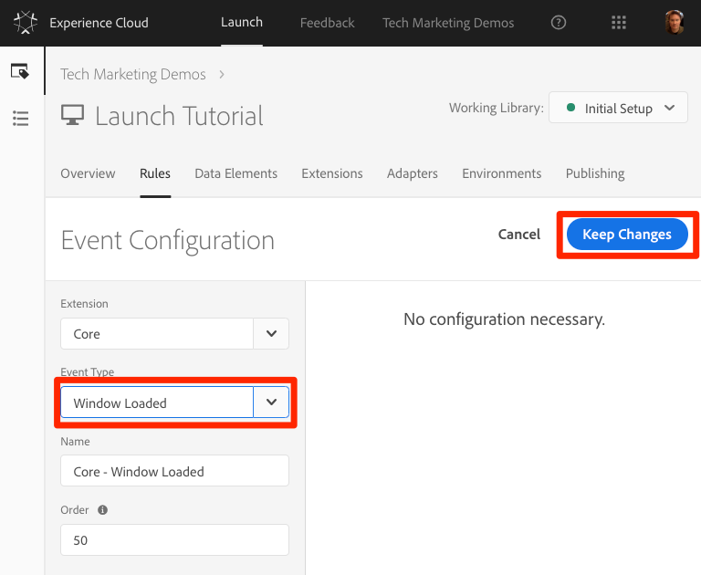

1. Click **[!UICONTROL Conditions > Add]** to open the `Condition Configuration` screen

    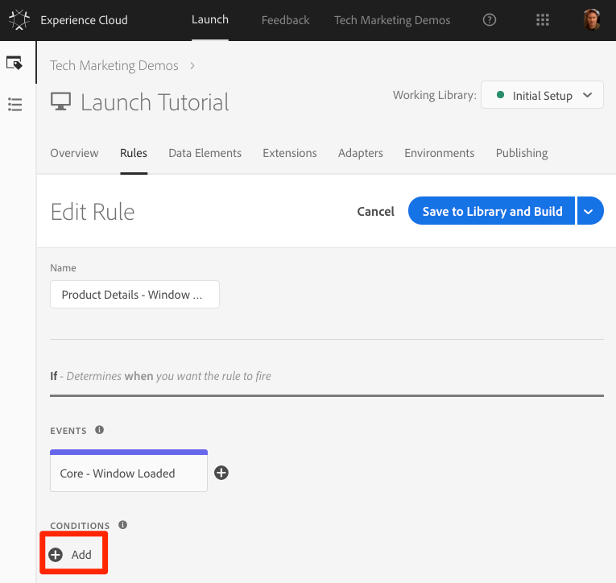

   1. Select **[!UICONTROL Condition Type > Value Comparison]**
   1. Use the data element picker, choose `Product SKU (Target)`
   1. Select  **[!UICONTROL Is Truthy]** from the comparison operator dropdown
   1. Click **[!UICONTROL Keep Changes]**

      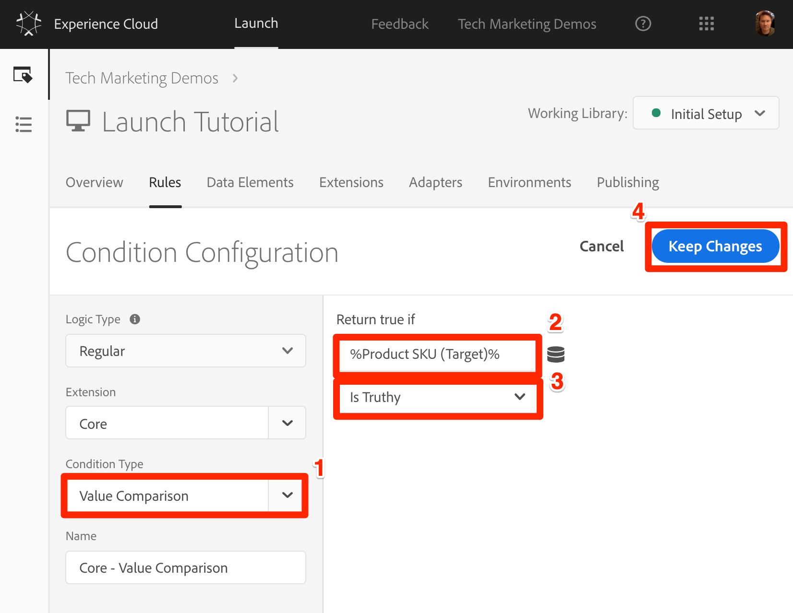

1. Click **[!UICONTROL Actions > Add]** to open the `Action Configuration` screen

   

   1. Select **[!UICONTROL Action Type > Custom Code]**

   1. Click the **[!UICONTROL </> Open Editor]** button to open the `Code Editor`

      

   1. Paste the following code into the `Code Editor`. Note that we are are going to add one more parameter `entity.event.detailsOnly=true` to indicate that this request is simply for the collection of catalog data and should not increment a view for the product in the Recommendations algorithms.

      ```javascript
      adobe.target.getOffer({
        "mbox": "recs-entities",
        "params": {
          "entity.id": _satellite.getVar('Product SKU (Target)'),
          "entity.value": _satellite.getVar('Product Price'),
          "entity.message": _satellite.getVar('Product Description'),
          "entity.event.detailsOnly"="true"
        },
        "success": function(offer) {
      },
        "error": function(status, error) {
          console.log('Error', status, error);
        }
      });
      ```
   1. Click the **[!UICONTROL Save]** button

      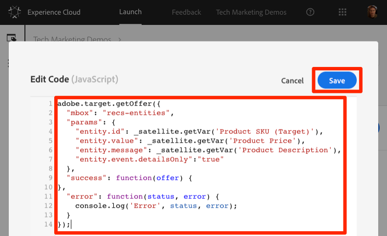

   1. Click  **[!UICONTROL Keep Changes]**

      

1. Click **[!UICONTROL Save to Library and Build]**

   

A few things to note:

* In the request, you also passed the `entity.id`. Since the `entity.id` is the key, this is required to make sure the other entities are attached to the correct catalog item.

* In order to avoid complications with the A4T integration, the custom mbox name `recs-entities` was used.

* Because the `applyOffer()` function was not used, this mbox cannot be used to apply offers to the page
  
* If your use case is to pass profile parameters instead of entity parameters, you would just update the parameter names and data elements in the code above.

#### Validate the Custom Mbox and Parameters

1. Open the We.Retail site to a [product details page](https://aem.enablementadobe.com/content/we-retail/us/en/products/men/coats/portland-hooded-jacket.html#meotwipot-S)
1. Make sure the Debugger is mapping the Launch property to *your* Development environment, as described in the [earlier lesson](launch-switch-environments.md)

   
1. Open the Debugger
1. Go to the Target tab
1. Open your client code
1. You should see the new `recs-entities` request with the `entity.id`, `entity.value`, and `entity.message` parameters fire on all product detail pages:

   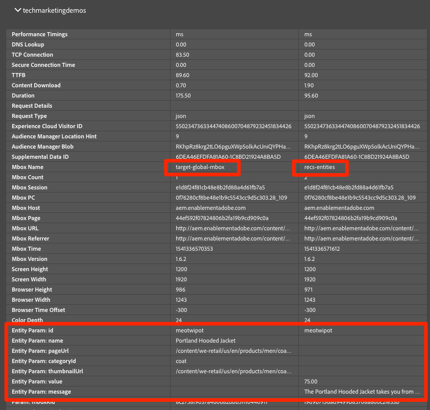

### Custom mboxes

In the rare instance when you need to make mbox calls other than the global mbox, use the Custom Code action in the Core extension to an mbox, as described in the earlier sections [Entity Parameters for Recommendations](#entity-parameters-for-recommendations) and [Order
Confirmation mbox](#order-confirmation-mbox) which used
[getOffer()](https://marketing.adobe.com/resources/help/en_US/target/?f=r_target-atjs-getoffer)/[applyOffer()](https://marketing.adobe.com/resources/help/en_US/target/ov2/r_target-atjs-applyoffer.html) and [trackEvent()](https://marketing.adobe.com/resources/help/en_US/target/ov2/r_target-atjs-trackevent.html)
methods. Just be sure to use the **[!UICONTROL Load Target]** action before making mbox calls from custom code.

### Library Header and Library Footer replacements

The Edit at.js screen in the Target user interface has locations in which you can paste custom JavaScript that will execute immediately before or after the at.js file.

The Library Header is sometimes used to override at.js settings via the
[targetGlobalSettings()](https://marketing.adobe.com/resources/help/en_US/target/ov2/c_atjs-settings-override.html) function or pass data from third parties using the [Data Providers](https://helpx.adobe.com/target/kt/using/dataProviders-atjs-feature-video-use.html) feature

The Library Footer is sometimes used to add [at.js library extensions](https://github.com/Adobe-Marketing-Cloud/target-atjs-extensions) or [at.js custom event](https://marketing.adobe.com/resources/help/en_US/target/ov2/r_target-atjs-notification.html) listeners.

To replicate this capability in Launch, just use the Custom Code action in the Core extension and sequence the action before (Library Header) or after (Library Footer) the Load Target action:


### What is different from DTM

* Natively supports at.js instead of mbox.js

* Target can be deployed asynchronously with the Launch async embed codes (be sure to hardcode the pre-hiding snippet to manage flicker)
  
* You must use the at.js version that comes with the extension

* The at.js library is packaged with the main Launch library--Document.write is not used and no warnings in Chrome should appear

* You don't have to load Target on all pages. You can control when the library loads and when the global mbox fires in the rule configuration (if using async embed codes, be sure to fire the global mbox on all pages where you've implemented the pre-hiding snippet)

* Some settings (Client Code, Organization Id, Global Mbox Name, Server Domain, and Cross Domain) are imported from the at.js settings in the Target UI. Other settings (Timeout, Library Header and Footer) are not

* Default timeout is 3 seconds and does not import from the Target UI at.js setting

* Library Header and Footer sections should be managed in separate "custom code" actions of the Rule builder

* Parameters can be added to just the global mbox or *all mboxes* in the Rule builder by using the "Add Params to Global Mbox" or "Add Params to All Mboxes," respectively

* Support for regional mboxes is discontinued

## Known Issues or Limitations

None

[Next "Add Adobe Analytics" >](analytics.md)