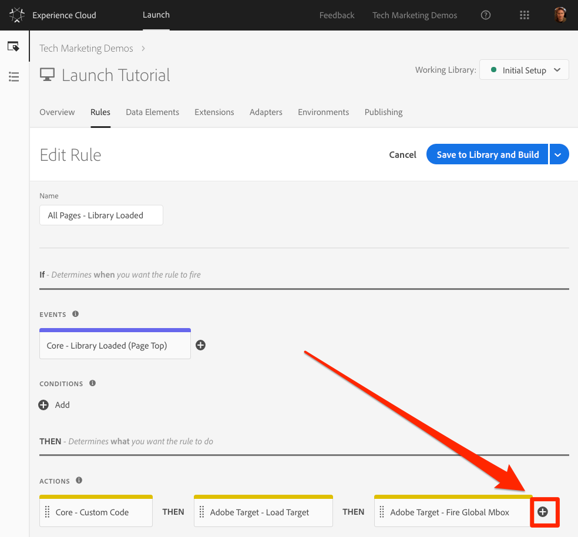
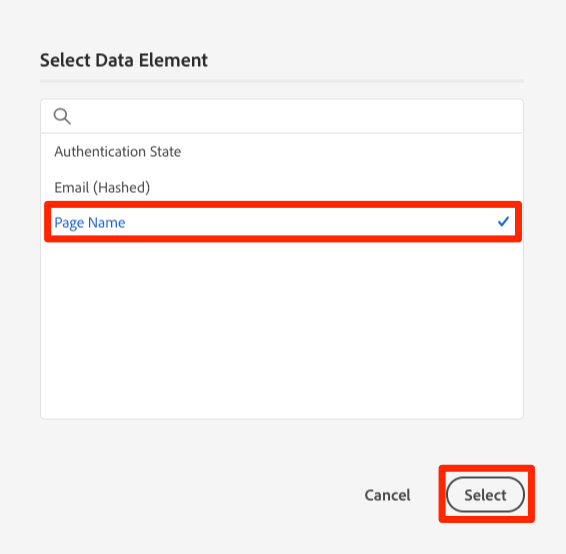

# Adobe Target

In this lesson, we will implement the [Adobe Target extension](https://docs.adobelaunch.com/extension-reference/web/adobe-target-extension) with a global request and custom parameters.

[Adobe Target](https://marketing.adobe.com/resources/help/en_US/target/) is the Adobe Marketing Cloud solution that provides everything you need to tailor and personalize your customers' experience, so you can maximize revenue on your web and mobile sites, apps, social media, and other digital channels.

## Learning Objectives

At the end of this lesson, you will be able to:

* Add the pre-hiding snippet used to manage flicker when using Target with asynchronous Launch embed codes
* Add the Target extension
* Fire the global mbox
* Add parameters to the global mbox
* Explain how profile and entity parameters can be added to the global mbox
* Fire the order confirmation mbox with required parameters
* Explain how to add advanced configurations such as Library Header and Library Footer code
* Validate a Target implementation

## Prerequisites

To complete the lessons in this section, you must first complete the lessons in [Configure Launch](launch.md) and [Add the ID Service](id-service.md).

## Add the Target Pre-Hiding Snippet

Before we get started, we need to make a slight update to the Launch embed codes. When the Launch embed codes are loaded asynchronously, the page may finish rendering before the Target library is fully loaded and has performed its content swap. This can lead to what is known as "flicker" where  default content briefly displays before being replaced by the personalized content specified by Target. If you want to avoid this flicker, we strongly recommend hardcoding a special pre-hiding snippet immediately before Launch's asynchronous embed codes.

This has already been done on the We.Retail site, but let's go ahead and do this on the sample page so you understand the implementation. Copy the following lines of code:

```html
<script>
    //prehiding snippet for Adobe Target with asynchronous Launch deployment
    (function(g,b,d,f){(function(a,c,d){if(a){var e=b.createElement("style");e.id=c;e.innerHTML=d;a.appendChild(e)}})(b.getElementsByTagName("head")[0],"at-body-style",d);setTimeout(function(){var a=b.getElementsByTagName("head")[0];if(a){var c=b.getElementById("at-body-style");c&&a.removeChild(c)}},f)})(window,document,"body {opacity: 0 !important}",3E3);
</script>
```

Open the sample page and paste it just before your Launch embed code as pictured below (don't worry if the line numbers are different):
   

Reload your sample page. You will notice that the page will be hidden for three seconds before it shown. This behavior is temporary and will go away after you have deployed Target. This pre-hiding behavior is controlled by two configurations at the very end of the snippet, which can be customized but are usually best left on the default settings:

* `body {opacity: 0 !important}` specifies the css definition to use for the pre-hiding until Target loads. By default, the entire body will be hidden. If you have a consistent DOM structure with an easily identifiable container element wrapping all of the content below your navigation, for example, and you never wanted to test or personalize your navigation, you could use this setting to limit the pre-hiding to that container element.
* `3E3` which specifies the timeout setting for the pre-hiding. By default, if Target hasn't loaded in three seconds the page will be shown. This should be extremely rare.

For more details and to obtain the un-minified pre-hiding snippet, please see [the Adobe Target extension with an asynchronous deployment​](https://docs.adobelaunch.com/extension-reference/web/adobe-target-extension#adobe-target-extension-with-an-asynchronous-deployment.)

## Add the Target Extension

The Adobe Target extension supports client-side implementations using Target's JavaScript SDK for the modern web, at.js. Customers still using Target's older library, mbox.js, [should upgrade to at.js](https://marketing.adobe.com/resources/help/en_US/target/ov2/t_target-migrate-atjs.html) in order to use Launch.

The Target extension consists of two main parts:

1. The extension configuration, which manages the core library settings
1. Rule actions to do the following:
    1. Load Target (at.js)
    1. Add Params to All Mboxes
    1. Add Params to Global Mbox
    1. Fire Global Mbox

In this first exercise we will add the extension and look at the configurations. In later exercises we will use the actions.

**To add the Extension**

1. Go to **[!UICONTROL Extensions > Catalog]**
1. Type `target` in the filter to quickly locate the Adobe Target extension
1. Click **[!UICONTROL Install]**

   

1. When you add the extension, it will import many, but not all of your at.js settings from the Target interface, as pictured below. One setting that will not be imported is the Timeout, which will always be 3000ms after adding the extension. For the tutorial, leave the default settings. Note, that on the left hand side it will show the at.js version that ships with the current version of the extension.

1. Click **[!UICONTROL Save to Library and Build]** 

At this point, Target isn't really doing anything, so there is nothing to validate.

>[!NOTE] Each version of the Target extension comes with a specific version of at.js, which is listed in the extension description. You update the at.js version by updating the Target extension.

## Load Target and Fire the Global Mbox

Marketers use Target to control the visitor experience on the page when testing and targeting content. Because of this important role in the display of the page, you should load Target as early as possible to minimize the impact on page visibility. In this section, we will load the Target JavaScript library&mdash;at.js&mdash;as well as fire the global mbox.

You can use the `All Pages - Library Loaded` rule you created in the lesson "[Add Data Elements, Rules and Libraries](launch-data-elements-rules.md)" to implement Target because it is already triggered on the first event that will fire on a page load&mdash;the Library Loaded event.

**To Load Target**

1. Go to the **[!UICONTROL Rules]** in the top navigation and then click on `All Pages - Library Loaded` to open the rule editor

   

1. Under Actions, click the  to add a new action

   

1. Select **[!UICONTROL Extension > Adobe Target]**

1. Select **[!UICONTROL Action Type > Load Target]**

1. Click **[!UICONTROL Keep Changes]**

   

With the `Load Target` action added, at.js will load on the page. However, no Target requests will fire until we add the `Fire Global Mbox` action.

**To add the `Fire Global Mbox` action**

1. Under Actions, click the  again to add another action

   

1. Select **[!UICONTROL Extension > Adobe Target]**

1. Select **[!UICONTROL Action Type > Fire Global Mbox]**

1. There are some configurations available for the global mbox related to whether or not to hide the page and CSS selector to use for pre-hiding. These settings work in conjunction with the pre-hiding snippet hardcoded on the page. Leave the default settings.

1. Click **[!UICONTROL Keep Changes]**

   

1. The new action is added in sequence after the `Load Target` action and the actions will execute in this order. You can drag-and-drop the actions to rearrange the order, but in this scenario, `Load Target` needs fire before the `Fire Global Mbox`.

1. Click **[!UICONTROL Save to Library and Build]**

   

### Validate the Global Mbox

Now that you have added the Target extension and fired the `Load Target` and `Fire Global Mbox` actions, there should be a global mbox request made on all pages where your Launch property is used.

**To validate the Load Target and Global Mbox actions**

1. Reload your sample page. You should no longer see a delay of three seconds before the page is visible. If you are loading the sample page using the `file://` protocol, you should do this step in Firefox or Safari browsers since Chrome will not fire a Target request when using the `file://` protocol.

1. Open the [We.Retail site](https://aem.enablementadobe.com/content/we-retail/us/en.html)

1. Make sure the Debugger is mapping the Launch property to *your* Development environment, as described in the [earlier lesson](launch-switch-environments.md)

   

1. Go to the Summary Tab of the Debugger

1. In the `Launch` section, confirm that `Target` appears under the `Extensions` heading

1. In the `Target` section, confirm that your client code, at.js library version, and your global mbox name appear

   

1. Finally, go to the `Target` tab, expand your client code, and confirm that the request for your global mbox appears:

   

Congratulations! You've implemented the global mbox!

## Add Parameters

Passing parameters in the Target request adds powerful capabilities to your targeting, testing, and personalization activities. The Launch extension provides two actions to pass parameters:

1. `Add Params to Global Mbox`, which adds parameters to global mbox requests (equivalent to the [targetPageParams()](https://marketing.adobe.com/resources/help/en_US/target/ov2/cmp_at.js_Functions.html) method)

1. `Add Params to All Mboxes`, which adds parameters in all mbox requests, e.g. the global mbox plus additional mbox requests made from Custom Code actions or hardcoded on your site (equivalent to the [targetPageParamsAll()](https://marketing.adobe.com/resources/help/en_US/target/ov2/cmp_at.js_Functions.html) method)

These actions can be used *before* the `Load Target` action and can set different parameters on different pages based on your rule configurations. Use the rule ordering feature you used when setting Customer IDs with the ID Service to set additional parameters on the `Library Loaded` event before the rule firing the global mbox.
>[!TIP] Since most implementations use the global mbox for activity delivery, it usually sufficient to just use the `Add Params to Global Mbox` action.

### Add an Mbox Parameter

Mbox parameters are used to pass custom data to Target, enriching your personalization capabilities. They are ideal for attributes that change frequently during a browsing session such as the page name, template, etc. and do not persist.

Let's add the `Page Name` data element that we created earlier in the [Add Data Elements, Rules and Libraries](launch-data-elements-rules.md) lesson as an mbox parameter.

**To add the mbox parameter**

1. Go to the **[!UICONTROL Rules]** in the top navigation and then click on `All Pages - Library Loaded` to open the rule editor.

   

1. Under Actions, click the  to add a new action

   

1. Select **[!UICONTROL Extension > Adobe Target]**

1. Select **[!UICONTROL Action Type > Add Params to Global Mbox]**

1. Enter `pageName` as the **[!UICONTROL Name]**

1. Click the  to open the data element modal

   

1. Click the `Page Name` data element

1. Click the **[!UICONTROL Select]** button

  

1. Click **[!UICONTROL Keep Changes]**

   

1. Click-and-drag on the left edge of the `Add Params to Global Mbox` action to rearrange the actions so that `Add Params to Global Mbox` is before the `Fire Global Mbox` action (it can be before or after `Load Target`)

1. Click **[!UICONTROL Save to Library and Build]**

  

#### Validate the Mbox Parameter

Reload the We.Retail site with it mapped to your property with Experience Cloud Debugger. Now go to the **[!UICONTROL Target]** tab in the Debugger. Expand your client code and look at the requests. You should see the new `pageName` parameter passed in the request:


### Profile Parameters

Similar to mbox parameters, profile parameters are also passed through the Target request. However, profile parameters get stored in Target's visitor profile database and will persist for the [duration of the visitor's profile](https://marketing.adobe.com/resources/help/en_US/target/ov/c_visitor_profile_lifetime.html). You can set them on one page of your site and use them in Target activities on another page. Here is an example from an  automobile website. When a visitor goes to a vehicle page, you could pass a profile parameter "profile.lastViewed=sportscar" to record their interest in that particular vehicle. When the visitor browses to other, non-vehicle pages you can target content based on their last vehicle viewed.  Profile parameters are ideal for attributes that rarely change or are only available on certain pages

You won't pass any profile parameters in this tutorial, but the workflow is almost identical to what you just did when passing the `pageName` mbox parameter. The one difference is  you need to give profile parameter names a `profile.` prefix. This is what a profile parameter called "userType" would look like in the `Pass Parameters to Global Mbox` action:


### Entity Parameters

Entity parameters are special parameters used in [Recommendations implementations](https://marketing.adobe.com/resources/help/en_US/target/recs/c_plan_implement.html) for three main reasons:

1. As a key to trigger product recommendations. For example, when using a recommendations algorithm like "People who viewed Product X, also viewed Y," "X" is the "key" of the recommendation. It is usually the product sku (`entity.id`) or category (`entity.categoryId`) that the visitor is currently viewing.
1. To collect visitor behavior to power recommendations algorithms, such as "Recently Viewed Products" or "Most Viewed Products"
1. To populate the Recommendations catalog. Recommendations contains a database of all of the products or articles on your website, so they can be served in the recommendation offer. For example, when recommending products, you typically want to display attributes like the product name (`entity.name`) and image (`entity.thumbnailUrl`). Some customers populate their catalog using backend feeds, but they can also be populated using entity parameters in Target requests.

You don't need to pass any profile parameters in this tutorial, but the workflow is identical to what you did earlier when passing the `pageName` mbox parameter&mdash;just give the parameter a name prefixed with "entity." and map it to the relevant data element. Note that some common entities have reserved names that must be used (e.g. entity.id for the product sku). This is what it would look like to set entity parameters in the `Pass Parameters to Global Mbox` action:


### Add Customer ID Parameters

The collection of customer ids with the Experience Cloud ID Service makes it easy to import CRM data into Target using the [Customer Attributes](https://marketing.adobe.com/resources/help/en_US/target/target/c_working-with-customer-attributes.html) feature of the Adobe Experience Cloud. It also enables [cross-device visitor stitching](https://marketing.adobe.com/resources/help/en_US/target/target/c_experience-cloud-device-co-op.html), allowing you to maintain a consistent user experience as your customers switch between say a laptop and their mobile device.

It is imperative that the Customer ID is set in the ID Service's `Set Customer IDs` action before firing the global mbox. To that end, make sure you have the following capabilities on your site:

* The customer ID must be available on the page before the Launch Embed Code
* The Experience Cloud ID Service extension must be installed
* You must use the "Set Customer IDs" action in a rule that fires at the "Library Loaded (Page Top)" event
* Use the "Fire global mbox" action in a rule that fires *after* the "Set Customer IDs" action

In the previous lesson, [Add the Experience Cloud ID Service](id-service.md), you created the `All Pages - Library Loaded - Authenticated - 10` rule to fire the "Set Customer ID" action. Because this rule has an  `Order` setting of `10`, the customer ids are set before our our global mbox fires from the `All Pages - Library Loaded` rule with its `Order` setting of `50`. So, you have already implemented the collection of customer ids for Target!

#### Validate the Customer ID

1. Open the [We.Retail site](https://aem.enablementadobe.com/content/we-retail/us/en.html)

1. Make sure the Debugger is mapping the Launch property to *your* Development environment, as described in the [earlier lesson](launch-switch-environments.md)

   

1. Log into the We.Retail site using the credentials `test@adobe.com`/`test`
1. Return to the [We.Retail homepage](https://aem.enablementadobe.com/content/we-retail/us/en.html)
1. Open the Debugger
1. Go to the Target tab
1. Expand your client code
1. You should see parameters in the latest Target request for `vst.crm_id.id` and `vst.crm_id.authState`. `vst.crm_id.id` should have a value of the hashed email address and `vst.crm_id.authState` should have a value of `1` to represent `authenticated`. Note that `crm_id` is the `Integration Code` you specified in the ID Service configuration and must align with the key you use in your [Customer Attributes data file](https://marketing.adobe.com/resources/help/en_US/mcloud/t_crs_usecase.html):


>[!WARNING] The Experience Cloud ID Service will allow you to send multiple ids to the Service, however, only the first one will be sent to Target.

### Add the Property Token Parameter

>[!NOTE] This is an optional exercise for Target Premium customers.

The property token is a reserved parameter used with the Target Premium [Enterprise User Permissions](https://marketing.adobe.com/resources/help/en_US/target/target/property_channel.html) feature. It is used to define different digital properties so that different members of an Experience Cloud Organization can be assigned different permissions on each property. For example, you might want one group of users to be able to set up Target activities on your web site, but not in your mobile application.

Target properties are analogous to Launch properties and Analytics report suites. An enterprise with multiple brands, websites, and marketing teams might use a different Target property, Launch property and Analytics report suite for each website or mobile app. Launch properties are differentiated by their embed codes, Analytics report suites are differentiated by their report suite id, and Target properties are differentiated by their property token parameter.

The property token is implemented just like an mbox parameter. Just name the parameter "at_property" and paste in the value provided in the Target interface.  If you are implementing multiple sites with a single Launch property, you could manage the at_property value via a data element.

Here is an optional exercise, if you are a Target Premium customer and would like to implement a property token in your Tutorial property:

1. In a separate tab, open the Target user interface

1. Go to **[!UICONTROL Setup > Properties ]**

1. Identify the Property that you want to use and click the **[!UICONTROL </> ]** (or create a new property)

1. Copy the `at_property` value to your clipboard

   

1. In your Launch tab, go to the **[!UICONTROL Rules]** in the top navigation and then click on `All Pages - Library Loaded` to open the rule editor.

   

1. Under Actions, click the `Adobe Target - Add Params to Global Mbox` action to open the `Action Configuration`

   

1. Under the `pageName` parameter, click the **[!UICONTROL Add]** button

   

1. Name the parameter `at_property` and paste in the value you copied from the Target interface

1. Click **[!UICONTROL Keep Changes]**

   

1. Click **[!UICONTROL Save to Library and Build]**
   

#### Validate the Property Token

1. Open the [We.Retail site](https://aem.enablementadobe.com/content/we-retail/us/en.html)
1. Make sure the Debugger is mapping the Launch property to *your* Development environment, as described in the [earlier lesson](launch-switch-environments.md)

   
1. Open the Debugger
1. Go to the `Target` tab
1. Expand your client code
1. You should see the parameter for "at_property" in every global mbox request as you browse the site:


## Add Custom Mboxes

### Add an Order Confirmation mbox

The order confirmation mbox is a special type of mbox used to define order submissions in Target. The inclusion of three specific mbox parameters&mdash;orderId, orderTotal, and productPurchasedId&mdash;is what turns an mbox into an order mbox. In addition to reporting revenue, the order mbox also does the following:

1. De-duplicates accidental order resubmissions
1. Filters extreme orders (any order whose total was more than three standard deviations from the mean)
1. Uses a different algorithm behind the scenes to calculate statistical confidence
1. Creates a special, downloadable Audit report of individual order details

The best practice is to use and order confirmation mbox in all order funnels, even on non-retail sites. For example, lead generation sites usually have lead funnels with a unique "lead id" generated at the end. These sites should implement an order mbox, using a static value (e.g. "1") for the orderTotal.

Customers using the Analytics for Target (A4T) integration for most of their reporting should also implement the order mbox, since A4T is not yet compatible with activity types like Auto Allocate, Automated Personalization and Auto Target. Additionally, the order mbox is a critical element in Recommendations implementations, powering algorithms based on purchase behavior.

The order confirmation mbox should fire from a rule that is only triggered on your order confirmation page or event. Often, it can be combined with a rule setting the Adobe Analytics purchase event. It must be configured using the Custom Code action of the Core extension, using the appropriate data elements to set the orderId, orderTotal, and productPurchasedId parameters.

Let's add the data elements and rule we need to fire an order confirmation mbox on the We.Retail site. Since you have already created several data elements, these instructions will be abbreviated.

**To create the data element for Order Id**

1. Click **[!UICONTROL Data Elements]** in the top navigation
1. Click **[!UICONTROL Add Data Element]**
1. Name the data element `Order Id`
1. Select **[!UICONTROL Data Element Type > JavaScript Variable]**
1. Use `digitalData.cart.orderId` as the `Path to Variable`
1. Check the `Clean text` option
1. Click **[!UICONTROL Save to Library and Build]**

**To create the data element for the Cart Amount**

1. Click **[!UICONTROL Add Data Element]**
1. Name the data element `Cart Amount`
1. Select **[!UICONTROL Data Element Type > JavaScript Variable]**
1. Use `digitalData.cart.cartAmount` as the `Path to Variable`
1. Check the `Clean text` option
1. Click **[!UICONTROL Save to Library and Build]**

**To create the data element for Cart SKUs (Target)**

1. Click **[!UICONTROL Add Data Element]**
1. Name the data element `Cart SKUs (Target)`
1. Select **[!UICONTROL Data Element Type > Custom Code]**
1. For Target, the skus must be a comma separated list. This custom code will reformat the data layer array into the proper format. In the custom code editor, paste the following:

   ```javascript
   var targetProdSkus="";
   for (var i=0; i<digitalData.cart.cartEntries.length; i++) {
     if(i>0) {
       targetProdSkus = targetProdSkus + ",";
     }
     targetProdSkus = targetProdSkus + digitalData.cart.cartEntries[i].sku;
   }
   return targetProdSkus;
   ```

1. Check the `Force lowercase value` option
1. Check the `Clean text` option
1. Click **[!UICONTROL Save to Library and Build]**

Now we need to create a rule to fire the global mbox with the order parameters on the order confirmation page.

**To create the rule for Order Confirmation page**

1. Click **[!UICONTROL Rules]** in the top navigation
1. Click **[!UICONTROL Add Rule]**
1. Name the rule `Order Confirmation Page - Library Loaded - 60`
1. Click **[!UICONTROL Events > Add]**
   1. Select **[!UICONTROL Event Type > Library Loaded (Page Top)]**
   1. Change the `Order` to `60` so that it will fire after the `Load Target` action (which is in our `All Pages - Library Loaded` rule where `Order` is set to `50`)
   1. Click **[!UICONTROL Keep Changes]**
1. Click **[!UICONTROL Conditions > Add]**
   1. Select **[!UICONTROL Condition Type > Path Without Query String]**
   1. For `Path equals` enter `thank-you.html`
   1. Toggle on the Regex option to change the logic from `equals` to `contains` (you can use the `Test` feature to confirm the test will pass with the URL `https://aem.enablementadobe.com/content/we-retail/us/en/user/checkout/order/thank-you.html`

      

   1. Click **[!UICONTROL Keep Changes]**
1. Click **[!UICONTROL Actions > Add]**
   1. Select **[!UICONTROL Action Type > Custom Code]**
   1. Click **[!UICONTROL Open Editor]**
   1. Paste the following code into the `Edit Code` modal

      ```javascript
      adobe.target.getOffer({
        "mbox": "orderConfirmPage",
        "params":{
           "orderId": _satellite.getVar('Order Id'),
           "orderTotal": _satellite.getVar('Cart Amount'),
          "productPurchasedId": _satellite.getVar('Cart SKUs (Target)')
        },
        "success": function(offer) {
          adobe.target.applyOffer({
            "mbox": "orderConfirmPage",
            "offer": offer
          });
        },
        "error": function(status, error) {
          console.log('Error', status, error);
        }
      });
      ```

   1. Click **[!UICONTROL Save]** to save the custom code
   1. Click **[!UICONTROL Keep Changes]** to keep the action
1. Click **[!UICONTROL Save to Library and Build]**

#### Validate the Order Confirmation Mbox

1. Open the [We.Retail site](https://aem.enablementadobe.com/content/we-retail/us/en.html)

1. Make sure the Debugger is mapping the Launch property to *your* Development environment, as described in the [earlier lesson](launch-switch-environments.md)

   

1. Browse the site and add several products to your cart
1. Continue to checkout
1. During the checkout process the only required fields are `First Name` and `Last Name`

   

1. On the Review Order page, be sure to click the `Place Order` button
1. Look in the Debugger
1. Go to the Target tab
1. Expand your client code
1. You should see the `orderConfirmPage` request as the latest Target request with the orderId, orderTotal, and productPurchasedId parameters populated with the details of your order

   

### Custom mboxes

There rare instances when you need to make Target requests other than the global and order confirmation mbox. For example, sometimes important data you would like to use for personalization is not defined on the page before the Launch embed codes&mdash;it might be hardcoded on the bottom of the page or get returned from an asynchronous API request. This data can still be sent to Target using an additional request, although it will not be optimal to use this request for content delivery since the page will already visible. It can be used to enrich the visitor profile for later use (using profile parameters) or to populate the Recommendations catalog.

In these circumstances, use the Custom Code action in the Core extension to fire an mbox using the
[getOffer()](https://marketing.adobe.com/resources/help/en_US/target/?f=r_target-atjs-getoffer)/[applyOffer()](https://marketing.adobe.com/resources/help/en_US/target/ov2/r_target-atjs-applyoffer.html) and [trackEvent()](https://marketing.adobe.com/resources/help/en_US/target/ov2/r_target-atjs-trackevent.html)
methods. This is very similar to what you just did in the [Order
Confirmation mbox](#order-confirmation-mbox) exercise, but you will just use a different mbox name and will not use the special order parameters. Be sure to use the **[!UICONTROL Load Target]** action before making mbox calls from custom code.

## Library Header and Library Footer

The Edit at.js screen in the Target user interface has locations in which you can paste custom JavaScript that will execute immediately before or after the at.js file.

The Library Header is sometimes used to override at.js settings via the
[targetGlobalSettings()](https://marketing.adobe.com/resources/help/en_US/target/ov2/c_atjs-settings-override.html) function or pass data from third parties using the [Data Providers](https://helpx.adobe.com/target/kt/using/dataProviders-atjs-feature-video-use.html) feature

The Library Footer is sometimes used to add [at.js library extensions](https://github.com/Adobe-Marketing-Cloud/target-atjs-extensions) or [at.js custom event](https://marketing.adobe.com/resources/help/en_US/target/ov2/r_target-atjs-notification.html) listeners.

To replicate this capability in Launch, just use the Custom Code action in the Core extension and sequence the action before (Library Header) or after (Library Footer) the Load Target action. This can be done in the same rule as the `Load Target` action (as pictured below) or in separate rules with events or order settings that will reliably fire before or after the rule containing `Load Target`:


To learn more about use cases for custom headers and footers see the following resources:

* [Use dataProviders to integrate third-party data into Adobe Target](https://helpx.adobe.com/target/kt/using/dataProviders-atjs-feature-video-use.html)
* [Implement dataProviders to integrate third-party data into Adobe Target](https://helpx.adobe.com/target/kt/using/dataProviders-atjs-technical-video-implement.html)
* [Use Response Tokens and at.js Custom Events with Adobe Target](https://helpx.adobe.com/target/kt/using/response-tokens-atjs-custom-events-technical-video-use.html)
  
[Next "Add Adobe Analytics" >](analytics.md)