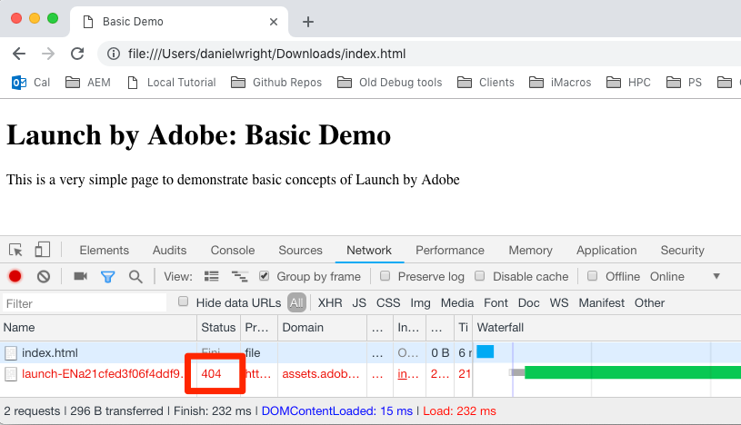

# Implement the Launch Embed Code

In this lesson, we will implement the asynchronous embed code for the Development environment of your Launch property.

## Copy the Embed Code

In your property, click on the "Environments" tab to go to the environments page. Note that Development, Staging, and Production environments have been pre-created for you. These are the only environments we need to complete the tutorial. Environments allow you to have differnet working versions of your Launch libraries hosted at different URLs, so you can safely add new features and make them available to the right users (e.g. developers, QA engineers, the public, etc.) at the right time

>[!NOTE:] DTM users--Note that Launch introduces the Development environment. Also, you have the ability to create *multiple development environments* allowing users and teams to work independently of each other, within the same property.

1. In the "Development" row, click the Install icon  to open the modal
2. Click the copy icon  to copy the embed code to your clipboard
3. Click "Close" to close the modal


## Implement the Embed Code in the `<head>` of the Sample HTML Page

The embed code should be implemented in the `<head>` element of all HTML pages that will share the property. You might have one or several template files which control the `<head>` globally across the site, making it a straightforward process to add Launch.

If you haven't already, download [the sample html page](https://www.enablementadobe.com/multi/web/basic-sample.html) (right-click on this link and click “Save Link As”) and open it in a code editor. ([Brackets](http://brackets.io/) is a free, open source editor if you need one).

Replace the existing embed code on line 35 with your own. Load the page in a web browser. If you are loading the page using the file:// protocol, you will need to add "https:" at the beginning of the URL of the embed code). Lines 34-36 of your sample page might look something like this:

```html
    <!--Launch Header Embed Code: REPLACE LINE 36 WITH THE EMBED CODE FROM YOUR OWN DEVELOPMENT ENVIRONMENT-->
    <script src="https://assets.adobedtm.com/launch-ENa21cfed3f06f4ddf9690de8077b39e81-development.min.js" async></script>
    <!--/Launch Header Embed Code-->
```

Open your web browser's developer tools and go to the Network tab. At this point you should see a 404 error for the Launch environment URL:


If you see a "failed" message instead of a 404 error, you probably forgot to add the `https://` protocol in the embed code. Again, you only need to specify the `https://` protocol if you are loading the sample page using the `file://` protocol. Make that change and reload the page until the 404 error appears. The 404 error is expected because we haven't yet built a library in this Launch environment.  Before we do that, let's look at some of the other best practices demonstrated in the sample page:

* **Data Layer**:
  * We *strongly* recommend creating a digital data layer on your site containing all of the attributes needed to populate variables in Analytics, Target, and other marketing solutions. This sample page only contains a very simple data layer, but a real data layer might contain many more details about the page, the visitor, their shopping cart details, etc. For more info on data layers, please see [Customer Experience Digital Data Layer 1.0](https://www.w3.org/2013/12/ceddl-201312.pdf)
  * Define your data layer before the Launch embed code, in order to maximize what you can do in Target, Customer Attributes, and Analytics.
* **JavaScript helper libraries**: If you already have a library like JQuery implemented in the `<head>` of your pages, load it before Launch in order to leverage its syntax in Launch and Target
* **HTML5 doctype**: The HTML5 doctype to required for Target implementations
* **preconnect and dns-prefetch**: Use preconnect and dns-prefetch to improve the page load time. See also: [https://w3c.github.io/resource-hints/](https://w3c.github.io/resource-hints/)

Here is a summary what this these best practices look like in the suggested order. Placeholders are in ALL-CAPS for account specific details:  

```html
<!doctype html>
<html>
<head>
    <title>Basic Demo</title>
    <!--Preconnect and DNS-Prefetch to improve page load time-->
    <link rel="preconnect" href="//dpm.demdex.net">
    <link rel="preconnect" href="//fast.REPLACE_WITH_YOUR_AUDIENCE_MANAGER_PARTNER.demdex.net">
    <link rel="preconnect" href="//REPLACE_WITH_YOUR_AUDIENCE_MANAGER_PARTNER.demdex.net">
    <link rel="preconnect" href="//cm.everesttech.net">
    <link rel="preconnect" href="//REPLACE_WITH_YOUR_TARGET_CLIENT_CODE.tt.omtrdc.net">
    <link rel="preconnect" href="//REPLACE_WITH_YOUR_ANALYTICS_TRACKING_SERVER.sc.omtrdc.net">
    <link rel="dns-prefetch" href="//dpm.demdex.net">
    <link rel="dns-prefetch" href="//fast.REPLACE_WITH_YOUR_AUDIENCE_MANAGER_CLIENT.demdex.net">
    <link rel="dns-prefetch" href="//REPLACE_WITH_YOUR_AUDIENCE_MANAGER_PARTNER.demdex.net">
    <link rel="dns-prefetch" href="//cm.everesttech.net">
    <link rel="dns-prefetch" href="//REPLACE_WITH_YOUR_TARGET_CLIENT_CODE.tt.omtrdc.net">
    <link rel="dns-prefetch" href="//fast.REPLACE_WITH_YOUR_AUDIENCE_MANAGER_PARTNER.demdex.net">
    <link rel="dns-prefetch" href="//agsld.sc.omtrdc.net">
    <!--/Preconnect and DNS-Prefetch-->
    <!--Data Layer to enable rich data collection and targeting-->
    <script>
    var digitalData = 
    {
        "pageName": "Home"
    };
    </script>
    <!--/Data Layer-->
    <!--jQuery or other helper libraries-->
    <script src="jquery-3.2.1.min.js"></script>
    <!--/jQuery-->

    <!--Launch Header Embed Code-->
        <script src="//assets.adobedtm.com/launch-REPLACE_WITH_YOUR_LAUNCH_PROPERTY-development.min.js" async></script>
    <!--/Launch Header Embed Code-->
</head>
```

[Next "Add Data Elements, Rules and Libraries" >](launch-data-elements-rules.md)