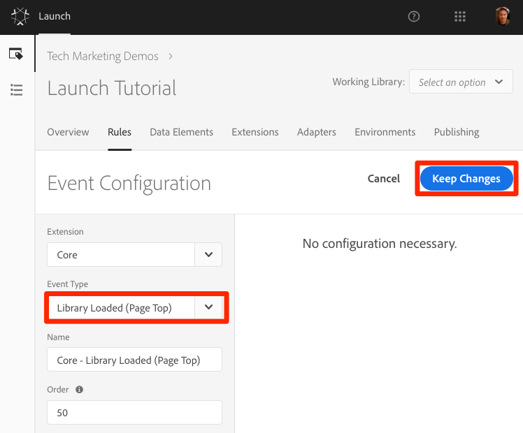
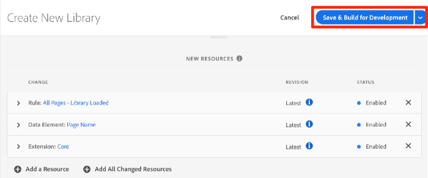

# Add Data Elements, Rules and Libraries

Data Elements and Rules are the basic building blocks of Launch. Data Elements store the attributes you want to send to your marketing and advertising solutions, while Libraries are the JavaScript files that load on the page to do all of the work. In this lesson, we will use all three to make our sample page do something.

## Data Element for Page Name

Data elements are Launch’s version of a data layer. They can store values from your own data layer object, cookies, local storage objects, query string parameters, page elements, meta tags, etc. In this exercise, we will create a data element for Page Name, which we will use later in our Target and Analytics implementations.

1. In the top navigation, click `Data Elements`  
1. Since you haven't created any data elements yet in this property, a brief video appears with additional information on this topic. Watch this video, if you like.
1. Click the `Create New Data Element` button:

   

1. Name the data element, e.g. `Page Name`
1. Leave the Extension as `Core` 
1. Use the JavaScript Variable Data Element type to read the property `digitalData.page.pageInfo.pageName`
1. Use `not available` as the Default Value
1. Use the `Force lowercase value` and `Clean text` options to standardize the case and remove extraneous spaces
1. Leave `None` as the duration (since this value will typically be different on every page)
1. Save the data element 

   .

### Differences in Data Elements between Launch and DTM

* Data Elements have their own top navigation element
* New data element types have been added, such as Local Storage, Session Storage, Page Info, and Random Number
* Data element capabilities _can be extended with Extensions_. For example, the ContextHub extension allows you to add data elements using features of the extension.

## Create a Rule

Next we will use this data element in a simple rule. Rules are one of the most powerful features in Launch and allow you to tell Launch when it should do something (e.g. fire a marketing pixel). We are going to create a rule that outputs the Page Name data element value to the browser console.

1. In the top navigation, click `Rules`  
1. Since you haven't created any rules yet in this property, a brief video appears with additional information on the topic. Watch this video, if you like.
1. Click the `Create New Rule` button: 

   

1. Name the Rule `All Pages - Library Loaded`. We will use a naming convention that indicates where and when the rule will fire.
1. Under Events, click `Add` 
  
   1. As the Event Type, select `Library Loaded (Page Top)`
   1. Click the `Keep Changes` button
  
   

1. Since we want to fire this rule on all pages, we are going to leave `Conditions` and `Exceptions` blank
1. As the `Action Type`, select `Custom Code`
1. Select Open Editor.

   

1. Add the following to the code window `console.log('The page name is '+_satellite.getVar('Page Name'));` 
1. Save the code window 

   

1. On the Action configuration screen click `Keep Changes`
1. Click `Save` to save the rule

### Differences in Rules between Launch and DTM

* Completely new and intuitive rule building screen
* New "Value Comparison" rule condition

## Save the Rule to a Library

1. Go to the Publishing tab
2. Click `Add New Library`

   

3. Name the Library "Initial Setup" 
4. As the `Environment` choose `Development`
5. Click `Add All Changed Resources`

   

6. Note that after clicking `Add All Changed Resources` Launch summarizes the changes you just made.
7. Click `Save & Build for Development` 

   

After a few moments, the status dot will turn green indicating the library successfully built.

### Differences in Libraries between Launch and DTM

* The ability to have multiple development libraries

## Validate Your Work

Now let's validate that your rule is working as expected.

Reload your sample page. If you look at the Developer Tools -> Network tab, you should now see a 200 response for your Launch Library!

If you look at the Developer Tools -> Console, you should see the text "The page name is home"

Congratulations, you created your first Data Element and Rule and built your first Launch Library!

[Next "Switch Environments with Launch Command" >](launch-switch-environments.md)
