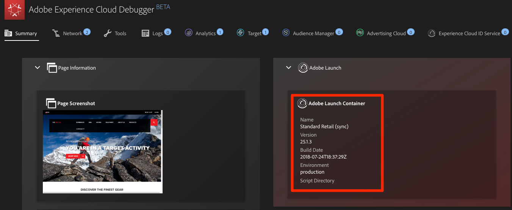
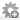
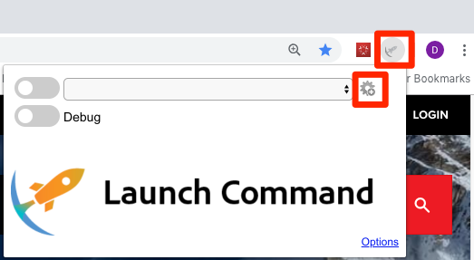
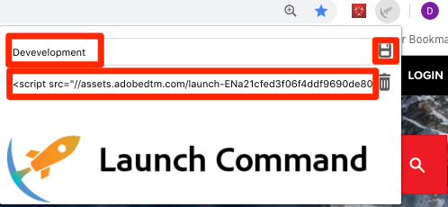
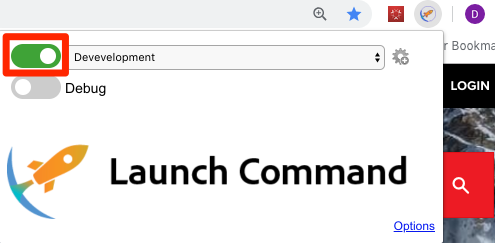
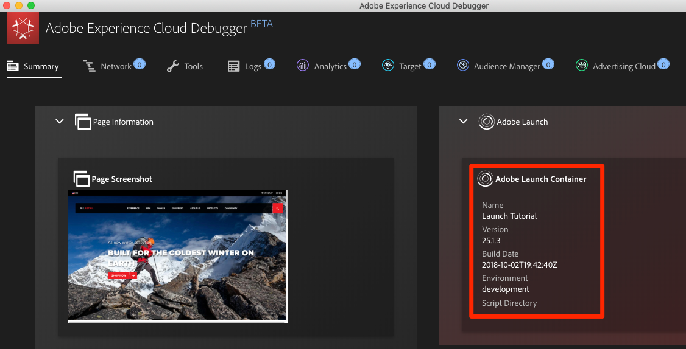
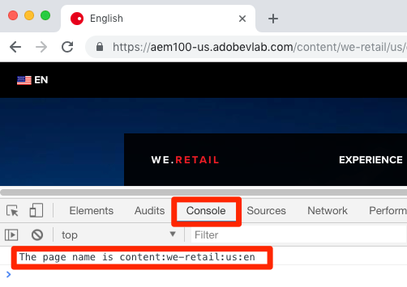

# Switch Environments with Launch Command

In this lesson you will use the [Launch Command extension](https://chrome.google.com/webstore/detail/launch-command/nkjhamgjeocefocmpbcjfmohkjgildki) for the Chrome web browser to substitute your new Launch property for the one currently implemented on the We.Retail demo site. You will use this technique frequently when Launch is deployed on your own website. It gives you the ability to test changes before you publish them to your production environment. This will enable to confidently make and QA changes to your Launch implementation separately from your regular code releases.  After all, this separation of marketing tag releases from your main codebase releases is one of the main reasons to use Launch in the first place!

## Open the We.Retail site

1. Open the [We.Retail demo site](https://aem100-us.adobevlab.com/content/we-retail/us/en.html) in your Chrome browser
1. While on the We.Retail site, open the [Experience Cloud Debugger extension](https://chrome.google.com/webstore/detail/adobe-experience-cloud-de/ocdmogmohccmeicdhlhhgepeaijenapj) by clicking the  icon 
1. Note that the currently iimplemented Launch property is shown on the Summary tab 

We will use another bookmarklet to intercept the call to the currently implemented Launch property and have it load our property. If you haven't already, download and install the [Launch Command extension](https://chrome.google.com/webstore/detail/launch-command/nkjhamgjeocefocmpbcjfmohkjgildki)

### To replace the property

1. Click the  icon to open the Launch Command Extension
1. Click the  icon to add a new Environment 
1. Add a name for the Environment so you will recognize it later in Launch Command (e.g. `Launch Tutorial: Development`)
1. Paste the Embed Code of your development Environment (the same code that you implemented on the sample page)
1. Click the  icon to save the Environment 
1. Toggle on the Environment switch (you might need to open Launch Command again via the  icon) 
1. Reload the page
1. Open the Experience Cloud Debugger extension. You should see that the We.Retail homepage is now loading your "Launch Tutorial" property's "development" environment! 
1. On the We.Retail homepage, open your Developer Tools Console. You should see the console.log statement that you added via a Launch rule in the earlier exercise! 

As you continue the tutorial, you will use this technique of mapping the We.Retail site to your own Launch property to validate your Launch implementation. When you start using Launch on your production website, you can use this same technique to validate changes you make to your Development and Staging Launch Environments before you publish them to Production.

[!WARNING when not working on the tutorial we recommend immediately toggling off Launch command or it will replace existing DTM or Launch embed codes on every website you visit in any open Chrome tab]

[Next "Add the Experience Cloud ID Service" >](id-service.md)