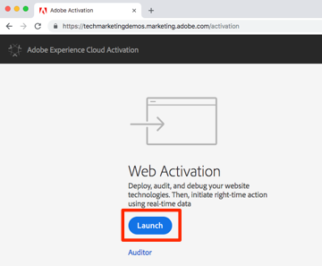
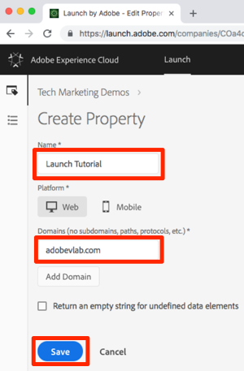
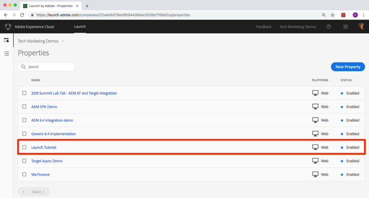

# General Launch Configuration & Settings

This chapter introduces you to the main concepts of Launch--Properties, Adapters, Environments, Embed Codes, Data Elements, and Rules.

## Prerequisites

In order to complete this Lesson, you must have permission to Develop, Approve, Publish, Manage Extensions, and Manage Environments in Launch. If you are unable to complete any of these steps because the user interface options are not available to you, reach out to your Experience Cloud Administrator to request access.

## Go to Launch

1. Log into the [Experience Cloud](http://experiencecloud.adobe.com)
2. Open the Solution Switcher 
3. Select "Activation" from the menu 
4. Under "Web Activation", click the "Launch" button

You should now see the Properties screen (if no Properties have ever been created in the account, this screen might be empty):

## Create a Property

Click the “New Property” button:  

1. Name your property (e.g. "Launch Tutorial")
1. Enter the "adobevlab.com" as the domain
1. Click “Save”

Your new property should display on Properties page. Click on the name of your property (e.g. "Launch Tutorial") to open the Overview screen.

[Next "Install the Embed Code" >](launch-add-embed.md)