# Adobe Target

In this exercise, we will implement Adobe Target with a global mbox including a custom parameter.

[NEED TO UPDATE WITH FULL SCOPE OF WHAT IS BEING COVERED]
The Adobe Target extension supports client-side implementations using Target's JavaScript SDK for the modern web, at.js. Customers still using Target's older library, mbox.js, [should upgrade to at.js](https://marketing.adobe.com/resources/help/en_US/target/ov2/t_target-migrate-atjs.html) in order to use Launch.

[ADD MIGRATION RESOURCES LINK]

The Target extension consists of two main parts:

1. The extension configuration, which manages the core at.js library settings
1. Rule actions to do the following:
    1. Load Target---loads the at.js library
    1. Add Params to All Mboxes
    1. Add Params to Global Mbox
    1. Fire Global Mbox

## Add the Target Pre-Hiding Snippet

When the Launch embed codes are loaded asynchronously, the page may finish rendering the default content before the Target library is fully loaded and has performed its content swap. This can lead to what is known as "flicker" where the default content shows up briefly before being replaced by the personalized content specified by Target. If you want to avoid this flicker, we strongly recommend hardcoding a special pre-hiding snippet immediately before Launch's asynchronous embed codes.

This has already been done on the We.Retail site, but let's go ahead and do this on the sample page so you understand the implementation. Paste the following lines of code:

``` html
<script>
    //prehiding snippet for Adobe Target with asynchronous Launch deployment
    (function(g,b,d,f){(function(a,c,d){if(a){var e=b.createElement("style");e.id=c;e.innerHTML=d;a.appendChild(e)}})(b.getElementsByTagName("head")[0],"at-body-style",d);setTimeout(function(){var a=b.getElementsByTagName("head")[0];if(a){var c=b.getElementById("at-body-style");c&&a.removeChild(c)}},f)})(window,document,"body {opacity: 0 !important}",3E3);
</script>
```

For more details and to obtain the pre-hiding snippet, please see the Adobe Target extension with an asynchronous deployment​

## Add the Target Extension

1. Go to Extensions->Catalog and position your mouse over the Adobe Target extension
1. Note that this will expose the at.js version which the extension currently uses
1. Click "Install" to add the extension  
1. Note that when you add the extension, it will import many of your at.js settings from the Target UI, as pictured below, although the Timeout will always be 3000ms. Leave the default settings.
1. Click "Save" 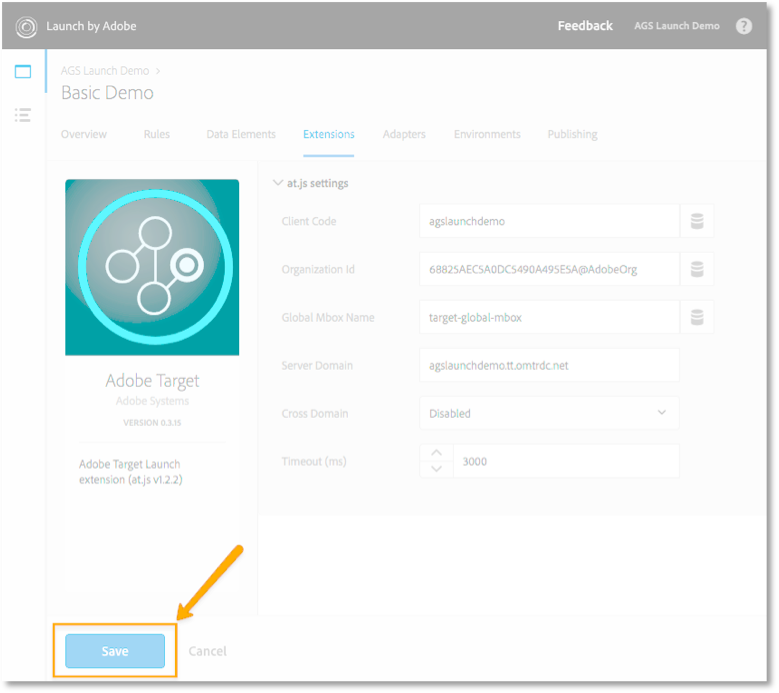

## Add a Rule to fire the global mbox

### Rules Overview

Since this is this is the first rule we are setting up, a few core
concepts should be explained. ***In Launch, rules are required in order
to fire [most]{.underline} marketing pixels***. For example, in order to
fire the target-global-mbox, we must use a Rule to instruct Launch to do
so.

The Rule builder has been dramatically redesigned and rebuilt in Launch.
Some of the main changes are:

* There is just one Rule builder. Things like "Page Bottom", "Click",
    and "Direct Call" are all just event-types in the Rule builder. This
    makes it much easier to update a rule, should you need to change the
    trigger from, say, a DOM Ready event to a custom event.

* There is a new "Custom Code" event-type

* Extensions can add new event types to the Rule builder. For example,
    the Target extension could eventually add built-in support for its
    [at.js custom
    events](https://marketing.adobe.com/resources/help/en_US/target/ov2/r_target-atjs-notification.html),
    so custom code wouldn't be needed to use this feature.

* Extensions can add new actions to the Rule builder, reducing issues
    by deprecating reliance on custom code.

* Rules are required to fire requests associated with most marketing
    tools. This will require a mindset adjustment, especially for things
    like setting Customer IDs, firing Analytics beacons, and firing the
    global mbox.

### Add the global mbox rule

Target needs to load at the top of the page in order to present
different visitor experiences without flicker. In this section, we will
load the Target library---at.js---as well as fire the target-global-mbox
with a parameter containing the Page Name data element.

1.  Go to the Rules in the top navigation and then click "Create New
    Rule"
    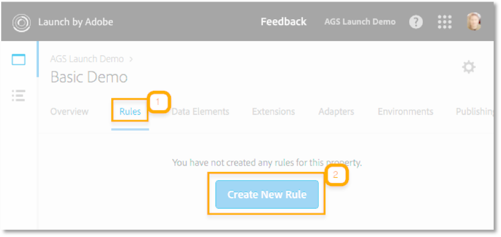

2.  Name the rule, e.g. "All Pages -- Top"

3.  Under "Events," click "Add." The event is what triggers the rule to
    fire.

4.  Use the "Library Loaded (Page Top)" event from the Core Extension
    and click the "Keep Changes" button. Note that you could enter a
    different name besides the auto-generated one ("Core -- Library
    Loaded (Page Top)") , if you
    prefer.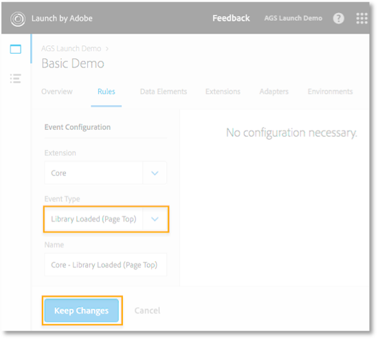

5.  Since we want this rule to fire on all pages of the site, we will
    leave the Conditions and Exceptions empty. Note that Conditions and
    Exceptions add restrictions and exclusions based on a large variety
    of options including, URLs, data element values, date ranges, and
    more.

6.  Under Actions, click "Add." Actions are what you want to happen when
    the event fires under the right conditions

7.  Select "Adobe Target" as the Extension

8.  Select the "Load Target" as the action

9.  Click "Keep Changes"
    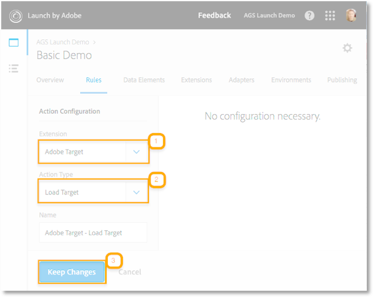

10. Add a second action by clicking the
     icon

11. Select "Adobe Target" as the Extension

12. Select the "Add Params to All Mboxes" as the action

13. Add a parameter called "pageName" and use the
     icon to open the "Select Data
    Element" dialog

14. Select "Page Name" and then click the "Select" button in the dialog
    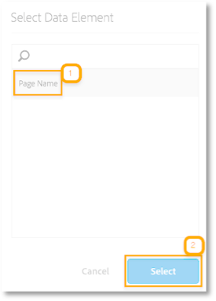

15. Click "Keep Changes"
    

16. Add a third action

17. Select "Adobe Target" as the Extension

18. Select the "Fire Global Mbox" as the action (note that the
    pre-hiding options for typical websites are pre-selected)

19. Click "Keep Changes"
    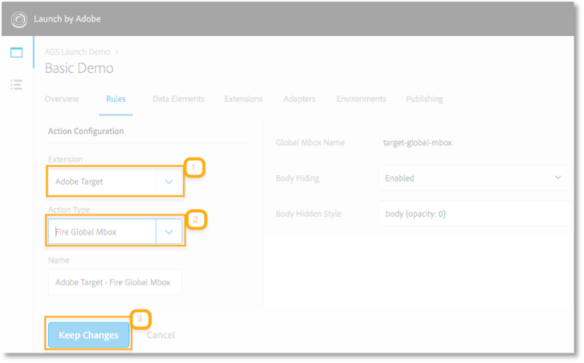

20. Verify that your rule now has three actions

21. Click "Save Rule" to save your changes
    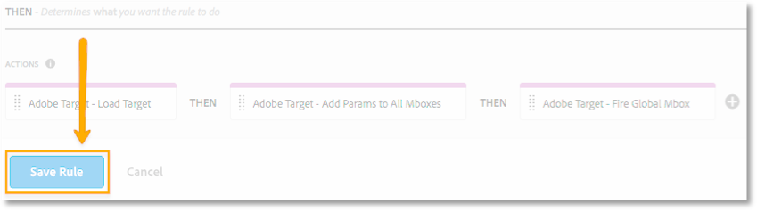

### What is similar to DTM?

The Target extension has been completely refactored for Launch. In
general, you still can:

* Manage the Target library (as long as you use at.js)

* Fire the global mbox (needs to be set in Rules)

* Add global mbox parameters (need to be set in Rules)

### What is different from DTM?

* Natively supports at.js instead of mbox.js

* You must use the at.js version that comes with the extension

* The at.js library is packaged with the main Launch
    library--Document.write is not used and no warnings in Chrome
    should appear

* You don't have to load Target on all pages. You can control when the
    library loads and when the global mbox fires in the rule
    configuration

* Some settings (Client Code, Organization Id, Global Mbox Name,
    Server Domain, and Cross Domain) are imported from the at.js
    settings in the Target UI. Other settings (Timeout, Library Header
    and Footer) are not.

* Default mbox timeout is lower than many clients have currently and
    does not import from the Target UI at.js setting. (3 seconds instead
    of 5 seconds)

* Library Header and Footer sections need to be managed in separate
    "custom code" actions of the Rule builder

* No support for wrapping mboxes (might be possible with custom code)

* Parameters can be added to just the global mbox or *all mboxes* in
    the Rule builder by using the "Add Params to Global Mbox" or "Add
    Params to All Mboxes," respectively

## Overview

This section demonstrates how to execute a robust Target implementation,
including:

* Passing the Customer Id and Authentication State to enable CRM integrations such as Customer Attributes
* Parameters

  * Mbox parameters
  * Profile parameters
  * Entity parameters for Recommendations

* Order confirmation page mbox

* Custom mboxes

* Library Header and Library Footer alternatives

## Prerequisites & Product-Specific Setup

* The Adobe Target extension has been implemented with default
    settings and the "All Pages -- Top" rule (see Basic Setup guide on the [Launch by Adobe Reference Architectures landing page](https://helpx.adobe.com/experience-manager/kt/integration/using/launch-reference-architecture-guides.html))

* The Experience Cloud Id Service extension has been implemented and Customer IDs are being set in "Library Loaded (Page Top)" rules for the Authenticated State as described in the previous section.

> The following Data Elements are used by the Target
> Implementation---see [Appendix 1: Data Element
> definitions](#_Appendix_1:_Data) for details on how each data element
> was defined:

* Page Name---useful for creating targeting conditions when building Target activities
* Authentication State---useful for creating targeting conditions when building Target activities
* Order Id---used to populate the orderId parameter in the order
 confirmation mbox
* Cart Amount---used to populate the orderTotal parameter in the order confirmation mbox
* Cart SKUs (Target)---used to populate the productPurchasedId
 parameter in the order confirmation mbox
* Product Category---used to populate the entity.categoryId parameter for the Recommendations catalog and to key Recommendations algorithms
* Product Description---used to populate the entity.message parameter for the Recommendations catalog
* Product Name---used to populate the entity.name parameter for the Recommendations catalog
* Product Path---used to populate the entity.pageUrl parameter for the Recommendations catalog
* Product Price---used to populate the entity.value parameter for the Recommendations catalog
* Product SKU (Target)---used to populate the entity.id parameter for the Recommendations catalog and to key Recommendations algorithms
* Product Thumbnail Path---used to populate the entity.thumbnailUrl parameter for the Recommendations catalog

### Using Customer IDs in Target

When using the Experience Cloud ID service to enable integrations and core services such as Customer Attributes, it is imperative that the
Customer ID is sent before firing the global mbox. To that end, make sure you have the following capabilities on your site:

* The customer ID must be available on the page before the Launch Embed Code
* The Experience Cloud ID Service extension must be installed
* You must use the "Set Customer IDs" action in a rule that fires at the "Library Loaded (Page Top)" event
* Use the "Fire global mbox" action in a rule that fires *after* the "Set Customer IDs" action

In the previous section, the "All Pages -- Top -- Authenticated - 10" rule was created to fire the "Set Customer ID" action. In the Basic Setup guide, we created a rule called "All Pages -- Top" which loaded Target, set a pageName parameter, and fired the global mbox. Since that rule use the default "order" setting of "50", it will fire after the "All Pages -- Top -- Authenticated - 10" rule, which is exactly what we
want.

### Parameters

Parameters passed through mbox calls greatly enhance the targeting and reporting capabilities of Target. The Launch extension provides two actions to pass parameters:

1. Add Params to All Mboxes---this action includes the parameters in all mbox calls made in the scope of the page load, e.g. additional mbox calls made from Custom Code actions or hardcoded on your site. It is equivalent to using the [targetPageParamsAll()](https://marketing.adobe.com/resources/help/en_US/target/ov2/r_target-atjs-targetpageparamsall.html) method in at.js.
1. Add Params to Global Mbox---this action includes the parameters only in mbox calls using the global mbox name in the extension configuration (e.g. "target-global-mbox"). It is equivalent to using the [targetPageParams()](https://marketing.adobe.com/resources/help/en_US/target/ov2/r_target-atjs-targetpageparams.html) method in at.js.

> Since most implementations only use the target-global-mbox for
> activity delivery, it usually doesn't matter which action you use to
> pass parameters.

### Mbox parameters

Mbox parameters are available for targeting and measurement in the scope of the mbox call in which they are passed. They are ideal for attributes that change frequently such as the page name, page template, etc.

Just give the parameter a simple name and map it to the relevant data element. In the reference implementation, "page" and "authState" parameters are passed to all mboxes in the "All Pages -- Top" rule:
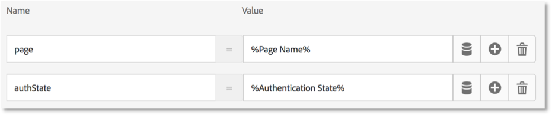

### Profile Parameters

Profile parameters passed through mbox calls are written the visitor profile on Target's backend database. They available for targeting and measurement for as long as the profile is active. They are ideal for attributes that rarely change or are only available on certain pages.

Just give the profile parameter a name prefixed with "profile." and map it to the relevant data element. In the reference implementation, we are not using any profile parameters, but this is what it would look like to set a profile parameter called "userType":


### Entity Parameters for Recommendations

Entity parameters passed through mbox calls are used in Recommendations implementations for two main reasons:

1. As a key to trigger product recommendations. For example, when using a recommendations algorithm like "People who viewed Product X, also viewed Y," "X" is the "key" of the recommendation. It is usually the product sku (entity.id) or category (entity.categoryId) that you are currently viewing.
1. To populate the Recommendations catalog. Recommendations contains a database of all of the products or articles on your website, the details of which are used in an mbox response serving recommendations. For example, when recommending products, you typically want to display attributes like the product name (entity.name) and image (entity.thumbnailUrl). Some customers populate their catalog using backend feeds, but they can also be populated using entity parameters in mbox calls.

Just give the profile parameter a name prefixed with "entity." and map it to the relevant data element. Note that some common entities have reserved names that must be used (e.g. entity.id for the product sku).

In the reference implementation, we have a rule called "Product Details-- Top" that fires only on product detail pages which fires on the "Library Loaded -- Page Top" event. The rule has a condition to only fire when the "Product SKU (Target)" data element has a value, defined by the regular expression "([\^\\s\])":

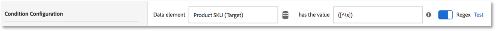

We then use the "Add Params to Global Mbox" action to set entity
parameters:

In order to deliver recommendations without flicker, it is critical to pass the entity.id and entity.categoryId parameters at the top of the page, in the global mbox. Since we have a pretty good data layer, we can also pass entities to populate the catalog.

However, if some of the catalog entities are not available until lower on the page, it is possible to pass them through a separate mbox call made later in the page load. In the reference implementation, there is another rule called "Product Details -- Bottom" which fires on the "Library Loaded -- Page Bottom" event using the same condition as the
"Product Details -- Top" rule. In order to avoid complications with A4T, we want to give this mbox a different name, so we use the Custom Code action of the Core Extension to fire an mbox called "recs-entities" with the following code:

``` javascript
adobe.target.getOffer({
  "mbox": "recs-entities",
  "params": {
    "entity.id": _satellite.getVar('Product SKU (Target)'),
    "entity.value": _satellite.getVar('Product Price'),
    "entity.message": _satellite.getVar('Product Description')
  },
  "success": function(offer) {
},
  "error": function(status, error) {
    console.log('Error', status, error);
  }
});
```

### Property Token for Enterprise User Permissions

The property token is a relatively new type of parameter in Target and is used with the Enterprise User Permissions feature available to Target Premium customers. It is used to identify different web properties to which different users should have different permissions. Target properties are analogous to Launch properties and Analytics report suites. An enterprise with multiple brands, websites, and marketing teams might have use a different Target property, Launch property, and Analytics report suite for each website. Whereas the embed codes differentiate Launch properties, and report suite ids differentiate Analytics report suites, the at_property parameter is used to differentiate Target properties.

Just name the parameter "at_property" and paste in the value provided in the Target interface. In the reference implementation, the "at_property" parameter is passed to all mboxes in our Launch property. Note: if you were using multiple Target properties in a single Launch property, you could manage the at_property value via a data element:


### Order Confirmation mbox

The order confirmation mbox (typically named "orderConfirmPage") is a special type of mbox used to define revenue metrics in Target. The inclusion of three specific mbox parameters---orderId, orderTotal, and productPurchasedId---is what turns an mbox into an order mbox. In addition to reporting revenue, the order mbox also does the following:

1. De-duplicates accidental order resubmissions
1. Filter extreme orders (any order whose total was more than three standard deviations from the mean)
1. Uses a different algorithm behind the scenes to calculate  statistical confidence
1. Creates a special, downloadable Audit report of individual order details

We recommend that all Target customers with order funnels implement the order confirmation mbox, even on non-retail sites. For example, lead generation sites with lead funnels that end with a lead id being generated should implement an order mbox (just use "1" or some other number for the orderTotal). Customers using the Analytics for Target
(A4T) integration for most of their reporting should also implement the order mbox, since A4T is not compatible with all activity types (e.g. Automated Personaization, Auto Allocate, and Auto Target). Additionally, this mbox is used to power Recommendations algorithms based on purchase behavior.

The order confirmation mbox should fire from a rule that is only
triggered on your order confirmation page. Often, it can be combined in a rule that also sets the Adobe Analytics purchase event. It must be configured by using the Custom Code action of the Core extension, using the appropriate data elements to set the orderId, orderTotal, and productPurchasedId parameters.

In the Reference site, we use a rule called "Order Confirmation Page - Bottom -- 30" (order=30 because it sets some Analytics variables that want to set before the Analytics "Send Beacon" action which fires in a rule with order=5) and fire the order mbox using custom code:

``` javascript
adobe.target.getOffer({
  "mbox": "orderConfirmPage",
  "params":{
    "orderId": _satellite.getVar('Order Id'),
    "orderTotal": _satellite.getVar('Cart Amount'),
    "productPurchasedId": _satellite.getVar('Cart SKUs (Target')
    },
  "success": function(offer) {
    adobe.target.applyOffer({
    "mbox": "orderConfirmPage",
    "offer": offer
    });
  },
  "error": function(status, error) {
    console.log('Error', status, error);
  }
});
```

### Custom mboxes

In the rare instance when you need to make mbox calls other than the global mbox, use the Custom Code action in the Core extension to an mbox, as described in the earlier sections [Entity Parameters for Recommendations](#entity-parameters-for-recommendations) and [Order
Confirmation mbox](#order-confirmation-mbox) which used
[getOffer()](https://marketing.adobe.com/resources/help/en_US/target/?f=r_target-atjs-getoffer)/[applyOffer()](https://marketing.adobe.com/resources/help/en_US/target/ov2/r_target-atjs-applyoffer.html) and [trackEvent()](https://marketing.adobe.com/resources/help/en_US/target/ov2/r_target-atjs-trackevent.html)
methods. Just be sure to use the "Load Target" action before making mbox calls from custom code.

### Library Header and Library Footer replacements

The Edit at.js screen in the Target user interface has locations in which you can paste custom JavaScript that will execute immediately before or after the at.js file. The Library Header is sometimes used to override at.js settings via the
[targetGlobalSettings()](https://marketing.adobe.com/resources/help/en_US/target/ov2/c_atjs-settings-override.html)

ADD LINK TO DATA PROVIDERS

function, while the Library Footer is sometimes used to add [at.js library extensions](https://github.com/Adobe-Marketing-Cloud/target-atjs-extensions) or [at.js custom event](https://marketing.adobe.com/resources/help/en_US/target/ov2/r_target-atjs-notification.html) listeners.

To replicate this capability in Launch, just use the Custom Code action in the Core extension and sequence the action before (Library Header) or after (Library Footer) the Load Target action. The reference architecture replicates Library Footer capabilities by delivering [the ttMeta event
listener](https://marketing.adobe.com/resources/help/en_US/target/?f=c_response-tokens) custom code after the Load Target action:
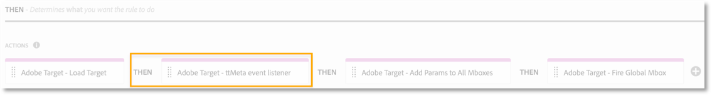

### Validate the implementation

Using the Experience Cloud Debugger, we can quickly confirm the correct implementation of many of the Target concepts described above.

For example, open the Debugger's Target->Requests tab on one of the reference architecture product detail pages(<https://aem100-us.adobevlab.com/content/we-retail/us/en/products/women/shirts/devi-sleeveless-shirt.html#wootsudet-XXS>):
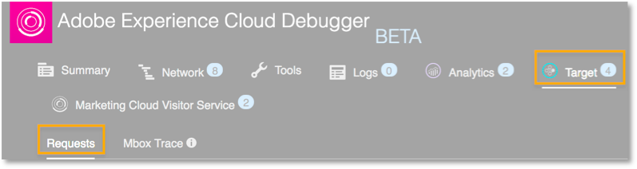
We can confirm the correct passing of the customer ids, mbox and entity parameters, plus the custom
mbox: 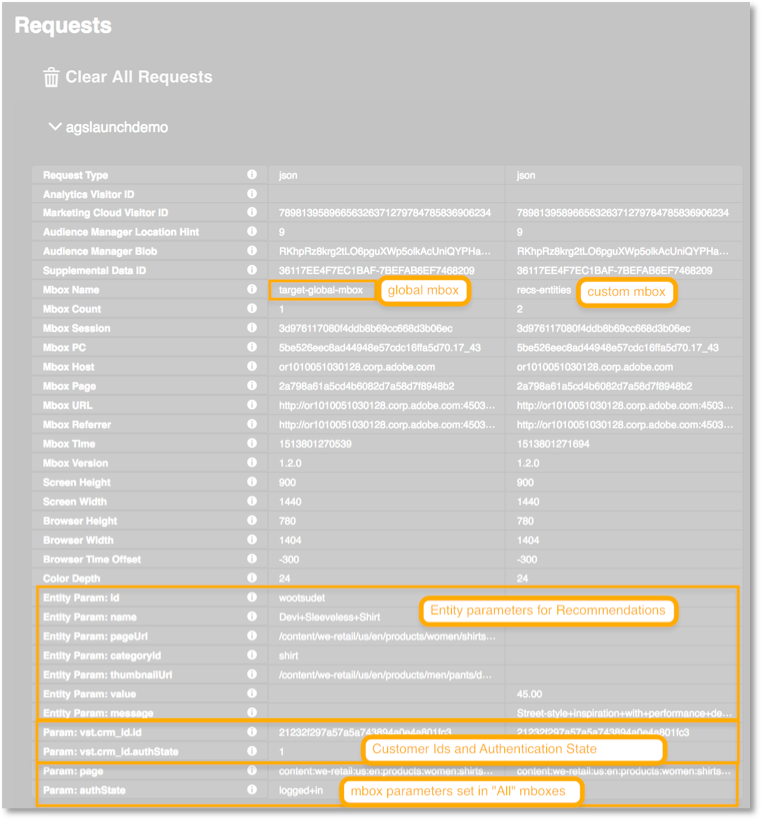

We can place a test order (first name and last name are the only
required fields on the reference implementation) to verify that our order confirmation mbox is firing and with the required parameters:
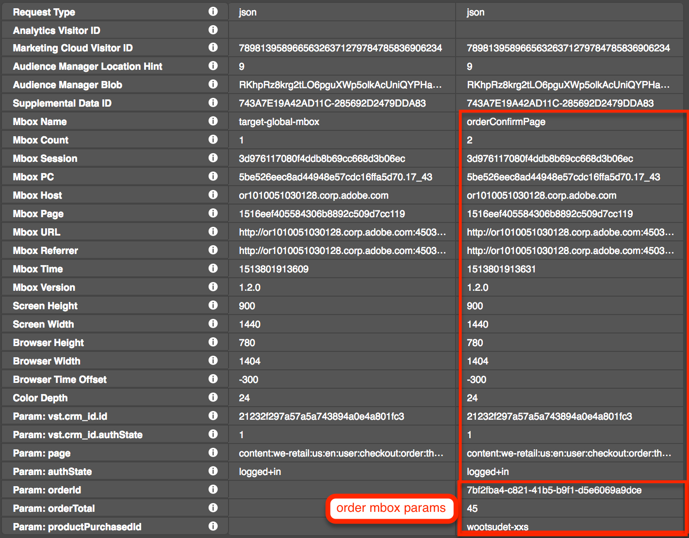

Library header and footer equivalents will require different validation techniques depending on what you are doing in the Custom Code. The ttMeta event listener used in the reference architecture---when combined with Target's [Response
Token](https://marketing.adobe.com/resources/help/en_US/target/target/c_response-tokens.html)
capability and a live activity---will expose details of the activity
when you run ttMETA in the browser console: 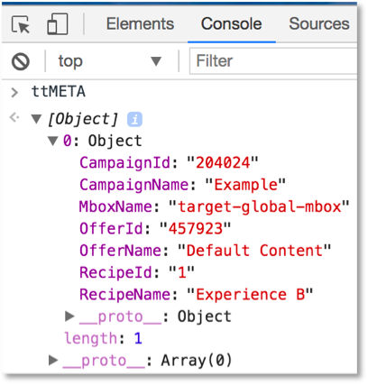

## Known Issues or Limitations

None
